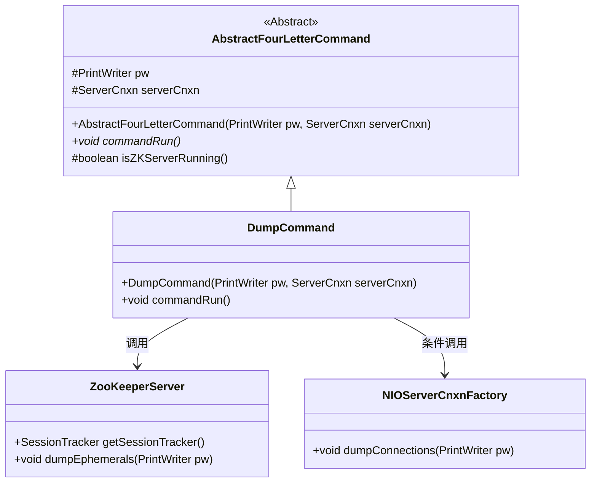
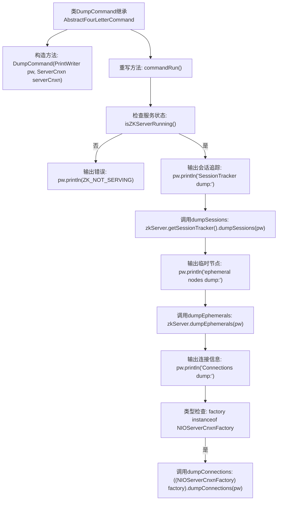

# 基础信息

|      |      |
|------|------|
| 名称 | DumpCommand |
| 编码语言 | .java |
| 代码路径 | zookeeper/zookeeper-server/src/main/java/org/apache/zookeeper/server/command/DumpCommand.java |
| 包名 | org.apache.zookeeper.server.command |
| 依赖项 | ['java.io.PrintWriter', 'org.apache.zookeeper.server.NIOServerCnxnFactory', 'org.apache.zookeeper.server.ServerCnxn'] |
| 概述说明 | DumpCommand类继承AbstractFourLetterCommand，用于检查ZK服务器状态并输出会话、临时节点和连接信息。 |

# 说明

该代码定义了一个名为DumpCommand的类，继承自AbstractFourLetterCommand。它通过构造函数接收PrintWriter和ServerCnxn对象。commandRun方法首先检查ZK服务器是否运行，若未运行则输出提示信息；若运行则依次输出会话追踪器信息、临时节点信息和连接信息。连接信息仅在工厂为NIOServerCnxnFactory类型时输出。整个过程通过PrintWriter对象进行结果输出。

# 类列表 Class Summary

| 名称   | 类型  | 说明 |
|-------|------|-------------|
| DumpCommand | class | DumpCommand类继承AbstractFourLetterCommand，用于检查ZK服务器状态并输出会话、临时节点和连接信息。 |

## 类 DumpCommand

|      |      |
|------|------|
| 访问范围 | public |
| 类型 | class |
| 名称 | DumpCommand |
| 说明 | DumpCommand类继承AbstractFourLetterCommand，用于检查ZK服务器状态并输出会话、临时节点和连接信息。 |

### UML类图

该类图展示了ZooKeeper中DumpCommand命令的实现结构。DumpCommand继承自抽象类AbstractFourLetterCommand，重写了commandRun()方法用于执行核心转储逻辑。在执行过程中，它会检查ZK服务器状态，并通过ZooKeeperServer实例获取会话跟踪器和临时节点信息，当连接工厂为NIOServerCnxnFactory类型时还会转储连接信息。整个设计体现了命令模式与条件分发的结合，用于实现ZK服务器的诊断功能。

### 内部方法调用关系图

这段代码是ZooKeeper中DumpCommand类的实现，用于诊断服务器状态。当服务未运行时输出错误信息，否则依次输出会话追踪数据、临时节点信息和连接信息（仅当连接工厂为NIOServerCnxnFactory类型时）。流程图清晰展示了从构造方法到命令执行的分支逻辑，包括状态检查、数据转储和类型判断等关键步骤。

### 字段列表 Field List

| 名称  | 类型  | 说明 |
|-------|-------|------|

### 方法列表 Method List

| 名称  | 类型  | 说明 |
|-------|-------|------|
| commandRun | void | 方法commandRun检查ZK服务器是否运行，未运行则输出提示，否则依次输出会话追踪、临时节点和连接信息（仅限NIOServerCnxnFactory实现）。 |

