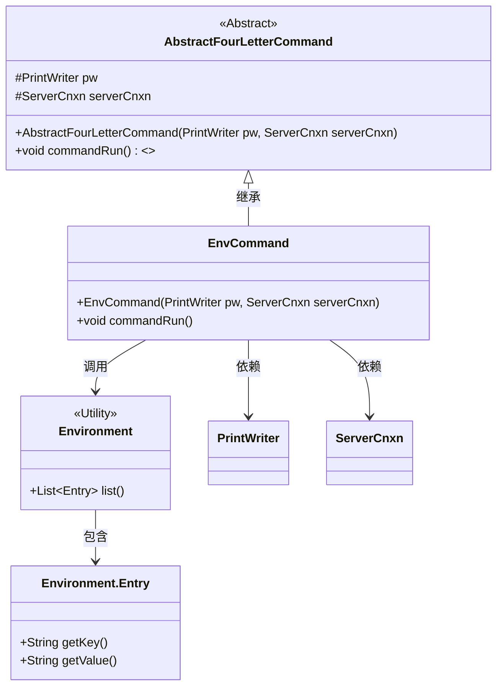
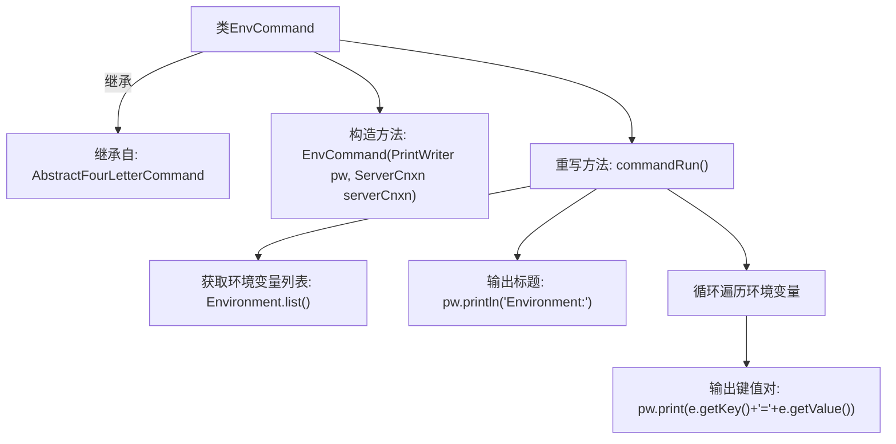

# 基础信息

|      |      |
|------|------|
| 名称 | EnvCommand |
| 编码语言 | .java |
| 代码路径 | zookeeper/zookeeper-server/src/main/java/org/apache/zookeeper/server/command/EnvCommand.java |
| 包名 | org.apache.zookeeper.server.command |
| 依赖项 | ['java.io.PrintWriter', 'java.util.List', 'org.apache.zookeeper.Environment', 'org.apache.zookeeper.server.ServerCnxn'] |
| 概述说明 | EnvCommand类继承AbstractFourLetterCommand，用于打印环境变量列表。构造函数接收PrintWriter和ServerCnxn。commandRun方法遍历环境变量并输出键值对。 |

# 说明

EnvCommand是一个继承自AbstractFourLetterCommand的类，用于输出环境变量信息。其构造函数接收PrintWriter和ServerCnxn参数。在commandRun方法中，通过Environment.list()获取环境变量列表，并遍历每个Entry对象，将键值对格式化为"key=value"形式输出到PrintWriter。该命令主要用于展示当前运行环境的所有变量及其值。

# 类列表 Class Summary

| 名称   | 类型  | 说明 |
|-------|------|-------------|
| EnvCommand | class | EnvCommand类继承AbstractFourLetterCommand，通过commandRun方法打印环境变量键值对列表。 |

## 类 EnvCommand

|      |      |
|------|------|
| 访问范围 | public |
| 类型 | class |
| 名称 | EnvCommand |
| 说明 | EnvCommand类继承AbstractFourLetterCommand，通过commandRun方法打印环境变量键值对列表。 |

### UML类图

这段代码展示了一个继承自AbstractFourLetterCommand的EnvCommand类，用于输出环境变量信息。EnvCommand通过调用Environment工具类获取环境变量列表，并利用PrintWriter逐行输出键值对。类图清晰地体现了继承关系、工具类调用以及环境变量条目的组合关系，整体结构简洁且职责明确。

### 内部方法调用关系图

这段代码流程图展示了EnvCommand类的结构和工作流程。该类继承自AbstractFourLetterCommand，通过构造方法初始化后，重写commandRun()方法实现核心功能：首先获取系统环境变量列表，然后循环遍历每个环境变量条目，以"key=value"格式逐行输出。整个过程清晰地反映了从环境信息收集到格式化输出的完整处理流程，体现了命令模式的具体实现方式。

### 字段列表 Field List

| 名称  | 类型  | 说明 |
|-------|-------|------|

### 方法列表 Method List

| 名称  | 类型  | 说明 |
|-------|-------|------|
| commandRun | void | 重写commandRun方法，遍历环境变量列表并打印键值对，格式为"key=value"。 |

