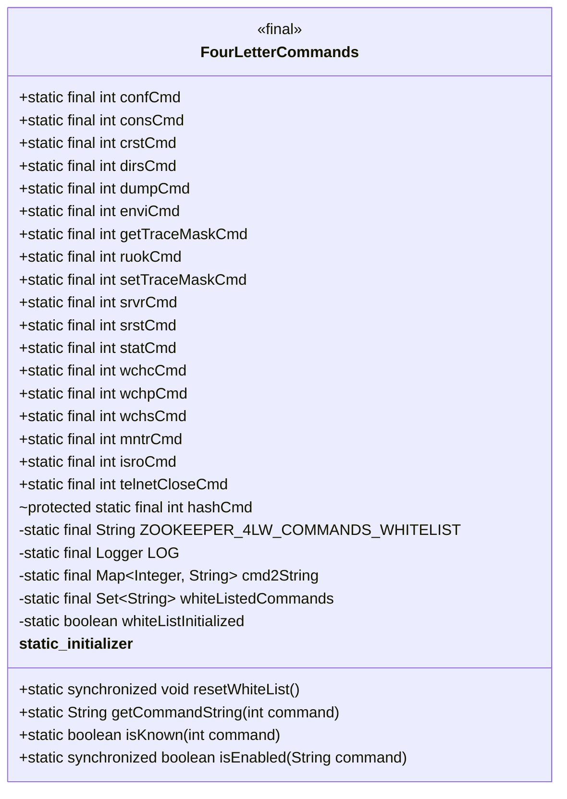
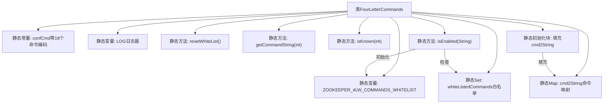

# 基础信息

|      |      |
|------|------|
| 名称 | FourLetterCommands |
| 编码语言 | .java |
| 代码路径 | zookeeper/zookeeper-server/src/main/java/org/apache/zookeeper/server/command/FourLetterCommands.java |
| 包名 | org.apache.zookeeper.server.command |
| 依赖项 | ['java.nio.ByteBuffer', 'java.util.Arrays', 'java.util.HashMap', 'java.util.HashSet', 'java.util.Map', 'java.util.Set', 'org.slf4j.Logger', 'org.slf4j.LoggerFactory'] |
| 概述说明 | FourLetterCommands类定义了Zookeeper的四字母命令常量，提供命令字符串转换、已知命令检查和启用状态检查功能，支持白名单配置。 |

# 说明

该代码定义了一个FourLetterCommands类，用于管理Zookeeper的四字母命令。类中包含多个静态常量，每个常量对应一个四字母命令的整数值，如conf、cons、crst等。通过cmd2String映射存储命令整数值与字符串的对应关系。提供了isKnown方法检查命令是否已知，isEnabled方法检查命令是否启用。启用命令通过白名单机制控制，可配置ZOOKEEPER_4LW_COMMANDS_WHITELIST系统属性指定允许的命令。默认强制启用isro和srvr命令。类初始化时将所有命令注册到映射表中。

# 类列表 Class Summary

| 名称   | 类型  | 说明 |
|-------|------|-------------|
| FourLetterCommands | class | ZooKeeper四字命令类，包含conf、cons等命令，支持白名单配置检查命令是否启用。 |

## 类 FourLetterCommands

|      |      |
|------|------|
| 访问范围 | public |
| 类型 | class |
| 名称 | FourLetterCommands |
| 说明 | ZooKeeper四字命令类，包含conf、cons等命令，支持白名单配置检查命令是否启用。 |

### UML类图

该代码是Zookeeper的四字命令管理类，定义了15种标准命令和2种特殊命令的静态常量，通过ByteBuffer将4字母命令转换为int值。核心功能包括：维护命令映射表(cmd2String)、实现白名单机制(whiteListedCommands)、提供命令查询和校验方法。特殊处理了"isro"和"srvr"命令的强制启用逻辑，通过系统属性ZOOKEEPER_4LW_COMMANDS_WHITELIST控制命令白名单，支持通配符"*"配置。

### 内部方法调用关系图

该流程图展示了ZooKeeper四字命令处理类的核心结构。类包含18个静态命令编码常量、配置白名单变量、日志器和两个核心数据结构（命令映射表和白名单集合）。主要功能包括白名单重置resetWhiteList()、命令查询getCommandString()、命令验证isKnown()和启用检查isEnabled()。静态初始化块负责建立四字命令与编码的映射关系，isEnabled()方法会动态加载系统配置来初始化白名单。整体设计采用线程安全的延迟初始化模式来管理命令白名单。

### 字段列表 Field List

| 名称  | 类型  | 说明 |
|-------|-------|------|
| dumpCmd = ByteBuffer.wrap("dump".getBytes()).getInt() | int | 定义静态常量dumpCmd，值为字符串"dump"转换为字节缓冲后的整型结果。 |
| whiteListInitialized = false | boolean | 私有静态布尔变量，标记白名单是否已初始化。 |
| setTraceMaskCmd = ByteBuffer.wrap("stmk".getBytes()).getInt() | int | 定义静态常量`setTraceMaskCmd`，其值为字符串"stmk"转换为字节缓冲后的整型值。 |
| crstCmd = ByteBuffer.wrap("crst".getBytes()).getInt() | int | Java代码定义常量crstCmd，值为字符串"crst"转换的字节缓冲区的整型。 |
| wchsCmd = ByteBuffer.wrap("wchs".getBytes()).getInt() | int | Java代码定义静态常量wchsCmd，值为字符串"wchs"转换的字节缓冲区的整型值。 |
| telnetCloseCmd = 0xfff4fffd | int | 定义常量telnetCloseCmd，值为0xfff4fffd，用于关闭Telnet连接。 |
| ZOOKEEPER_4LW_COMMANDS_WHITELIST = "zookeeper.4lw.commands.whitelist" | String | 私有静态常量ZOOKEEPER_4LW_COMMANDS_WHITELIST定义ZooKeeper四字命令白名单配置键。 |
| srvrCmd = ByteBuffer.wrap("srvr".getBytes()).getInt() | int | Java代码定义静态常量srvrCmd，将字符串"srvr"转为字节缓冲并提取整数值。 |
| wchcCmd = ByteBuffer.wrap("wchc".getBytes()).getInt() | int | Java代码定义静态常量wchcCmd，值为字符串"wchc"转换的字节缓冲区的整型结果。 |
| getTraceMaskCmd = ByteBuffer.wrap("gtmk".getBytes()).getInt() | int | Java代码定义静态常量getTraceMaskCmd，值为字符串"gtmk"转为字节缓冲后的整型。 |
| dirsCmd = ByteBuffer.wrap("dirs".getBytes()).getInt() | int | Java代码定义静态常量dirsCmd，将字符串"dirs"转为字节缓冲并提取整数值。 |
| LOG = LoggerFactory.getLogger(FourLetterCommands.class) | Logger | 定义日志记录器LOG，用于FourLetterCommands类的日志输出。 |
| enviCmd = ByteBuffer.wrap("envi".getBytes()).getInt() | int | Java代码定义静态常量enviCmd，将字符串"envi"转为字节缓冲并提取整数值。 |
| confCmd = ByteBuffer.wrap("conf".getBytes()).getInt() | int | Java代码定义静态常量confCmd，将字符串"conf"转为字节缓冲并解析为整数值。 |
| hashCmd = ByteBuffer.wrap("hash".getBytes()).getInt() | int | Java代码定义静态常量hashCmd，值为字符串"hash"的字节缓冲转换的整型。 |
| srstCmd = ByteBuffer.wrap("srst".getBytes()).getInt() | int | Java代码定义静态常量srstCmd，值为字符串"srst"转换的字节缓冲区的整型。 |
| whiteListedCommands = new HashSet<>() | Set<String> | 定义私有静态终态字符串集合whiteListedCommands，初始化为空HashSet。 |
| ruokCmd = ByteBuffer.wrap("ruok".getBytes()).getInt() | int | Java代码定义静态常量ruokCmd，值为字符串"ruok"转为字节缓冲后的整型。 |
| isroCmd = ByteBuffer.wrap("isro".getBytes()).getInt() | int | 定义静态常量isroCmd，值为字符串"isro"转换的字节缓冲区的整型结果。 |
| wchpCmd = ByteBuffer.wrap("wchp".getBytes()).getInt() | int | Java代码定义静态常量wchpCmd，值为字符串"wchp"转换的字节缓冲区的整数值。 |
| mntrCmd = ByteBuffer.wrap("mntr".getBytes()).getInt() | int | Java代码定义常量mntrCmd，值为"mntr"字符串转字节缓冲后的整型值。 |
| consCmd = ByteBuffer.wrap("cons".getBytes()).getInt() | int | 定义静态常量consCmd，将字符串"cons"转为字节后通过ByteBuffer解析为整数值。 |
| cmd2String = new HashMap<>() | Map<Integer, String> | 定义静态常量映射表cmd2String，键为整型，值为字符串，初始化为空HashMap。 |
| statCmd = ByteBuffer.wrap("stat".getBytes()).getInt() | int | Java代码：将字符串"stat"转为字节缓冲并提取整数值，赋值给静态常量statCmd。 |

### 方法列表 Method List

| 名称  | 类型  | 说明 |
|-------|-------|------|
| getCommandString | String | 这是一个静态方法，根据输入的命令代码返回对应的字符串。方法通过查找映射表cmd2String实现。 |
| isKnown | boolean | 检查命令是否存在于映射表中。 |
| resetWhiteList | void | 重置白名单：静态同步方法，将初始化标志设为false并清空白名单命令集合。 |
| isEnabled | boolean | 检查命令是否在白名单中。若未初始化，从系统属性读取并解析白名单，处理通配符和空值。默认添加isro和srvr命令。返回命令是否在白名单内。 |

