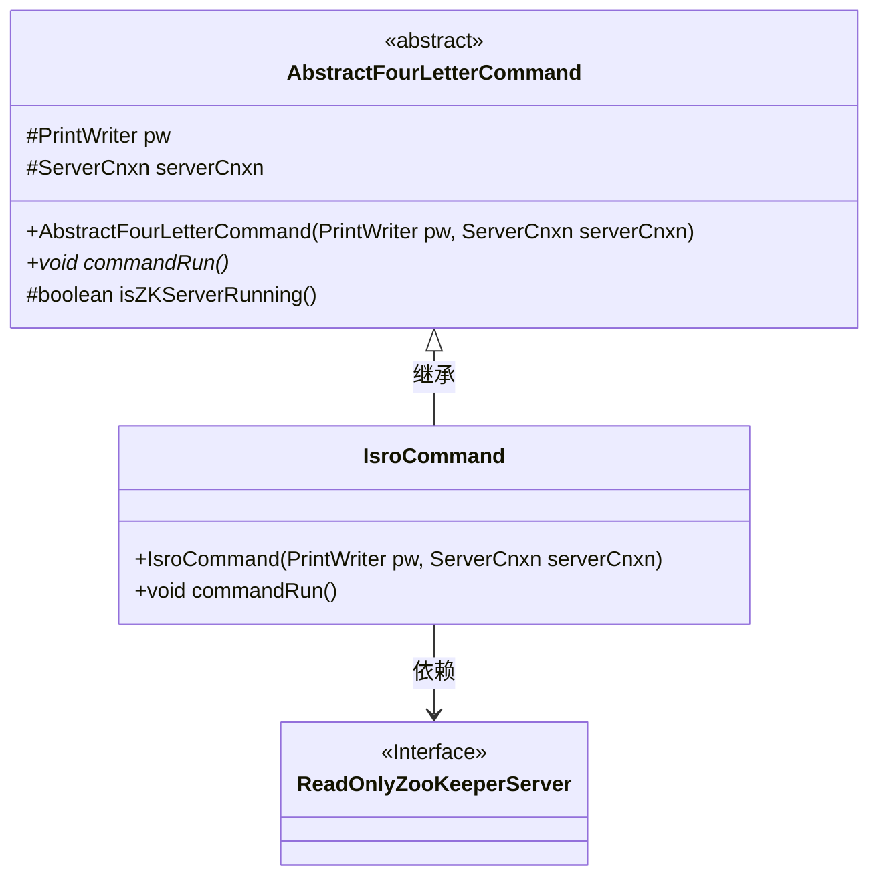
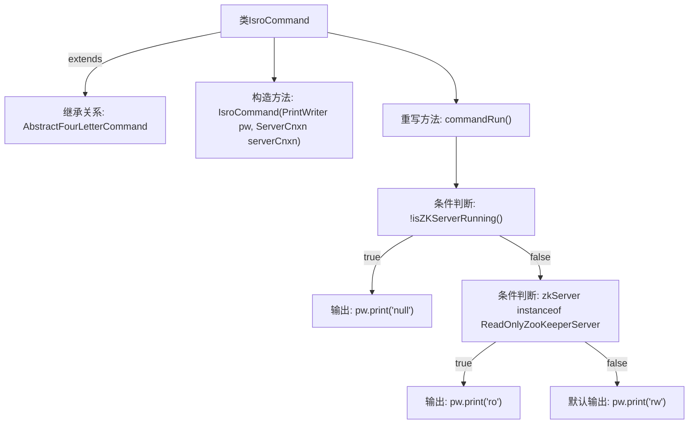

# 基础信息

|      |      |
|------|------|
| 名称 | IsroCommand |
| 编码语言 | .java |
| 代码路径 | zookeeper/zookeeper-server/src/main/java/org/apache/zookeeper/server/command/IsroCommand.java |
| 包名 | org.apache.zookeeper.server.command |
| 依赖项 | ['java.io.PrintWriter', 'org.apache.zookeeper.server.ServerCnxn', 'org.apache.zookeeper.server.quorum.ReadOnlyZooKeeperServer'] |
| 概述说明 | IsroCommand类继承AbstractFourLetterCommand，检查ZKServer运行状态并输出ro（只读）、rw（读写）或null（未运行）。 |

# 说明

这是一个名为IsroCommand的Java类，继承自AbstractFourLetterCommand。该类用于检查ZooKeeper服务器的运行状态和模式。构造函数接收PrintWriter和ServerCnxn参数。核心方法是commandRun，它会判断：若服务器未运行则输出"null"；若服务器处于只读模式输出"ro"；否则输出"rw"。通过PrintWriter将结果返回给客户端。

# 类列表 Class Summary

| 名称   | 类型  | 说明 |
|-------|------|-------------|
| IsroCommand | class | IsroCommand类继承AbstractFourLetterCommand，检查ZK服务器状态并输出运行模式（null/ro/rw）。 |

## 类 IsroCommand

|      |      |
|------|------|
| 访问范围 | public |
| 类型 | class |
| 名称 | IsroCommand |
| 说明 | IsroCommand类继承AbstractFourLetterCommand，检查ZK服务器状态并输出运行模式（null/ro/rw）。 |

### UML类图

这段代码展示了一个ZooKeeper服务器状态检测命令的实现类结构。IsroCommand继承自抽象基类AbstractFourLetterCommand，通过覆写commandRun()方法实现核心逻辑：检测服务器运行状态并输出"ro"(只读)、"rw"(读写)或"null"(未运行)。类图中清晰体现了继承关系和接口依赖，其中ReadOnlyZooKeeperServer作为接口参与类型判断。该设计遵循模板方法模式，基类提供基础设施而子类实现具体行为。

### 内部方法调用关系图

这段代码流程图描述了IsroCommand类的继承结构和核心逻辑。该类继承自AbstractFourLetterCommand，主要功能是通过commandRun()方法检测ZooKeeper服务器状态并输出对应标识：当服务器未运行时输出"null"，处于只读模式时输出"ro"，否则输出"rw"。流程图清晰展示了从类定义到方法调用的完整路径，包括继承关系和条件分支逻辑，每个判断节点都有明确的输出路径。

### 字段列表 Field List

| 名称  | 类型  | 说明 |
|-------|-------|------|

### 方法列表 Method List

| 名称  | 类型  | 说明 |
|-------|-------|------|
| commandRun | void | 重写commandRun方法，根据ZK服务器状态输出不同字符串：未运行输出"null"，只读模式输出"ro"，否则输出"rw"。 |

