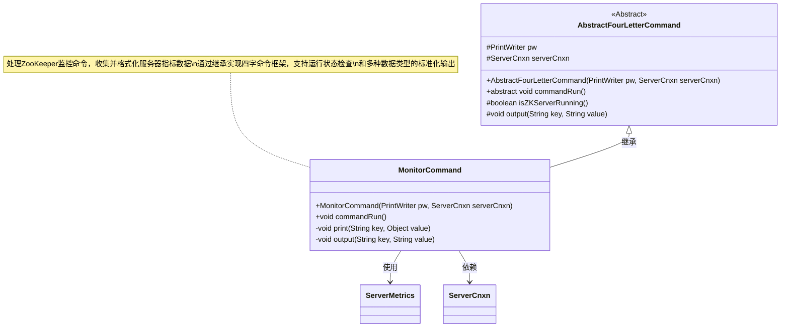
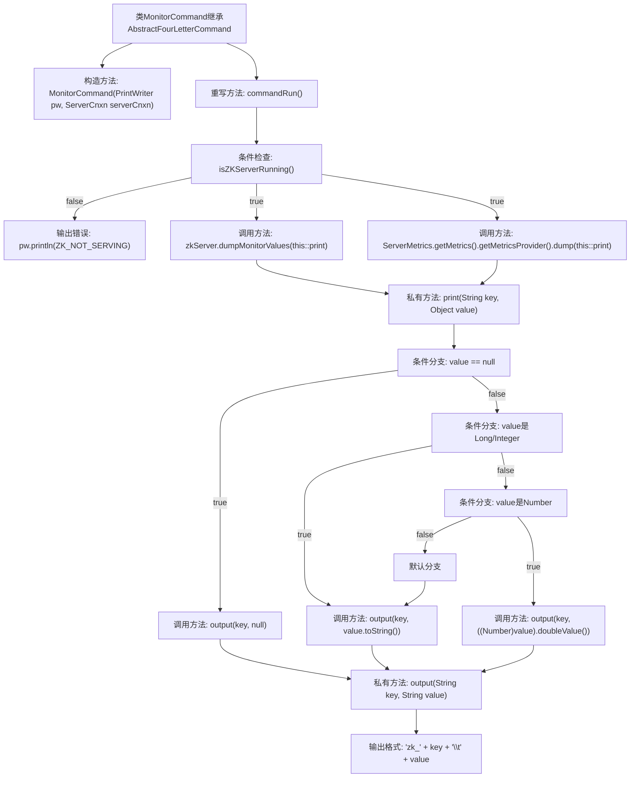

# 基础信息

|      |      |
|------|------|
| 名称 | MonitorCommand |
| 编码语言 | .java |
| 代码路径 | zookeeper/zookeeper-server/src/main/java/org/apache/zookeeper/server/command/MonitorCommand.java |
| 包名 | org.apache.zookeeper.server.command |
| 依赖项 | ['java.io.PrintWriter', 'org.apache.zookeeper.server.ServerCnxn', 'org.apache.zookeeper.server.ServerMetrics'] |
| 概述说明 | MonitorCommand类继承AbstractFourLetterCommand，用于监控ZK服务器状态。检查服务器运行后，输出监控指标和非指标数据，格式化数值并打印。 |

# 说明

MonitorCommand是一个继承自AbstractFourLetterCommand的类，用于监控ZooKeeper服务器状态。其构造函数接收PrintWriter和ServerCnxn对象。commandRun方法首先检查服务器是否运行，若未运行则输出提示信息。随后调用dumpMonitorValues方法输出非指标数据，并通过MetricsProvider获取并输出指标数据。print方法处理不同类型的数据，将其格式化为字符串后通过output方法输出。output方法将键值对格式化为特定格式后写入PrintWriter。

# 类列表 Class Summary

| 名称   | 类型  | 说明 |
|-------|------|-------------|
| MonitorCommand | class | MonitorCommand类继承AbstractFourLetterCommand，用于监控ZooKeeper服务器状态。检查服务器运行状态后，输出监控指标和非指标数据，格式化数值和字符串并打印。 |

## 类 MonitorCommand

|      |      |
|------|------|
| 访问范围 | public |
| 类型 | class |
| 名称 | MonitorCommand |
| 说明 | MonitorCommand类继承AbstractFourLetterCommand，用于监控ZooKeeper服务器状态。检查服务器运行状态后，输出监控指标和非指标数据，格式化数值和字符串并打印。 |

### UML类图

类图描述：
MonitorCommand继承自AbstractFourLetterCommand，实现了ZooKeeper服务器的监控功能。该类通过commandRun()方法检查服务状态，收集服务器指标数据，并通过print()方法处理不同类型的数据格式化。output()方法负责最终的标准格式输出，包含指标前缀和制表符分隔。整个设计体现了命令模式与模板方法模式的结合，实现了可扩展的四字命令处理框架。

### 内部方法调用关系图

该流程图描述了MonitorCommand类的执行逻辑。首先检查ZooKeeper服务是否运行，若未运行则输出错误信息；否则通过两个独立路径收集监控数据（zkServer和MetricsProvider），统一通过print方法处理不同数据类型，最终按"zk_key\tvalue"格式输出。print方法包含完整的类型判断分支，确保数值、字符串和空值的正确处理，output方法负责标准化输出格式。整个流程体现了监控命令的数据收集、格式转换和标准化输出的完整处理链条。

### 字段列表 Field List

| 名称  | 类型  | 说明 |
|-------|-------|------|

### 方法列表 Method List

| 名称  | 类型  | 说明 |
|-------|-------|------|
| print | void | 私有方法print接收键值对，根据值类型格式化输出：null直接输出，整型转字符串，数值型转浮点字符串，其他类型调用toString。 |
| commandRun | void | 重写commandRun方法：检查ZK服务状态，未运行则输出提示；运行则调用dumpMonitorValues和MetricsProvider的dump方法输出监控数据。 |
| output | void | 私有方法output接收key和value参数，用pw打印"zk_"+key+制表符+value并换行。 |

