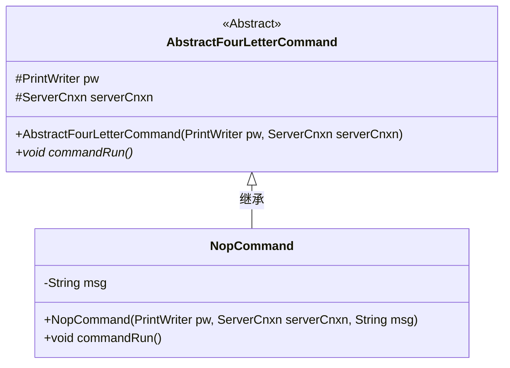
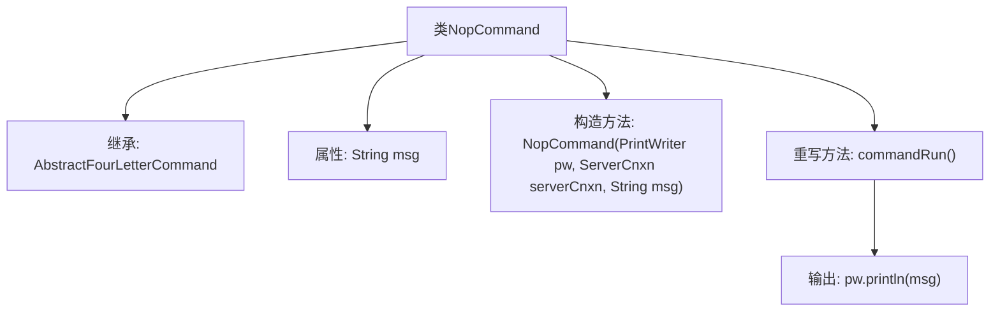

# 基础信息

|      |      |
|------|------|
| 名称 | NopCommand |
| 编码语言 | .java |
| 代码路径 | zookeeper/zookeeper-server/src/main/java/org/apache/zookeeper/server/command/NopCommand.java |
| 包名 | org.apache.zookeeper.server.command |
| 依赖项 | ['java.io.PrintWriter', 'org.apache.zookeeper.server.ServerCnxn'] |
| 概述说明 | NopCommand类继承AbstractFourLetterCommand，通过构造函数接收参数并存储msg，执行时输出msg内容。 |

# 说明

NopCommand类继承自AbstractFourLetterCommand，是一个无操作命令实现。该类包含一个字符串类型成员变量msg，通过构造函数接收PrintWriter、ServerCnxn和msg参数并初始化。重写的commandRun方法简单地将msg内容通过PrintWriter输出。该设计实现了基础命令模式，仅执行消息输出功能。

# 类列表 Class Summary

| 名称   | 类型  | 说明 |
|-------|------|-------------|
| NopCommand | class | NopCommand类继承AbstractFourLetterCommand，构造函数接收PrintWriter、ServerCnxn和msg参数，commandRun方法将msg输出到PrintWriter。 |

## 类 NopCommand

|      |      |
|------|------|
| 访问范围 | public |
| 类型 | class |
| 名称 | NopCommand |
| 说明 | NopCommand类继承AbstractFourLetterCommand，构造函数接收PrintWriter、ServerCnxn和msg参数，commandRun方法将msg输出到PrintWriter。 |

### UML类图

这段类图展示了NopCommand继承自抽象类AbstractFourLetterCommand的层级关系。AbstractFourLetterCommand定义了受保护的PrintWriter和ServerCnxn字段以及抽象方法commandRun()，而NopCommand作为具体实现类，添加了私有msg字段并实现了commandRun()方法，通过构造函数初始化所有必要参数。该设计体现了模板方法模式，父类定义框架而子类实现具体行为。

### 内部方法调用关系图

这段代码展示了一个继承自AbstractFourLetterCommand的NopCommand类，包含msg属性和带三个参数的构造函数。核心逻辑在重写的commandRun方法中，通过PrintWriter输出msg内容。流程图清晰呈现了类继承关系、属性构造和方法调用链路，体现了命令模式中具体命令的实现方式。

### 字段列表 Field List

| 名称  | 类型  | 说明 |
|-------|-------|------|
| msg | String | 私有字符串变量msg。 |

### 方法列表 Method List

| 名称  | 类型  | 说明 |
|-------|-------|------|
| commandRun | void | 重写commandRun方法，调用pw.println输出msg。 |

