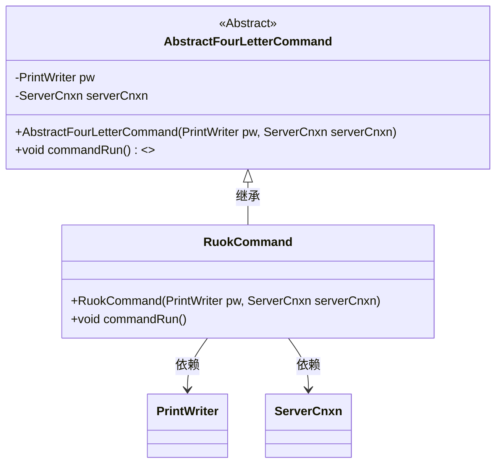
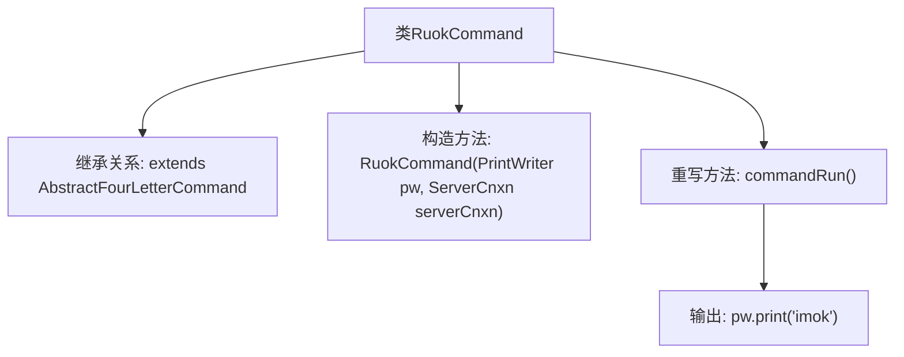

# 基础信息

|      |      |
|------|------|
| 名称 | RuokCommand |
| 编码语言 | .java |
| 代码路径 | zookeeper/zookeeper-server/src/main/java/org/apache/zookeeper/server/command/RuokCommand.java |
| 包名 | org.apache.zookeeper.server.command |
| 依赖项 | ['java.io.PrintWriter', 'org.apache.zookeeper.server.ServerCnxn'] |
| 概述说明 | RuokCommand类继承AbstractFourLetterCommand，执行时输出"imok"。 |

# 说明

这是一个名为RuokCommand的Java类，继承自AbstractFourLetterCommand。类中包含一个构造函数，接收PrintWriter和ServerCnxn两个参数，并调用父类构造函数。重写了commandRun方法，执行时通过PrintWriter输出字符串"imok"。这是一个简单的命令实现类，用于处理特定四字母命令。

# 类列表 Class Summary

| 名称   | 类型  | 说明 |
|-------|------|-------------|
| RuokCommand | class | RuokCommand类继承AbstractFourLetterCommand，重写commandRun方法输出"imok"。 |

## 类 RuokCommand

|      |      |
|------|------|
| 访问范围 | public |
| 类型 | class |
| 名称 | RuokCommand |
| 说明 | RuokCommand类继承AbstractFourLetterCommand，重写commandRun方法输出"imok"。 |

### UML类图

这段代码展示了一个继承自抽象类AbstractFourLetterCommand的RuokCommand类。RuokCommand通过构造函数接收PrintWriter和ServerCnxn对象，并重写了commandRun()方法，该方法会向PrintWriter输出"imok"字符串。类图清晰地体现了继承关系和依赖关系，其中抽象基类定义了通用结构，子类实现了具体行为。

### 内部方法调用关系图

这段代码展示了一个继承自`AbstractFourLetterCommand`的`RuokCommand`类，主要用于实现简单的健康检查功能。类中包含一个构造方法用于初始化父类参数，并重写了`commandRun()`方法，该方法执行时会向输出流打印"imok"字符串作为响应。该设计模式常用于实现命令模式，通过继承抽象基类来统一接口，具体子类只需关注自身业务逻辑的实现。

### 字段列表 Field List

| 名称  | 类型  | 说明 |
|-------|-------|------|

### 方法列表 Method List

| 名称  | 类型  | 说明 |
|-------|-------|------|
| commandRun | void | 重写commandRun方法，输出"imok"。 |

