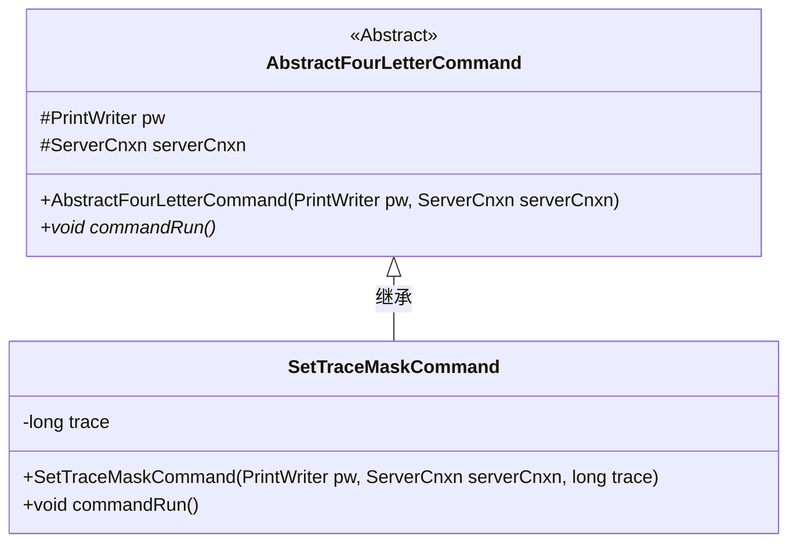
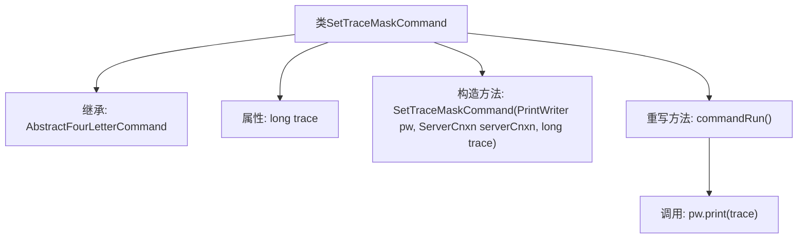

# 基础信息

|      |      |
|------|------|
| 名称 | SetTraceMaskCommand |
| 编码语言 | .java |
| 代码路径 | zookeeper/zookeeper-server/src/main/java/org/apache/zookeeper/server/command/SetTraceMaskCommand.java |
| 包名 | org.apache.zookeeper.server.command |
| 依赖项 | ['java.io.PrintWriter', 'org.apache.zookeeper.server.ServerCnxn'] |
| 概述说明 | SetTraceMaskCommand类继承AbstractFourLetterCommand，通过构造函数接收trace值并在commandRun方法中输出该值。 |

# 说明

这是一个名为SetTraceMaskCommand的Java类，继承自AbstractFourLetterCommand。该类用于设置跟踪掩码，包含一个长整型变量trace存储掩码值。构造函数接收PrintWriter、ServerCnxn和trace参数，并将trace赋值给成员变量。重写的commandRun方法将trace值输出到PrintWriter。整个类功能简洁，专注于实现设置和输出跟踪掩码的核心逻辑。

# 类列表 Class Summary

| 名称   | 类型  | 说明 |
|-------|------|-------------|
| SetTraceMaskCommand | class | SetTraceMaskCommand类继承AbstractFourLetterCommand，用于设置跟踪掩码值，构造函数接收参数并赋值，commandRun方法输出trace值。 |

## 类 SetTraceMaskCommand

|      |      |
|------|------|
| 访问范围 | public |
| 类型 | class |
| 名称 | SetTraceMaskCommand |
| 说明 | SetTraceMaskCommand类继承AbstractFourLetterCommand，用于设置跟踪掩码值，构造函数接收参数并赋值，commandRun方法输出trace值。 |

### UML类图

这段代码展示了一个ZooKeeper的四字命令实现结构。SetTraceMaskCommand继承自抽象基类AbstractFourLetterCommand，用于设置跟踪掩码。基类封装了通用的命令执行环境（PrintWriter和ServerCnxn），子类添加了特定的trace字段并实现了commandRun()方法，将trace值输出到PrintWriter。这种设计模式体现了命令模式的思想，便于扩展不同的四字命令实现。

### 内部方法调用关系图

这段代码展示了一个继承自AbstractFourLetterCommand的SetTraceMaskCommand类，主要用于设置跟踪掩码。类中包含一个long类型属性trace，构造方法初始化父类并设置trace值，重写的commandRun()方法通过PrintWriter输出trace值。流程图清晰地呈现了类继承关系、属性定义和关键方法调用链。

### 字段列表 Field List

| 名称  | 类型  | 说明 |
|-------|-------|------|
| trace = 0 | long | 初始化变量long trace为0。 |

### 方法列表 Method List

| 名称  | 类型  | 说明 |
|-------|-------|------|
| commandRun | void | 重写commandRun方法，调用pw.print输出trace内容。 |

