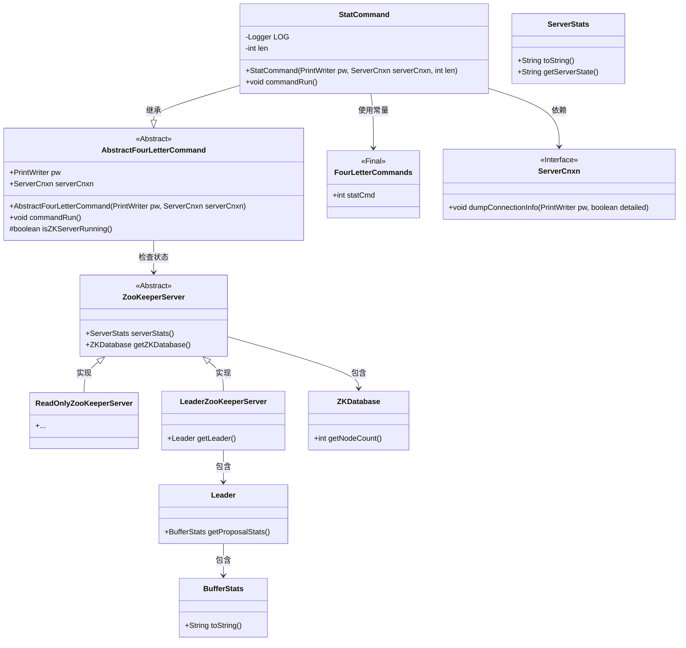
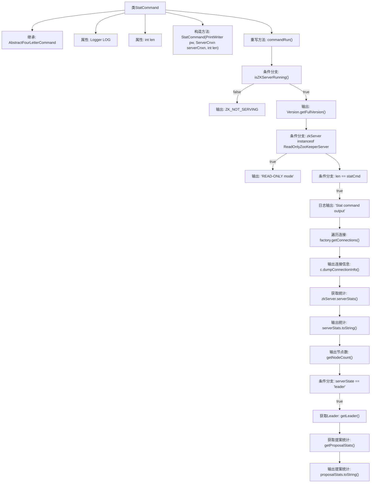

# 基础信息

|      |      |
|------|------|
| 名称 | StatCommand |
| 编码语言 | .java |
| 代码路径 | zookeeper/zookeeper-server/src/main/java/org/apache/zookeeper/server/command/StatCommand.java |
| 包名 | org.apache.zookeeper.server.command |
| 依赖项 | ['java.io.PrintWriter', 'org.apache.zookeeper.Version', 'org.apache.zookeeper.server.ServerCnxn', 'org.apache.zookeeper.server.ServerStats', 'org.apache.zookeeper.server.quorum.BufferStats', 'org.apache.zookeeper.server.quorum.Leader', 'org.apache.zookeeper.server.quorum.LeaderZooKeeperServer', 'org.apache.zookeeper.server.quorum.ReadOnlyZooKeeperServer', 'org.slf4j.Logger', 'org.slf4j.LoggerFactory'] |
| 概述说明 | StatCommand类继承AbstractFourLetterCommand，用于处理Zookeeper统计命令。检查服务状态后输出版本、连接信息、节点数和提案统计（若为Leader）。 |

# 说明

该代码定义了一个名为StatCommand的类，继承自AbstractFourLetterCommand，用于处理ZooKeeper服务器的统计信息查询命令。类中包含一个构造函数，接收输出流PrintWriter、服务器连接ServerCnxn和长度参数len。主要逻辑在commandRun方法中实现：首先检查服务器是否运行，未运行则输出提示信息；运行状态下会输出ZooKeeper版本号、运行模式（如只读模式）。当命令类型为statCmd时，会记录日志并输出所有客户端连接信息。随后输出服务器统计信息，包括节点数量。若服务器处于领导者状态，还会输出提案大小的统计信息（最近/最小/最大值）。整个过程通过PrintWriter输出结果，不返回任何数据。

# 类列表 Class Summary

| 名称   | 类型  | 说明 |
|-------|------|-------------|
| StatCommand | class | StatCommand类继承AbstractFourLetterCommand，用于处理Zookeeper统计命令。检查服务状态后输出版本、客户端连接、节点数和提案统计（若为Leader）。 |

## 类 StatCommand

|      |      |
|------|------|
| 访问范围 | public |
| 类型 | class |
| 名称 | StatCommand |
| 说明 | StatCommand类继承AbstractFourLetterCommand，用于处理Zookeeper统计命令。检查服务状态后输出版本、客户端连接、节点数和提案统计（若为Leader）。 |

### UML类图

这段代码展示了一个ZooKeeper统计命令(StatCommand)的实现，继承自抽象的四字母命令框架。类图清晰地呈现了核心类之间的层次关系和依赖：StatCommand通过继承扩展基础命令功能，同时与ZooKeeper服务器核心组件（如ServerStats、ZKDatabase）交互获取运行时状态。系统采用分层设计，抽象类定义基础行为，具体实现类处理只读/领导者模式下的差异化逻辑，并通过Logger记录操作日志，体现了良好的扩展性和状态处理能力。

### 内部方法调用关系图

该流程图描述了StatCommand类的核心逻辑流程。从继承关系开始，展示了构造方法和重写的commandRun()方法的主要执行路径。通过条件分支判断ZK服务器状态，分别处理未运行和运行中的情况。在运行状态下，依次输出版本信息、只读模式提示、客户端连接详情（当len匹配statCmd时）、服务器统计数据和节点数量。如果是Leader节点，还会输出提案统计信息。整个流程严格遵循代码逻辑，清晰展示了各步骤的调用关系和条件分支。

### 字段列表 Field List

| 名称  | 类型  | 说明 |
|-------|-------|------|
| len | int | 私有整型变量len。 |
| LOG = LoggerFactory.getLogger(AbstractFourLetterCommand.class) | Logger | 抽象类AbstractFourLetterCommand中定义了一个静态不可变日志对象LOG，用于记录日志信息。 |

### 方法列表 Method List

| 名称  | 类型  | 说明 |
|-------|-------|------|
| commandRun | void | 该方法检查ZooKeeper服务器状态，若未运行则输出提示；否则显示版本信息、运行模式（如只读）、客户端连接详情、服务器统计信息（包括节点数）。若为Leader节点，还会输出提案统计信息。 |

