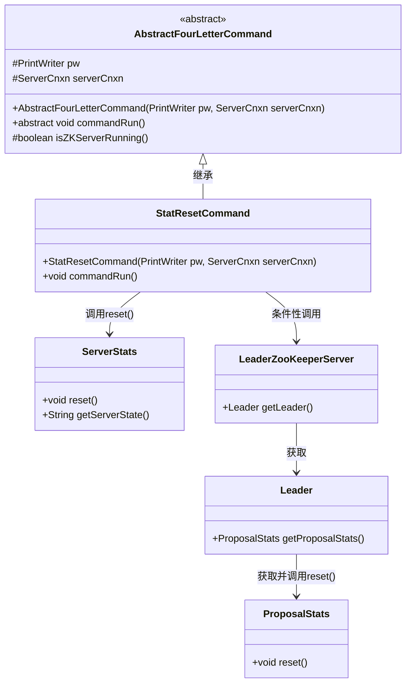
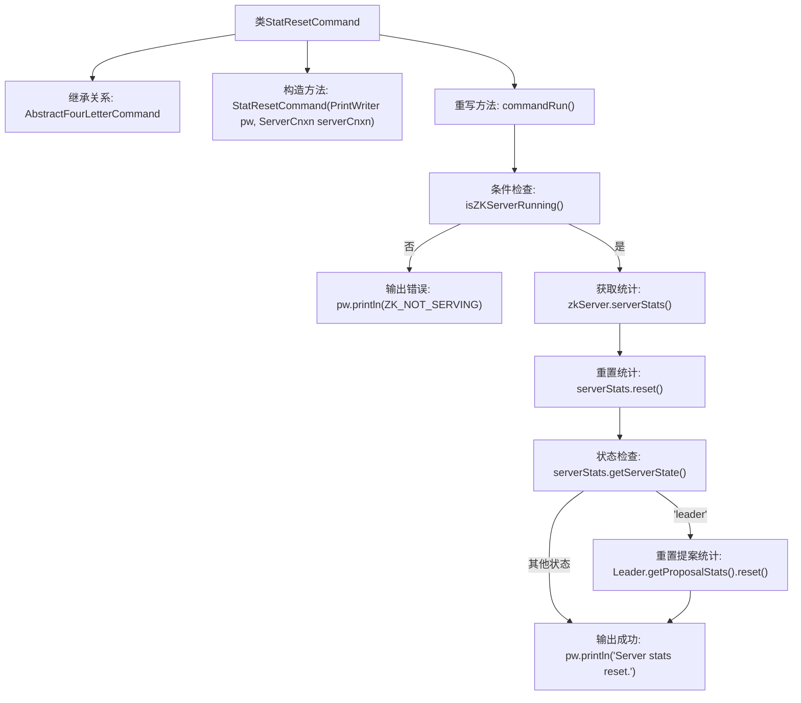

# 基础信息

|      |      |
|------|------|
| 名称 | StatResetCommand |
| 编码语言 | .java |
| 代码路径 | zookeeper/zookeeper-server/src/main/java/org/apache/zookeeper/server/command/StatResetCommand.java |
| 包名 | org.apache.zookeeper.server.command |
| 依赖项 | ['java.io.PrintWriter', 'org.apache.zookeeper.server.ServerCnxn', 'org.apache.zookeeper.server.ServerStats', 'org.apache.zookeeper.server.quorum.LeaderZooKeeperServer'] |
| 概述说明 | StatResetCommand继承AbstractFourLetterCommand，用于重置服务器统计信息。若非运行状态输出提示，否则重置统计，若为Leader节点则额外重置提案统计，最后输出重置成功信息。 |

# 说明

StatResetCommand是一个继承自AbstractFourLetterCommand的类，用于重置服务器统计信息。其构造函数接收PrintWriter和ServerCnxn参数。在commandRun方法中，首先检查ZooKeeper服务器是否运行，若未运行则输出ZK_NOT_SERVING。若服务器运行，则获取ServerStats实例并重置统计信息。若服务器状态为leader，还会重置leader的ProposalStats。最后输出"Server stats reset."表示操作完成。

# 类列表 Class Summary

| 名称   | 类型  | 说明 |
|-------|------|-------------|
| StatResetCommand | class | StatResetCommand类继承AbstractFourLetterCommand，用于重置ZooKeeper服务器统计信息。若服务器未运行则返回错误，否则重置统计，若为Leader节点还会重置提案统计。最后返回重置成功信息。 |

## 类 StatResetCommand

|      |      |
|------|------|
| 访问范围 | public |
| 类型 | class |
| 名称 | StatResetCommand |
| 说明 | StatResetCommand类继承AbstractFourLetterCommand，用于重置ZooKeeper服务器统计信息。若服务器未运行则返回错误，否则重置统计，若为Leader节点还会重置提案统计。最后返回重置成功信息。 |

### UML类图

该类图展示了StatResetCommand继承自AbstractFourLetterCommand，并实现了commandRun方法。该方法首先检查ZooKeeper服务器是否运行，若未运行则输出错误信息；否则重置服务器统计信息，若服务器为Leader状态还会额外重置提案统计。图中清晰呈现了类之间的继承关系、方法调用链和条件性交互逻辑，涉及ServerStats、LeaderZooKeeperServer、Leader和ProposalStats等多个组件的协作。

### 内部方法调用关系图

该流程图描述了StatResetCommand类的执行逻辑，主要展示了一个ZooKeeper服务器统计重置命令的处理流程。首先检查服务器是否运行，若未运行则输出错误信息；若运行则获取服务器统计对象并重置基础统计，若当前是Leader节点还会额外重置提案统计，最后输出重置成功信息。流程清晰展现了条件分支和不同角色（Leader/Follower）的处理差异。

### 字段列表 Field List

| 名称  | 类型  | 说明 |
|-------|-------|------|

### 方法列表 Method List

| 名称  | 类型  | 说明 |
|-------|-------|------|
| commandRun | void | 该方法检查ZK服务器是否运行，未运行则输出未服务信息；若运行则重置服务器统计信息，若为Leader节点还会重置提案统计，最后输出重置成功提示。 |

