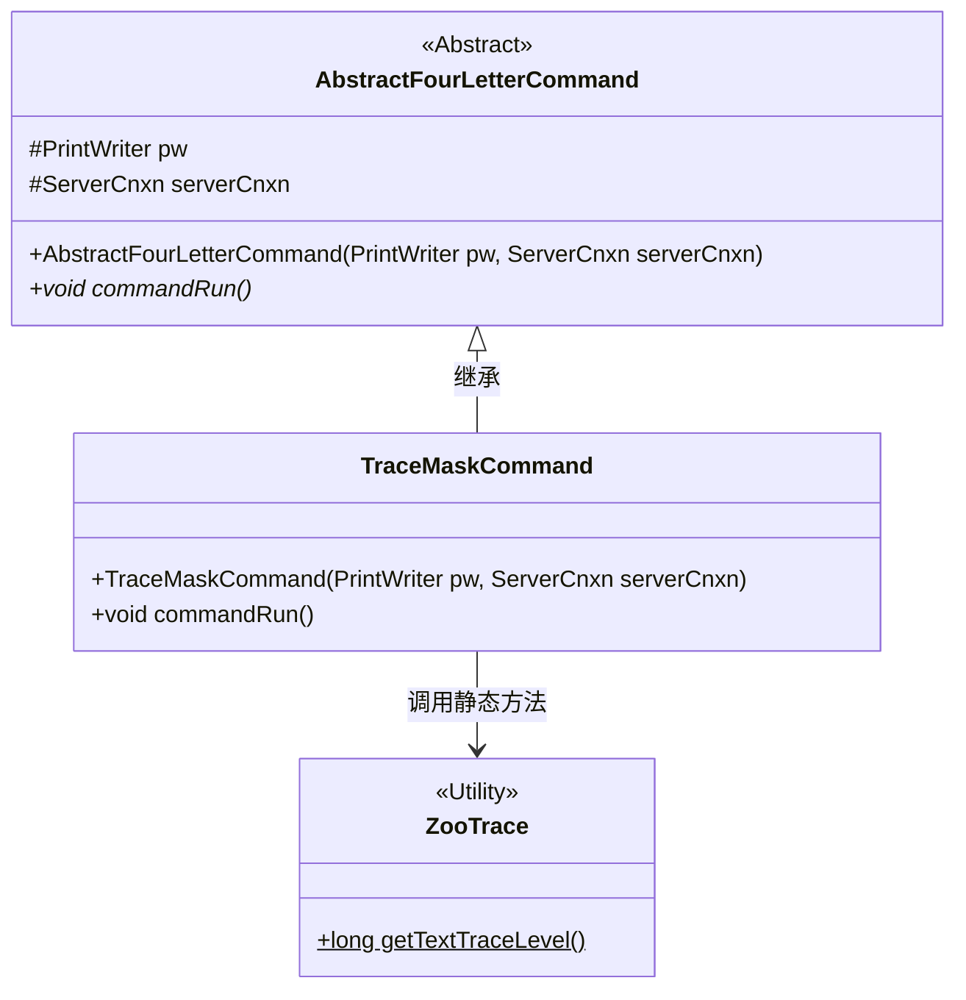
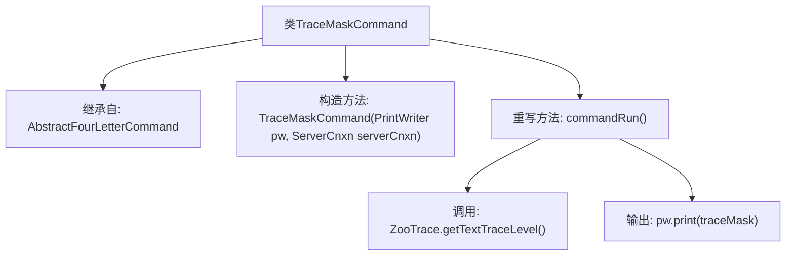

# 基础信息

|      |      |
|------|------|
| 名称 | TraceMaskCommand |
| 编码语言 | .java |
| 代码路径 | zookeeper/zookeeper-server/src/main/java/org/apache/zookeeper/server/command/TraceMaskCommand.java |
| 包名 | org.apache.zookeeper.server.command |
| 依赖项 | ['java.io.PrintWriter', 'org.apache.zookeeper.server.ServerCnxn', 'org.apache.zookeeper.server.ZooTrace'] |
| 概述说明 | TraceMaskCommand类继承AbstractFourLetterCommand，通过commandRun方法获取并输出ZooTrace的文本跟踪级别traceMask。 |

# 说明

这段内容描述了一个名为TraceMaskCommand的Java类，它继承自AbstractFourLetterCommand。该类包含一个构造函数，接收PrintWriter和ServerCnxn两个参数，并传递给父类构造函数。类中重写了commandRun方法，该方法通过调用ZooTrace.getTextTraceLevel获取traceMask值，并使用PrintWriter将其输出。整个类主要用于处理与跟踪掩码相关的命令操作。

# 类列表 Class Summary

| 名称   | 类型  | 说明 |
|-------|------|-------------|
| TraceMaskCommand | class | Java类TraceMaskCommand继承AbstractFourLetterCommand，通过commandRun方法获取并输出ZooTrace的文本跟踪级别。 |

## 类 TraceMaskCommand

|      |      |
|------|------|
| 访问范围 | public |
| 类型 | class |
| 名称 | TraceMaskCommand |
| 说明 | Java类TraceMaskCommand继承AbstractFourLetterCommand，通过commandRun方法获取并输出ZooTrace的文本跟踪级别。 |

### UML类图

这段类图展示了TraceMaskCommand继承自抽象类AbstractFourLetterCommand，并实现了其commandRun()方法。TraceMaskCommand通过调用ZooTrace工具类的静态方法getTextTraceLevel()获取跟踪掩码值并输出。该设计体现了命令模式的特点，通过继承实现具体命令逻辑，同时依赖工具类完成核心功能。抽象基类封装了公共字段和基础结构，派生类专注于特定命令的实现。

### 内部方法调用关系图

这段代码展示了一个继承自AbstractFourLetterCommand的TraceMaskCommand类，主要用于处理四字命令的跟踪掩码功能。流程图清晰地描述了类的继承关系、构造方法以及重写的commandRun()方法内部逻辑，其中commandRun()会获取ZooTrace的文本跟踪级别并通过PrintWriter输出结果。整个结构体现了命令模式的具体实现方式。

### 字段列表 Field List

| 名称  | 类型  | 说明 |
|-------|-------|------|

### 方法列表 Method List

| 名称  | 类型  | 说明 |
|-------|-------|------|
| commandRun | void | Java方法重写，打印ZooTrace的文本跟踪级别到输出流。 |

