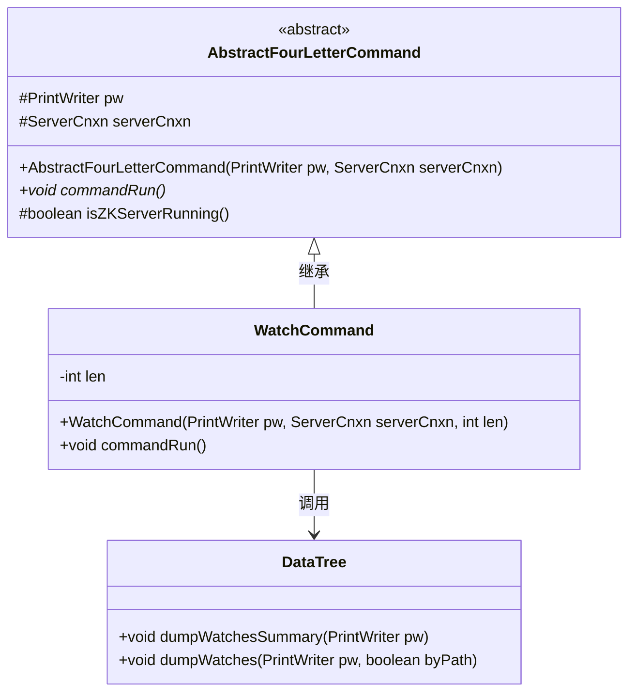
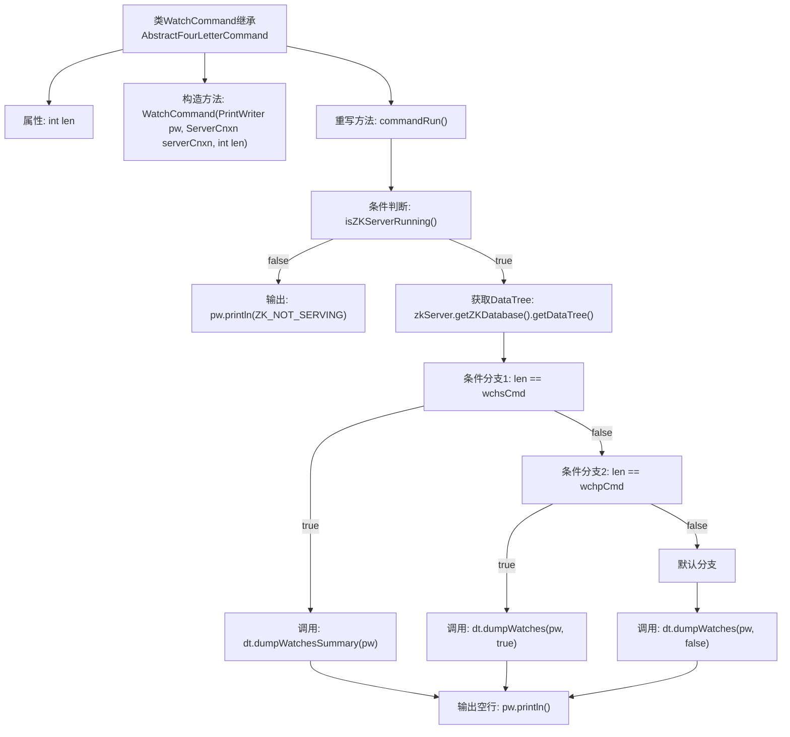

# 基础信息

|      |      |
|------|------|
| 名称 | WatchCommand |
| 编码语言 | .java |
| 代码路径 | zookeeper/zookeeper-server/src/main/java/org/apache/zookeeper/server/command/WatchCommand.java |
| 包名 | org.apache.zookeeper.server.command |
| 依赖项 | ['java.io.PrintWriter', 'org.apache.zookeeper.server.DataTree', 'org.apache.zookeeper.server.ServerCnxn'] |
| 概述说明 | WatchCommand继承AbstractFourLetterCommand，根据输入参数len执行不同操作：len为wchsCmd时输出监视摘要，为wchpCmd时输出详细监视信息，否则输出默认监视信息。若ZKServer未运行则提示错误。 |

# 说明

这段代码定义了一个名为WatchCommand的类，继承自AbstractFourLetterCommand。该类用于处理ZooKeeper服务器的监控命令，根据输入参数len的不同值执行不同的监控操作。构造函数接收PrintWriter、ServerCnxn和len参数。commandRun方法检查服务器是否运行，若未运行则输出提示信息；否则根据len值调用DataTree的不同方法输出监控信息：wchsCmd输出监控摘要，wchpCmd输出带路径的监控信息，否则输出不带路径的监控信息。最后输出空行。

# 类列表 Class Summary

| 名称   | 类型  | 说明 |
|-------|------|-------------|
| WatchCommand | class | WatchCommand继承AbstractFourLetterCommand，根据len执行不同watch操作：wchsCmd输出watch摘要，wchpCmd输出watch路径，否则输出watch详情。检查ZK服务状态后执行。 |

## 类 WatchCommand

|      |      |
|------|------|
| 访问范围 | public |
| 类型 | class |
| 名称 | WatchCommand |
| 说明 | WatchCommand继承AbstractFourLetterCommand，根据len执行不同watch操作：wchsCmd输出watch摘要，wchpCmd输出watch路径，否则输出watch详情。检查ZK服务状态后执行。 |

### UML类图

类图描述：该图展示了WatchCommand继承自抽象类AbstractFourLetterCommand的关系，其中WatchCommand通过构造器接收PrintWriter、ServerCnxn和长度参数len，并重写了commandRun方法。该方法根据len值决定调用DataTree的不同监控数据输出方法（dumpWatchesSummary或dumpWatches），体现了命令模式与策略选择的结合。DataTree类提供两种监控数据输出方式，分别按摘要或路径进行展示。

### 内部方法调用关系图

这段代码是ZooKeeper中用于监控命令的WatchCommand类实现。流程图展示了其核心逻辑：首先检查ZK服务器是否运行，若未运行则输出错误信息；若运行则根据len参数值选择不同的数据树监控信息输出方式（统计摘要/带路径详情/不带路径详情），最后统一输出空行。类继承结构和条件分支逻辑清晰展现了命令处理流程。

### 字段列表 Field List

| 名称  | 类型  | 说明 |
|-------|-------|------|
| len = 0 | int | 定义整型变量len并初始化为0。 |

### 方法列表 Method List

| 名称  | 类型  | 说明 |
|-------|-------|------|
| commandRun | void | 该代码重写commandRun方法，检查ZK服务器状态，若未运行输出提示，否则根据命令类型调用DataTree的不同方法输出监视信息。 |

