# 基础信息

|      |      |
|------|------|
| 名称 | command |
| 编码语言 | .java |
| 代码路径 | zookeeper/zookeeper-server/src/main/java/org/apache/zookeeper/server/command |
| 包名 | zookeeper.docs.zookeeper-server.src.main.java.org.apache.zookeeper.server.command |
| 概述说明 | Zookeeper四字母命令实现类集合，包括命令管理、执行器及多个具体命令类如状态查询、环境变量、监控等，通过抽象基类统一处理流程，支持白名单控制。 |

# 说明

## 概述  
1. 该模块是ZooKeeper的四字母命令管理系统，负责解析、验证和执行服务器管理命令。  
2. 主要接口为命令执行器（CommandExecutor）和抽象基类（AbstractFourLetterCommand），通过PrintWriter输出结果。  
3. 关键数据结构包括命令码映射表（cmd2String）和白名单机制，例如通过ZOOKEEPER_4LW_COMMANDS_WHITELIST控制命令权限。  
4. 依赖ZooKeeper核心组件（如ServerCnxn、ZooKeeperServer）和Java标准库（如Environment.list()）。  

## 主要业务场景  
1. 支持15种四字母命令（如stat、cons、dump），涵盖服务器状态查询、配置输出、统计重置等功能。  
2. 采用命令模式设计，类似文件系统的API，通过CommandExecutor分发请求到具体命令类执行。  
3. 功能完整，例如强制启用isro（只读检查）和srvr（服务器状态）命令，确保基础运维需求。  
4. 主要用于ZooKeeper集群监控和调试，例如通过EnvCommand输出环境变量，或MonitorCommand获取指标数据。  
5. 提供Java类级API，如AbstractFourLetterCommand派生类需实现commandRun方法。  
6. 第三方工具可通过TCP协议发送四字母命令（如"stat"）集成，类似Telnet交互模式。

### 包内部结构视图

```mermaid
graph TD
    command --> FourLetterCommands.java
    command --> CommandExecutor.java
    command --> SetTraceMaskCommand.java
    command --> EnvCommand.java
    command --> StatResetCommand.java
    command --> StatCommand.java
    command --> NopCommand.java
    command --> DigestCommand.java
    command --> ConsCommand.java
    command --> TraceMaskCommand.java
    command --> AbstractFourLetterCommand.java
    command --> DumpCommand.java
    command --> DirsCommand.java
    command --> MonitorCommand.java
    command --> IsroCommand.java
    command --> RuokCommand.java
    command --> CnxnStatResetCommand.java
    command --> WatchCommand.java
    command --> ConfCommand.java
```

该流程图展示了Zookeeper服务器命令模块的文件结构，所有命令类文件都直接隶属于command目录。这些命令类包括FourLetterCommands、CommandExecutor等20个具体实现，用于处理不同的服务器命令操作，如状态监控(StatCommand)、环境查询(EnvCommand)和跟踪设置(TraceMaskCommand)等。

# 文件列表 File List

| 名称   | 类型  | 说明 |
|-------|------|-------------|
| [NopCommand.java](NopCommand.md) | file | NopCommand类继承AbstractFourLetterCommand，通过构造函数接收参数并存储msg，执行时输出msg内容。 |
| [StatCommand.java](StatCommand.md) | file | StatCommand类继承AbstractFourLetterCommand，用于处理Zookeeper统计命令。检查服务状态后输出版本、连接信息、节点数和提案统计（若为Leader）。 |
| [StatResetCommand.java](StatResetCommand.md) | file | StatResetCommand继承AbstractFourLetterCommand，用于重置服务器统计信息。若非运行状态输出提示，否则重置统计，若为Leader节点则额外重置提案统计，最后输出重置成功信息。 |
| [EnvCommand.java](EnvCommand.md) | file | EnvCommand类继承AbstractFourLetterCommand，用于打印环境变量列表。构造函数接收PrintWriter和ServerCnxn。commandRun方法遍历环境变量并输出键值对。 |
| [SetTraceMaskCommand.java](SetTraceMaskCommand.md) | file | SetTraceMaskCommand类继承AbstractFourLetterCommand，通过构造函数接收trace值并在commandRun方法中输出该值。 |
| [CommandExecutor.java](CommandExecutor.md) | file | CommandExecutor类根据命令码选择并执行对应的四字母命令，如ruok、stat等，设置相关参数后启动命令执行。 |
| [FourLetterCommands.java](FourLetterCommands.md) | file | FourLetterCommands类定义了Zookeeper的四字母命令常量，提供命令字符串转换、已知命令检查和启用状态检查功能，支持白名单配置。 |
| [DirsCommand.java](DirsCommand.md) | file | DirsCommand类继承AbstractFourLetterCommand，检查ZK服务状态并输出数据目录和日志目录大小。 |
| [DumpCommand.java](DumpCommand.md) | file | DumpCommand类继承AbstractFourLetterCommand，用于检查ZK服务器状态并输出会话、临时节点和连接信息。 |
| [AbstractFourLetterCommand.java](AbstractFourLetterCommand.md) | file | 抽象类AbstractFourLetterCommand定义了ZooKeeper四字命令的基本结构，包含运行命令、服务器状态检查及资源清理功能，需子类实现具体命令逻辑。 |
| [TraceMaskCommand.java](TraceMaskCommand.md) | file | TraceMaskCommand类继承AbstractFourLetterCommand，通过commandRun方法获取并输出ZooTrace的文本跟踪级别traceMask。 |
| [ConsCommand.java](ConsCommand.md) | file | ConsCommand继承AbstractFourLetterCommand，检查ZK服务状态并输出连接信息。 |
| [DigestCommand.java](DigestCommand.md) | file | DigestCommand继承AbstractFourLetterCommand，检查ZK服务状态，若运行则输出数据树摘要日志（zxid和digest），否则提示未运行。 |
| [CnxnStatResetCommand.java](CnxnStatResetCommand.md) | file | CnxnStatResetCommand类继承AbstractFourLetterCommand，用于重置ZooKeeper服务器连接统计。若服务器未运行则输出错误，否则重置并提示成功。 |
| [RuokCommand.java](RuokCommand.md) | file | RuokCommand类继承AbstractFourLetterCommand，执行时输出"imok"。 |
| [IsroCommand.java](IsroCommand.md) | file | IsroCommand类继承AbstractFourLetterCommand，检查ZKServer运行状态并输出ro（只读）、rw（读写）或null（未运行）。 |
| [ConfCommand.java](ConfCommand.md) | file | Java类ConfCommand继承AbstractFourLetterCommand，检查ZK服务状态并输出配置信息。 |
| [WatchCommand.java](WatchCommand.md) | file | WatchCommand继承AbstractFourLetterCommand，根据输入参数len执行不同操作：len为wchsCmd时输出监视摘要，为wchpCmd时输出详细监视信息，否则输出默认监视信息。若ZKServer未运行则提示错误。 |
| [MonitorCommand.java](MonitorCommand.md) | file | MonitorCommand类继承AbstractFourLetterCommand，用于监控ZK服务器状态。检查服务器运行后，输出监控指标和非指标数据，格式化数值并打印。 |

