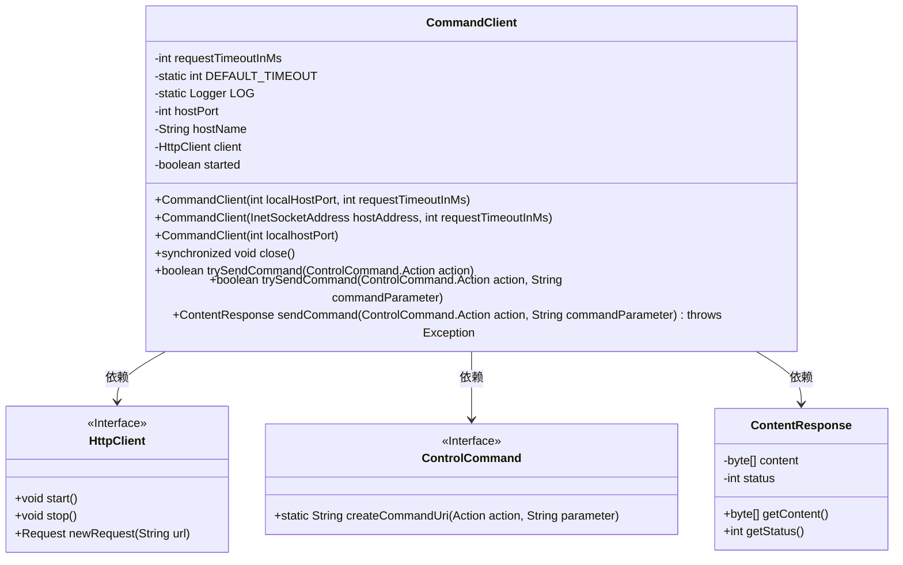
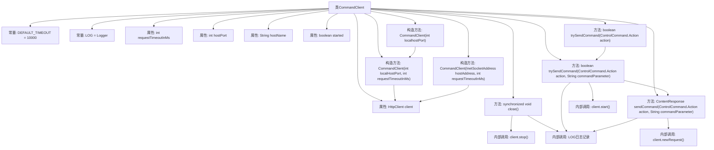
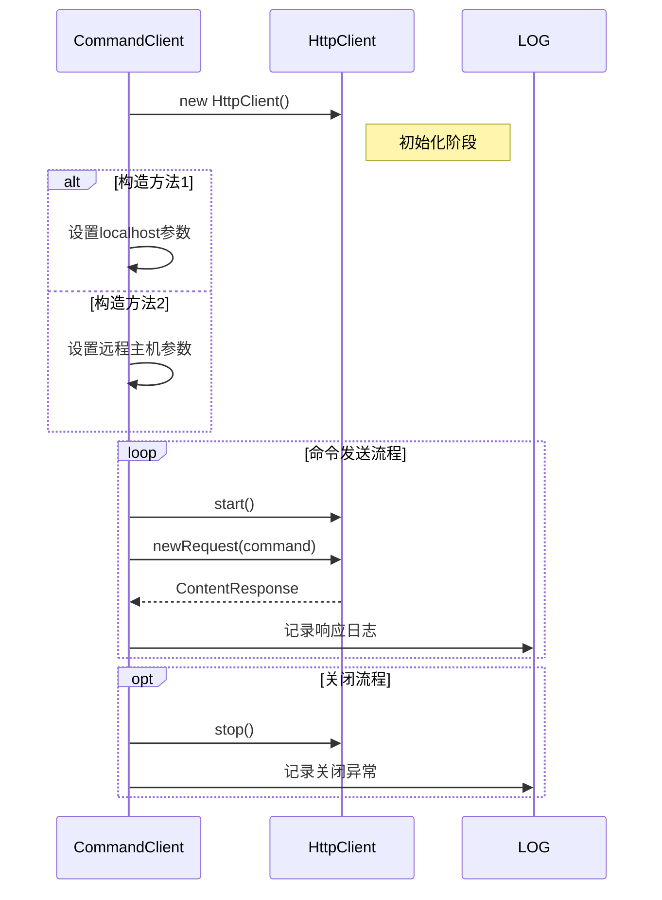

# 基础信息

|      |      |
|------|------|
| 名称 | CommandClient |
| 编码语言 | .java |
| 代码路径 | zookeeper/zookeeper-server/src/main/java/org/apache/zookeeper/server/controller/CommandClient.java |
| 包名 | org.apache.zookeeper.server.controller |
| 依赖项 | ['java.io.IOException', 'java.net.InetSocketAddress', 'java.nio.charset.StandardCharsets', 'java.util.concurrent.TimeUnit', 'org.eclipse.jetty.client.HttpClient', 'org.eclipse.jetty.client.api.ContentResponse', 'org.slf4j.Logger', 'org.slf4j.LoggerFactory'] |
| 概述说明 | CommandClient类用于发送HTTP命令到指定主机和端口，支持同步请求和超时设置，提供发送带参数命令和关闭连接的方法，默认超时10秒。 |

# 说明

CommandClient是一个用于向服务器发送命令并接收响应的客户端类。它包含两个构造函数，分别用于本地主机和指定主机地址的配置，支持设置请求超时时间。类中维护了主机名、端口号、HttpClient实例及启动状态等属性。提供了关闭客户端的方法，确保资源释放。核心功能包括发送无参数命令和带参数命令，支持同步请求并返回响应状态。通过HttpClient发送HTTP请求，处理200状态码为成功，记录日志并捕获异常。所有操作均线程安全，且包含详细的日志记录机制。

# 类列表 Class Summary

| 名称   | 类型  | 说明 |
|-------|------|-------------|
| CommandClient | class | CommandClient类用于发送HTTP命令到服务器，支持自定义超时和主机地址，提供同步请求和响应处理功能，包含启动、关闭及命令发送方法。 |

## 类 CommandClient

|      |      |
|------|------|
| 访问范围 | public |
| 类型 | class |
| 名称 | CommandClient |
| 说明 | CommandClient类用于发送HTTP命令到服务器，支持自定义超时和主机地址，提供同步请求和响应处理功能，包含启动、关闭及命令发送方法。 |

### UML类图

这段代码描述了一个`CommandClient`类，用于通过HTTP协议向服务器发送控制命令并接收响应。该类包含三个构造函数，分别支持不同参数配置，核心方法`trySendCommand`和`sendCommand`实现命令发送与响应处理，依赖`HttpClient`执行网络请求，使用`ControlCommand`构建命令URI，并通过`ContentResponse`封装响应数据。私有字段记录主机地址、端口、超时时间和客户端状态，日志系统记录操作过程。

### 内部方法调用关系图

该流程图展示了CommandClient类的完整结构，包含3个构造方法、4个核心方法和内部HttpClient的交互过程。时序图重点描述了命令发送的完整生命周期：从初始化HttpClient、构造请求命令、发送请求获取响应到最后的资源释放。类设计采用线程安全的同步关闭机制，并通过多态构造方法支持本地和远程两种连接模式，所有网络操作都带有超时控制和详尽的日志记录。

### 字段列表 Field List

| 名称  | 类型  | 说明 |
|-------|-------|------|
| hostPort | int | 私有整型变量hostPort，不可修改。 |
| started = false | boolean | 变量started初始值为false，表示未启动状态。 |
| DEFAULT_TIMEOUT = 10000 | int | 定义私有静态常量DEFAULT_TIMEOUT，默认超时时间为10000毫秒。 |
| LOG = LoggerFactory.getLogger(CommandClient.class) | Logger | 定义CommandClient类的私有静态日志对象LOG。 |
| hostName | String | 私有字符串变量hostName，用于存储主机名。 |
| requestTimeoutInMs | int | 私有整型变量，表示请求超时时间（毫秒）。 |
| client | HttpClient | 私有HttpClient客户端实例。 |

### 方法列表 Method List

| 名称  | 类型  | 说明 |
|-------|-------|------|
| close | void | 同步关闭方法，检查并停止客户端，异常时记录警告日志。 |
| trySendCommand | boolean | 方法trySendCommand尝试发送控制命令，参数为action，无附加数据，返回布尔值表示成功与否。 |
| trySendCommand | boolean | 方法trySendCommand尝试发送控制命令，若未启动则先启动客户端。成功返回服务器响应状态为200则返回true，失败或异常则记录日志并返回false。 |
| sendCommand | ContentResponse | 方法sendCommand发送HTTP请求到指定主机和端口，执行控制命令并返回响应内容。包含超时设置和日志记录。 |

