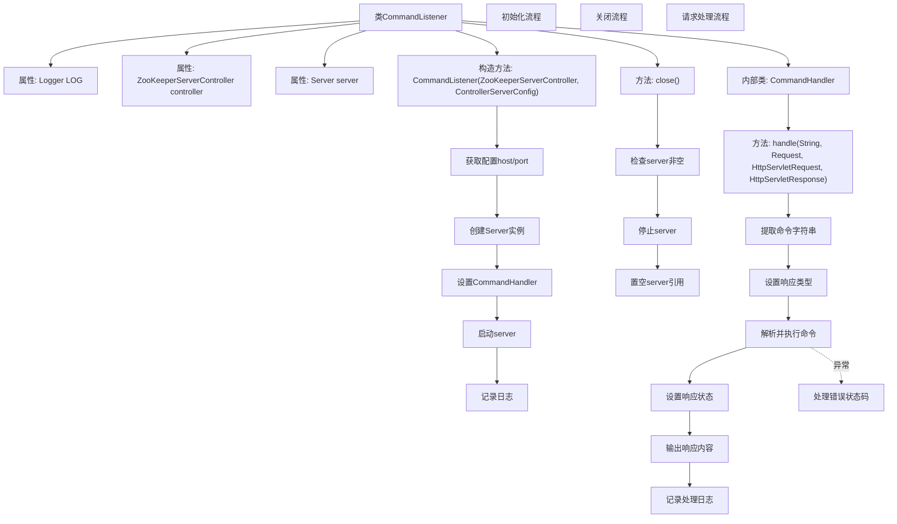

# 基础信息

|      |      |
|------|------|
| 名称 | CommandListener |
| 编码语言 | .java |
| 代码路径 | zookeeper/zookeeper-server/src/main/java/org/apache/zookeeper/server/controller/CommandListener.java |
| 包名 | org.apache.zookeeper.server.controller |
| 依赖项 | ['java.io.IOException', 'javax.servlet.http.HttpServletRequest', 'javax.servlet.http.HttpServletResponse', 'org.apache.zookeeper.server.ExitCode', 'org.apache.zookeeper.util.ServiceUtils', 'org.eclipse.jetty.server.Request', 'org.eclipse.jetty.server.Server', 'org.eclipse.jetty.server.handler.AbstractHandler', 'org.slf4j.Logger', 'org.slf4j.LoggerFactory'] |
| 概述说明 | CommandListener类监听命令请求，初始化服务器并处理HTTP请求。通过CommandHandler解析执行命令，记录日志并返回响应状态码。异常时记录错误并退出系统。提供关闭方法停止服务器。 |

# 说明

CommandListener类是一个用于监听和处理命令的服务器组件。它接收ZooKeeperServerController和配置参数，初始化服务器并设置处理器CommandHandler。服务器启动时记录主机和端口信息，失败时触发系统退出。close方法用于停止服务器。CommandHandler继承AbstractHandler，处理HTTP请求，从路径提取命令字符串，解析为ControlCommand后交由controller处理。成功返回200状态码，参数错误返回400，异常时记录错误日志并抛出。处理结果会记录命令字符串和响应码。

# 类列表 Class Summary

| 名称   | 类型  | 说明 |
|-------|------|-------------|
| CommandListener | class | CommandListener类监听命令请求，初始化服务器并处理HTTP请求，解析命令后交由controller处理，记录日志并返回响应状态码。 |


## 类 CommandListener

|      |      |
|------|------|
| 访问范围 | public |
| 类型 | class |
| 名称 | CommandListener |
| 说明 | CommandListener类监听命令请求，初始化服务器并处理HTTP请求，解析命令后交由controller处理，记录日志并返回响应状态码。 |


### UML类图

```mermaid
classDiagram
    class CommandListener {
        -Logger LOG
        -ZooKeeperServerController controller
        -Server server
        +CommandListener(ZooKeeperServerController controller, ControllerServerConfig config)
        +void close()
        -class CommandHandler {
            +void handle(String target, Request baseRequest, HttpServletRequest request, HttpServletResponse response)
        }
    }

    class ZooKeeperServerController {
        // 控制器类，处理命令
    }

    class ControllerServerConfig {
        +ControllerAddress getControllerAddress()
    }

    class ControllerAddress {
        +String getHostName()
        +int getPort()
    }

    class Server {
        +Server(int port)
        +void setHandler(AbstractHandler handler)
        +void start()
        +void stop()
    }

    class AbstractHandler {
        <<Interface>>
        +void handle(String target, Request baseRequest, HttpServletRequest request, HttpServletResponse response)
    }

    CommandListener --> ZooKeeperServerController : 依赖
    CommandListener --> ControllerServerConfig : 依赖
    CommandListener --> Server : 依赖
    CommandListener ..|> AbstractHandler : 实现(内部类)
    ControllerServerConfig --> ControllerAddress : 包含
    Server --> AbstractHandler : 使用
```

这段代码描述了一个命令监听器系统，CommandListener通过Server监听特定端口，使用内部类CommandHandler处理HTTP请求。当收到控制命令时，交由ZooKeeperServerController处理，并返回响应状态码。类图展示了核心组件间的依赖关系，包括配置管理、网络通信和命令处理流程，体现了分层设计和异常处理机制。


### 内部方法调用关系图



这段代码实现了一个基于Jetty的HTTP命令监听服务，主要包含三个核心流程：1) 初始化时创建Server并绑定处理器；2) 关闭时安全停止服务；3) 处理HTTP请求时解析命令并转发给控制器。流程图展示了类结构关系和执行路径，特别突出了异常处理分支和关键日志记录点，体现了完善的错误处理机制。内部类CommandHandler通过继承AbstractHandler实现了具体的HTTP请求处理逻辑，与主类形成清晰的层级调用关系。

### 字段列表 Field List

| 名称  | 类型  | 说明 |
|-------|-------|------|
| LOG = LoggerFactory.getLogger(CommandListener.class) | Logger | 私有静态日志常量LOG，用于CommandListener类的日志记录。 |
| controller | ZooKeeperServerController | 私有ZooKeeper服务器控制器实例。 |
| server | Server | 私有服务器实例变量。 |

### 方法列表 Method List

| 名称  | 类型  | 说明 |
|-------|-------|------|
| close | void | 该方法关闭服务器，若存在则停止并置空，异常时记录警告日志。 |


