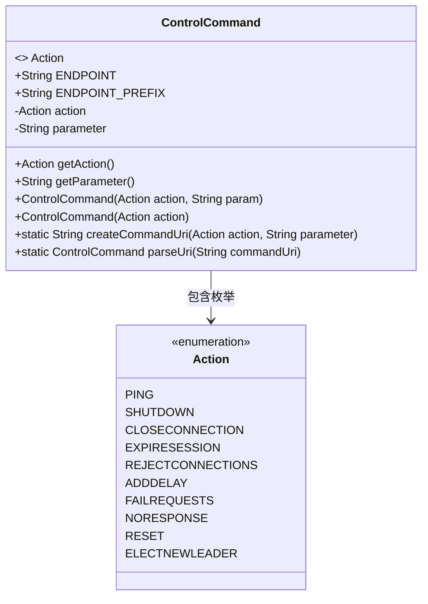
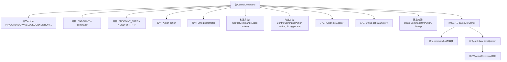

# 基础信息

|      |      |
|------|------|
| 名称 | ControlCommand |
| 编码语言 | .java |
| 代码路径 | zookeeper/zookeeper-server/src/main/java/org/apache/zookeeper/server/controller/ControlCommand.java |
| 包名 | org.apache.zookeeper.server.controller |
| 依赖项 | [] |
| 概述说明 | ControlCommand类定义控制器操作枚举（如PING、SHUTDOWN等），提供创建和解析REST命令URI的方法，支持带参数操作。 |

# 说明

ControlCommand类定义了控制器可执行的操作枚举Action，包含PING、SHUTDOWN、CLOSECONNECTION等12种指令，部分支持可选参数。类中包含端点常量ENDPOINT和ENDPOINT_PREFIX，以及action和parameter字段及其getter方法。提供了两种构造函数，支持带参数和不带参数创建命令。包含两个静态方法：createCommandUri用于生成符合格式的URI字符串，parseUri用于解析URI并返回对应的ControlCommand对象。URI格式要求以command/开头，后接动作名称和可选参数。解析时会对格式进行校验，并转换大小写确保枚举匹配。

# 类列表 Class Summary

| 名称   | 类型  | 说明 |
|-------|------|-------------|
| ControlCommand | class | ControlCommand类定义控制器动作枚举（如PING、SHUTDOWN等），提供创建和解析REST命令URI的方法，支持带参数操作。 |

## 类 ControlCommand

|      |      |
|------|------|
| 访问范围 | public |
| 类型 | class |
| 名称 | ControlCommand |
| 说明 | ControlCommand类定义控制器动作枚举（如PING、SHUTDOWN等），提供创建和解析REST命令URI的方法，支持带参数操作。 |

### UML类图

这段代码定义了一个`ControlCommand`类，用于处理控制器命令的创建和解析。类中包含一个`Action`枚举，定义了多种控制器可执行的操作类型（如PING、SHUTDOWN等）。主要功能包括通过`createCommandUri`方法生成REST命令URI，以及通过`parseUri`方法解析URI为命令对象。类设计采用枚举模式定义固定操作集，并通过静态方法提供URI处理能力，适合用于远程控制场景。

### 内部方法调用关系图

这段代码定义了一个ControlCommand类，主要用于处理控制命令的创建和解析。核心功能包括：1) 通过枚举定义多种控制动作(Action)；2) 提供构造方法初始化命令动作和参数；3) 实现URI生成方法(createCommandUri)将命令转换为可发送的字符串；4) 实现URI解析方法(parseUri)将接收到的字符串还原为命令对象。流程图清晰展示了类结构、属性、方法以及parseUri方法内部的验证和解析流程，体现了命令模式的设计思想。

### 字段列表 Field List

| 名称  | 类型  | 说明 |
|-------|-------|------|
| parameter | String | 私有字符串变量parameter。 |
| action | Action | 私有动作类型变量action。 |
| ENDPOINT_PREFIX = ENDPOINT + "/" | String | 定义静态常量字符串ENDPOINT_PREFIX，值为ENDPOINT加上斜杠。 |
| ENDPOINT = "command" | String | 定义静态常量ENDPOINT，值为"command"。 |

### 方法列表 Method List

| 名称  | 类型  | 说明 |
|-------|-------|------|
| getAction | Action | 这是一个Java方法，返回名为action的变量。方法名为getAction，可见性为public。 |
| parseUri | ControlCommand | 解析URI生成控制命令：检查非空和前缀，提取名称和参数，返回对应操作和参数的对象。 |
| getParameter | String | 这是一个Java方法，返回字符串类型的成员变量parameter的值。 |
| createCommandUri | String | 这是一个静态方法，用于生成命令URI。方法接收动作和参数，拼接端点前缀、动作字符串和可选参数（非空时加斜杠），返回完整URI。 |

