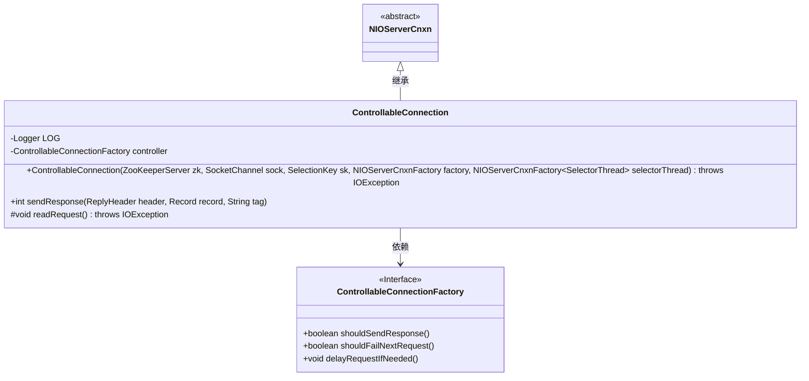
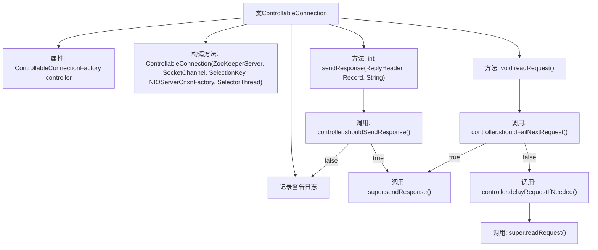

# 基础信息

|      |      |
|------|------|
| 名称 | ControllableConnection |
| 编码语言 | .java |
| 代码路径 | zookeeper/zookeeper-server/src/main/java/org/apache/zookeeper/server/controller/ControllableConnection.java |
| 包名 | org.apache.zookeeper.server.controller |
| 依赖项 | ['edu.umd.cs.findbugs.annotations.SuppressFBWarnings', 'java.io.IOException', 'java.nio.ByteBuffer', 'java.nio.channels.SelectionKey', 'java.nio.channels.SocketChannel', 'org.apache.jute.BinaryInputArchive', 'org.apache.jute.Record', 'org.apache.zookeeper.KeeperException', 'org.apache.zookeeper.proto.ReplyHeader', 'org.apache.zookeeper.proto.RequestHeader', 'org.apache.zookeeper.server.ByteBufferInputStream', 'org.apache.zookeeper.server.NIOServerCnxn', 'org.apache.zookeeper.server.NIOServerCnxnFactory', 'org.apache.zookeeper.server.ZooKeeperServer', 'org.slf4j.Logger', 'org.slf4j.LoggerFactory'] |
| 概述说明 | ControllableConnection继承NIOServerCnxn，通过ControllableConnectionFactory控制响应发送和请求处理，可配置是否发送响应、延迟请求或模拟失败。 |

# 说明

这段代码描述了一个名为ControllableConnection的类，它继承自NIOServerCnxn。该类通过ControllableConnectionFactory控制器管理连接行为，主要功能包括有条件地发送响应和读取请求。在发送响应时，会检查控制器是否允许发送，否则记录警告。读取请求时，若控制器设置为失败，则返回错误响应；否则可能延迟请求或正常处理。代码包含异常处理和日志记录，用于调试和错误追踪。

# 类列表 Class Summary

| 名称   | 类型  | 说明 |
|-------|------|-------------|
| ControllableConnection | class | ControllableConnection继承NIOServerCnxn，通过ControllableConnectionFactory控制响应发送和请求处理。可配置是否发送响应、模拟请求失败或延迟请求。 |

## 类 ControllableConnection

|      |      |
|------|------|
| 访问范围 | @SuppressFBWarnings(value = "BC_UNCONFIRMED_CAST", justification = "factory is ControllableConnectionFactory type.");public |
| 类型 | class |
| 名称 | ControllableConnection |
| 说明 | ControllableConnection继承NIOServerCnxn，通过ControllableConnectionFactory控制响应发送和请求处理。可配置是否发送响应、模拟请求失败或延迟请求。 |

### UML类图

这段代码展示了一个可控制的网络连接类`ControllableConnection`，它继承自`NIOServerCnxn`并实现了响应控制和请求处理逻辑。该类通过`ControllableConnectionFactory`接口来控制是否发送响应、是否使下一个请求失败以及是否需要延迟请求。类图中清晰地展示了继承关系和依赖关系，其中`ControllableConnection`依赖于接口`ControllableConnectionFactory`来获取控制策略，同时重写了父类的`sendResponse`和`readRequest`方法以实现特定的控制逻辑。

### 内部方法调用关系图

这段代码是ZooKeeper中一个可控连接的实现，继承自NIOServerCnxn。主要功能包括：1) 通过工厂模式控制连接行为；2) 可配置是否发送响应给客户端；3) 可模拟请求失败场景；4) 支持延迟请求处理。核心逻辑在sendResponse和readRequest方法中，通过controller对象动态决定是否发送响应或使请求失败，体现了灵活的网络控制能力。

### 字段列表 Field List

| 名称  | 类型  | 说明 |
|-------|-------|------|
| LOG = LoggerFactory.getLogger(ControllableConnection.class) | Logger | 定义私有静态日志常量LOG，用于ControllableConnection类的日志记录。 |
| controller | ControllableConnectionFactory | 私有不可变的可控连接工厂控制器实例。 |

### 方法列表 Method List

| 名称  | 类型  | 说明 |
|-------|-------|------|
| sendResponse | int | 重写sendResponse方法，根据controller配置决定是否发送响应。若发送失败记录IO异常日志，未发送则记录警告日志，默认返回-1。 |
| readRequest | void | 方法重写readRequest，根据控制器决定是否失败请求：若失败则返回错误响应，否则延迟处理并调用父类方法。 |

