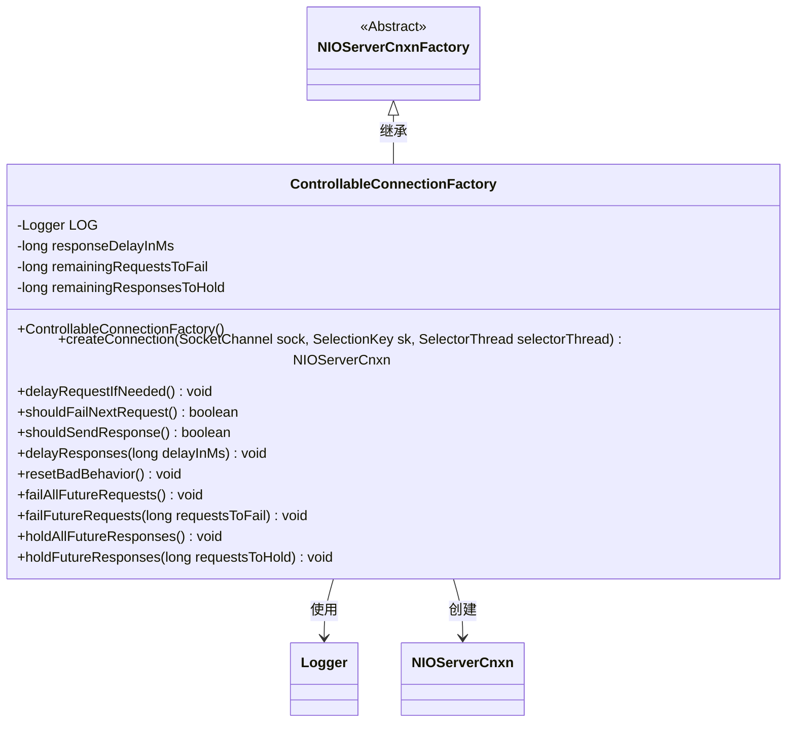

# 基础信息

|      |      |
|------|------|
| 名称 | ControllableConnectionFactory |
| 编码语言 | .java |
| 代码路径 | zookeeper/zookeeper-server/src/main/java/org/apache/zookeeper/server/controller/ControllableConnectionFactory.java |
| 包名 | org.apache.zookeeper.server.controller |
| 依赖项 | ['edu.umd.cs.findbugs.annotations.SuppressFBWarnings', 'java.io.IOException', 'java.nio.channels.SelectionKey', 'java.nio.channels.SocketChannel', 'org.apache.zookeeper.server.NIOServerCnxn', 'org.apache.zookeeper.server.NIOServerCnxnFactory', 'org.slf4j.Logger', 'org.slf4j.LoggerFactory'] |
| 概述说明 | ControllableConnectionFactory扩展NIOServerCnxnFactory，提供延迟请求、失败请求和保留响应的控制功能，通过同步方法管理状态变量。 |

# 说明

ControllableConnectionFactory是一个扩展自NIOServerCnxnFactory的类，用于控制客户端连接行为。它包含三个主要状态变量：responseDelayInMs控制请求处理延迟时间，remainingRequestsToFail控制待失败请求数量，remainingResponsesToHold控制待保留响应数量。类提供了同步方法来延迟请求处理、检查是否应失败请求、检查是否应发送响应，以及设置和重置这些行为状态。通过方法可配置延迟响应时间、失败所有或指定数量请求、保留所有或指定数量响应。resetBadBehavior方法可重置所有异常行为状态。该类主要用于测试场景模拟网络异常情况。

# 类列表 Class Summary

| 名称   | 类型  | 说明 |
|-------|------|-------------|
| ControllableConnectionFactory | class | ControllableConnectionFactory类扩展NIOServerCnxnFactory，提供延迟请求、失败请求和保留响应的控制功能，用于测试客户端行为。 |

## 类 ControllableConnectionFactory

|      |      |
|------|------|
| 访问范围 | @SuppressFBWarnings(value = "SWL_SLEEP_WITH_LOCK_HELD", justification = "no dead lock");public |
| 类型 | class |
| 名称 | ControllableConnectionFactory |
| 说明 | ControllableConnectionFactory类扩展NIOServerCnxnFactory，提供延迟请求、失败请求和保留响应的控制功能，用于测试客户端行为。 |

### UML类图

这段代码展示了一个可控制的连接工厂类`ControllableConnectionFactory`，它继承自`NIOServerCnxnFactory`，主要用于管理网络连接的延迟、失败和响应控制。该类通过同步方法实现线程安全，包含延迟请求处理、失败请求计数、响应保持等功能，适用于需要模拟网络异常或延迟的测试场景。类图清晰地展示了继承关系和关键方法，体现了对网络连接行为的精细控制能力。

### 内部方法调用关系图

```mermaid
graph TD
    A["类ControllableConnectionFactory"]
    B["属性: Logger LOG"]
    C["属性: long responseDelayInMs"]
    D["属性: long remainingRequestsToFail"]
    E["属性: long remainingResponsesToHold"]
    F["构造方法: ControllableConnectionFactory()"]
    G["重写方法: createConnection(SocketChannel, SelectionKey, SelectorThread)"]
    H["同步方法: delayRequestIfNeeded()"]
    I["同步方法: shouldFailNextRequest()"]
    J["同步方法: shouldSendResponse()"]
    K["同步方法: delayResponses(long)"]
    L["同步方法: resetBadBehavior()"]
    M["同步方法: failAllFutureRequests()"]
    N["同步方法: failFutureRequests(long)"]
    O["同步方法: holdAllFutureResponses()"]
    P["同步方法: holdFutureResponses(long)"]

    A --> B
    A --> C
    A --> D
    A --> E
    A --> F
    A --> G
    A --> H
    A --> I
    A --> J
    A --> K
    A --> L
    A --> M
    A --> N
    A --> O
    A --> P
```

该流程图展示了ControllableConnectionFactory类的完整结构，包括4个私有属性、1个构造方法和9个同步控制方法。核心功能围绕请求延迟(responseDelayInMs)、请求失败控制(remainingRequestsToFail)和响应保持控制(remainingResponsesToHold)三个状态变量展开，所有方法都通过synchronized实现线程安全。其中createConnection方法重写了父类实现，其他方法如delayRequestIfNeeded、shouldFailNextRequest等提供了对网络连接行为的精确控制能力，可用于模拟网络异常场景的测试。

### 字段列表 Field List

| 名称  | 类型  | 说明 |
|-------|-------|------|
| remainingResponsesToHold = 0 | long | 剩余待处理响应数初始化为0。 |
| responseDelayInMs = 0 | long | 定义长整型变量responseDelayInMs，初始值为0，用于存储响应延迟时间（毫秒）。 |
| LOG = LoggerFactory.getLogger(ControllableConnectionFactory.class) | Logger | 声明一个名为LOG的私有静态常量日志记录器，用于ControllableConnectionFactory类的日志输出。 |
| remainingRequestsToFail = 0 | long | 剩余失败请求计数变量，初始值为0。 |

### 方法列表 Method List

| 名称  | 类型  | 说明 |
|-------|-------|------|
| holdFutureResponses | void | 同步方法holdFutureResponses设置剩余响应保持数，参数为requestsToHold。 |
| createConnection | NIOServerCnxn | 重写方法创建ControllableConnection实例，传入ZK服务器、Socket通道、选择键和选择器线程。 |
| holdAllFutureResponses | void | 方法holdAllFutureResponses设置remainingResponsesToHold为-1，表示阻止所有未来响应。 |
| delayResponses | void | 同步方法delayResponses设置响应延迟时间，参数delayInMs需非负，否则抛出异常。 |
| shouldFailNextRequest | boolean | 同步方法判断是否应使下一次请求失败：剩余失败次数为0返回false；大于0则减1并返回true；小于0始终返回true。 |
| shouldSendResponse | boolean | 同步方法判断是否发送响应：剩余响应数为0时返回true；大于0时减1并返回false；负数表示全部保留。 |
| delayRequestIfNeeded | void | 同步方法延迟请求，若需延迟则休眠指定毫秒，捕获中断异常并记录警告。 |
| failAllFutureRequests | void | 方法`failAllFutureRequests`将`remainingRequestsToFail`设为-1，表示后续所有请求都将失败。 |
| failFutureRequests | void | 同步方法failFutureRequests设置剩余失败请求数，参数为requestsToFail。 |
| resetBadBehavior | void | 重置异常行为：将响应延迟、剩余失败请求和剩余挂起响应数归零。 |

