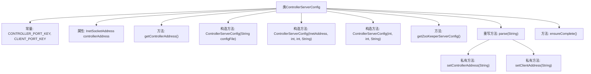

# 基础信息

|      |      |
|------|------|
| 名称 | ControllerServerConfig |
| 编码语言 | .java |
| 代码路径 | zookeeper/zookeeper-server/src/main/java/org/apache/zookeeper/server/controller/ControllerServerConfig.java |
| 包名 | org.apache.zookeeper.server.controller |
| 依赖项 | ['java.io.File', 'java.io.IOException', 'java.net.InetAddress', 'java.net.InetSocketAddress', 'java.net.ServerSocket', 'java.util.HashMap', 'java.util.Map', 'org.apache.zookeeper.server.ServerConfig', 'org.apache.zookeeper.server.quorum.QuorumPeer', 'org.apache.zookeeper.server.quorum.QuorumPeerConfig', 'org.apache.zookeeper.server.quorum.flexible.QuorumMaj'] |
| 概述说明 | ControllerServerConfig类扩展QuorumPeerConfig，用于配置控制器服务器，包含控制器端口、客户端端口、数据目录等设置，支持从文件或参数初始化，并确保配置完整性。 |

# 说明

该代码定义了一个名为ControllerServerConfig的类，继承自QuorumPeerConfig，用于配置控制器服务器和ZooKeeper服务器的参数。主要功能包括解析配置文件、设置控制器地址和客户端端口地址，并提供默认配置以确保单机环境下的正常运行。类中包含多个构造函数，支持通过配置文件或直接参数初始化。关键方法包括解析配置文件、设置端口地址、获取ZooKeeper服务器配置以及确保配置完整性。在单机环境下，会自动生成选举和仲裁通信所需的端口，并设置当前主机为领导者。

# 类列表 Class Summary

| 名称   | 类型  | 说明 |
|-------|------|-------------|
| ControllerServerConfig | class | ControllerServerConfig类继承QuorumPeerConfig，用于配置控制器服务器。包含控制器端口、客户端端口等设置，支持从文件或参数初始化，提供ZooKeeper服务器配置，并确保配置完整性。 |


## 类 ControllerServerConfig

|      |      |
|------|------|
| 访问范围 | public |
| 类型 | class |
| 名称 | ControllerServerConfig |
| 说明 | ControllerServerConfig类继承QuorumPeerConfig，用于配置控制器服务器。包含控制器端口、客户端端口等设置，支持从文件或参数初始化，提供ZooKeeper服务器配置，并确保配置完整性。 |


### UML类图

```mermaid
classDiagram
    class QuorumPeerConfig {
        <<Interface>>
    }

    class ControllerServerConfig {
        +String CONTROLLER_PORT_KEY
        +String CLIENT_PORT_KEY
        -InetSocketAddress controllerAddress
        +ControllerServerConfig(String configFile) throws ConfigException
        +ControllerServerConfig(InetAddress hostAddress, int controllerPort, int zkServerPort, String dataDirPath)
        +ControllerServerConfig(int controllerPort, int zkServerPort, String dataDirPath)
        +InetSocketAddress getControllerAddress()
        +ServerConfig getZooKeeperServerConfig()
        +void parse(String configFile) throws ConfigException
        +void ensureComplete() throws IOException
        -void setControllerAddress(String port)
        -void setClientAddress(String port)
    }

    class ServerConfig {
        +void readFrom(ControllerServerConfig config)
    }

    class QuorumPeer {
        class QuorumServer {
            +long id
            +InetSocketAddress addr
            +InetSocketAddress electionAddr
            +InetSocketAddress clientAddr
        }
    }

    class QuorumMaj {
        +QuorumMaj(Map~Long, QuorumPeer.QuorumServer~ peers)
    }

    ControllerServerConfig --|> QuorumPeerConfig : 继承
    ControllerServerConfig --> ServerConfig : 依赖
    ControllerServerConfig --> QuorumPeer.QuorumServer : 依赖
    ControllerServerConfig --> QuorumMaj : 依赖
```

这段代码描述了一个ZooKeeper控制器服务器的配置类`ControllerServerConfig`，它继承自`QuorumPeerConfig`接口。该类主要负责管理控制器地址、客户端端口等配置信息，并提供多种构造方式（通过配置文件或直接参数）。核心功能包括解析配置文件、设置网络地址、生成ZooKeeper服务器配置，以及确保配置完整性（通过动态生成选举和仲裁端口）。类图中展示了与`ServerConfig`、`QuorumServer`和`QuorumMaj`的依赖关系，体现了配置信息的传递和仲裁机制的建立过程。


### 内部方法调用关系图



这段代码展示了一个ZooKeeper控制器服务器配置类，继承自QuorumPeerConfig。主要功能包括：通过配置文件或直接参数初始化控制器地址和客户端端口，提供ZooKeeper服务器配置生成，以及确保配置完整性。流程图中清晰呈现了类结构、构造方法重载关系、关键方法调用链（如parse()调用setter方法），以及独立方法ensureComplete()用于补充默认仲裁配置。异常处理逻辑体现在端口设置方法中，确保配置参数的合法性验证。

### 字段列表 Field List

| 名称  | 类型  | 说明 |
|-------|-------|------|
| CONTROLLER_PORT_KEY = "zookeeper.controllerPort" | String | 定义常量CONTROLLER_PORT_KEY，值为"zookeeper.controllerPort"，用于配置ZooKeeper控制器端口。 |
| controllerAddress | InetSocketAddress | 私有变量controllerAddress，类型为InetSocketAddress。 |
| CLIENT_PORT_KEY = "zookeeper.clientPortAddress" | String | 定义静态常量CLIENT_PORT_KEY，值为"zookeeper.clientPortAddress"。 |

### 方法列表 Method List

| 名称  | 类型  | 说明 |
|-------|-------|------|
| getControllerAddress | InetSocketAddress | 获取控制器地址的方法，返回InetSocketAddress类型。 |
| setControllerAddress | void | 私有方法setControllerAddress接收端口字符串，尝试创建回环地址的InetSocketAddress，若端口无效则抛出非法参数异常。 |
| parse | void | 重写parse方法，解析配置文件并检查系统属性中的控制器和客户端端口参数，缺失则抛出异常。 |
| getZooKeeperServerConfig | ServerConfig | 获取ZooKeeper服务器配置的方法：创建ServerConfig对象，从当前对象读取配置并返回。 |
| setClientAddress | void | 该方法用于设置客户端地址，解析端口字符串为整数并创建回环地址的SocketAddress。若端口无效则抛出异常。 |
| ensureComplete | void | 方法ensureComplete确保法定人数验证器存在，若无则创建单节点法定组，分配选举和通信端口，并标记自身为领导者。 |


