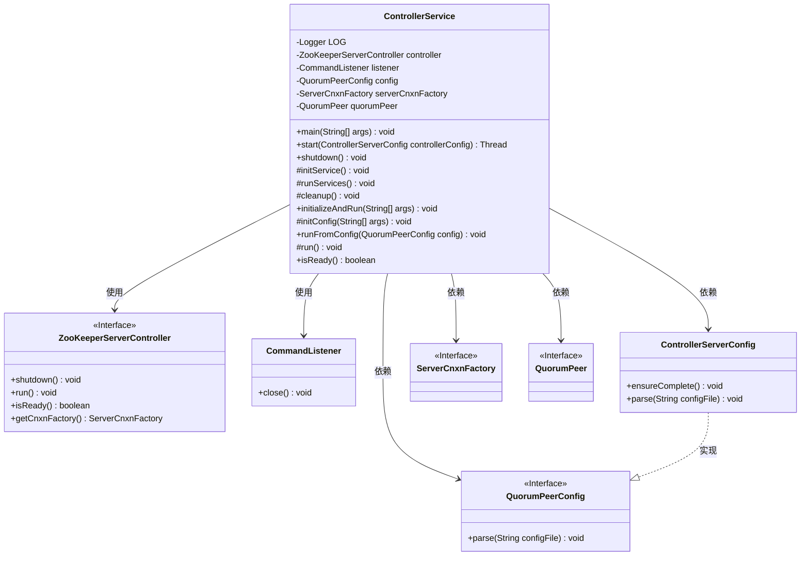

# 基础信息

|      |      |
|------|------|
| 名称 | ControllerService |
| 编码语言 | .java |
| 代码路径 | zookeeper/zookeeper-server/src/main/java/org/apache/zookeeper/server/controller/ControllerService.java |
| 包名 | org.apache.zookeeper.server.controller |
| 依赖项 | ['java.io.IOException', 'org.apache.zookeeper.server.ExitCode', 'org.apache.zookeeper.server.ServerCnxnFactory', 'org.apache.zookeeper.server.quorum.QuorumPeer', 'org.apache.zookeeper.server.quorum.QuorumPeerConfig', 'org.apache.zookeeper.util.ServiceUtils', 'org.slf4j.Logger', 'org.slf4j.LoggerFactory'] |
| 概述说明 | ControllerService类管理ZooKeeper控制器服务，支持独立启动或线程内运行，包含初始化、运行、关闭及状态检查功能。 |

# 说明

该代码定义了一个ControllerService类，用于管理和控制ZooKeeper服务器。主要功能包括：通过main方法独立启动服务，支持线程方式启动，提供初始化、运行和关闭服务的方法。类中包含ZooKeeperServerController、CommandListener等核心组件，能处理配置加载、服务初始化、运行监控和资源清理。服务状态可通过isReady方法检查。代码结构清晰，包含异常处理和日志记录，适用于集成测试和单元测试场景。

# 类列表 Class Summary

| 名称   | 类型  | 说明 |
|-------|------|-------------|
| ControllerService | class | ControllerService类用于管理ZooKeeperServerController和CommandListener，提供启动、关闭、初始化服务功能，支持独立运行或线程内启动，包含配置解析和状态检查。 |

## 类 ControllerService

|      |      |
|------|------|
| 访问范围 | public |
| 类型 | class |
| 名称 | ControllerService |
| 说明 | ControllerService类用于管理ZooKeeperServerController和CommandListener，提供启动、关闭、初始化服务功能，支持独立运行或线程内启动，包含配置解析和状态检查。 |

### UML类图

这段代码描述了一个`ControllerService`类，它是ZooKeeper服务器控制器的服务实现。该类负责初始化、运行和关闭控制器服务，包含配置解析、服务初始化、运行控制和状态检查等功能。通过`ZooKeeperServerController`和`CommandListener`实现核心控制逻辑，支持从配置文件启动服务，并能以守护线程方式运行。类图中清晰地展示了各组件间的依赖关系，其中`ControllerServerConfig`实现了`QuorumPeerConfig`接口，体现了配置管理的层次结构。

### 内部方法调用关系图

```mermaid
graph TD
    A["类ControllerService"]
    B["属性: Logger LOG"]
    C["属性: ZooKeeperServerController controller"]
    D["属性: CommandListener listener"]
    E["属性: QuorumPeerConfig config"]
    F["属性: ServerCnxnFactory serverCnxnFactory"]
    G["属性: QuorumPeer quorumPeer"]
    H["main方法: main(String[] args)"]
    I["方法: start(ControllerServerConfig controllerConfig)"]
    J["方法: shutdown()"]
    K["方法: initService()"]
    L["方法: runServices()"]
    M["方法: cleanup()"]
    N["方法: initializeAndRun(String[] args)"]
    O["方法: initConfig(String[] args)"]
    P["方法: runFromConfig(QuorumPeerConfig config)"]
    Q["方法: run()"]
    R["方法: isReady()"]

    A --> B
    A --> C
    A --> D
    A --> E
    A --> F
    A --> G
    A --> H
    A --> I
    A --> J
    A --> K
    A --> L
    A --> M
    A --> N
    A --> O
    A --> P
    A --> Q
    A --> R

    H -->|"args.length != 1"| H1["抛出异常"]
    H -->|"args.length == 1"| H2["创建ControllerServerConfig"]
    H2 --> H3["调用start(config)"]
    I --> I1["创建并启动线程运行svc.run()"]
    J --> J1["关闭listener"]
    J --> J2["关闭controller"]
    K --> K1["初始化controller和listener"]
    Q --> Q1["调用initService()"]
    Q --> Q2["调用runServices()"]
    Q --> Q3["调用cleanup()"]
    P --> P1["设置config并调用run()"]
    N --> N1["调用initConfig()"]
    N --> N2["调用run()"]
```

这段代码展示了一个ControllerService类，主要用于管理和控制ZooKeeper服务器的运行。它包含了初始化服务、运行服务、清理资源等方法，并通过多线程机制实现服务的启动和关闭。流程图清晰地展示了类属性和方法之间的调用关系，以及主要逻辑流程，如参数检查、服务初始化和运行等关键步骤。

### 字段列表 Field List

| 名称  | 类型  | 说明 |
|-------|-------|------|
| config | QuorumPeerConfig | 受保护的QuorumPeerConfig配置对象。 |
| controller | ZooKeeperServerController | 私有ZooKeeper服务器控制器实例。 |
| LOG = LoggerFactory.getLogger(ControllerService.class) | Logger | 定义ControllerService类的私有静态日志对象LOG。 |
| listener | CommandListener | 私有命令监听器对象。 |
| quorumPeer = null | QuorumPeer | 声明一个受保护的QuorumPeer类型变量quorumPeer，初始值为null。 |
| serverCnxnFactory = null | ServerCnxnFactory | 私有服务器连接工厂实例未初始化。 |

### 方法列表 Method List

| 名称  | 类型  | 说明 |
|-------|-------|------|
| shutdown | void | 同步方法shutdown关闭监听器和控制器，释放资源后置空。 |
| initializeAndRun | void | 初始化配置并运行程序，处理可能的配置异常。 |
| cleanup | void | 清理方法关闭监听器并置空。 |
| start | Thread | 启动守护线程运行ControllerService，返回线程对象。忽略异常，配置由controllerConfig提供。 |
| initConfig | void | 这是一个Java方法，用于初始化配置。若参数args长度为1，则解析args[0]作为配置。方法可能抛出ConfigException异常。 |
| initService | void | 初始化服务方法，包括配置检查、创建控制器和监听器，并获取服务器连接工厂。 |
| runServices | void | 运行服务方法，调用控制器的run方法执行。 |
| main | void | Java主方法：检查命令行参数是否为1，否则报错；加载配置文件启动ControllerService，异常时打印错误信息并退出。 |
| runFromConfig | void | 启动基于配置的仲裁节点，记录日志并执行运行方法。 |
| run | void | 代码定义run方法，初始化服务失败则记录错误并退出系统，成功则运行服务并清理。 |
| isReady | boolean | 检查控制器非空且就绪状态。 |

