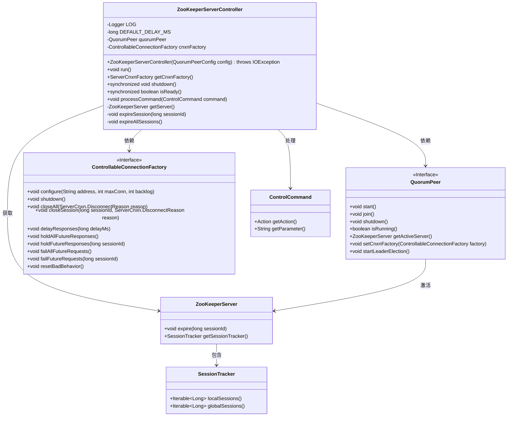
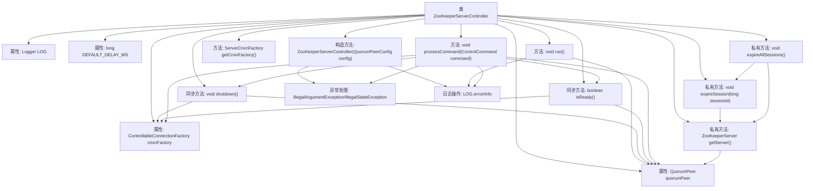

# 基础信息

|      |      |
|------|------|
| 名称 | ZooKeeperServerController |
| 编码语言 | .java |
| 代码路径 | zookeeper/zookeeper-server/src/main/java/org/apache/zookeeper/server/controller/ZooKeeperServerController.java |
| 包名 | org.apache.zookeeper.server.controller |
| 依赖项 | ['edu.umd.cs.findbugs.annotations.SuppressFBWarnings', 'java.io.IOException', 'org.apache.zookeeper.server.ExitCode', 'org.apache.zookeeper.server.ServerCnxn', 'org.apache.zookeeper.server.ServerCnxnFactory', 'org.apache.zookeeper.server.ZooKeeperServer', 'org.apache.zookeeper.server.quorum.QuorumPeer', 'org.apache.zookeeper.server.quorum.QuorumPeerConfig', 'org.apache.zookeeper.util.ServiceUtils', 'org.slf4j.Logger', 'org.slf4j.LoggerFactory'] |
| 概述说明 | ZooKeeperServerController类管理ZooKeeper服务器集群，初始化QuorumPeer和连接工厂，提供启动、关闭、就绪检查及处理多种控制命令（如关闭连接、选举新领导等）的功能。异常处理确保系统稳定。 |

# 说明

ZooKeeperServerController类用于管理ZooKeeper服务器的核心功能。它通过QuorumPeer和ControllableConnectionFactory实现集群协调与连接控制。构造函数要求传入有效配置，初始化连接工厂和仲裁节点。提供启动、关闭、就绪检查等方法，并支持多种控制命令：PING无操作、SHUTDOWN关闭服务、CLOSECONNECTION关闭连接、EXPIRESESSION终止会话、ADDDELAY延迟响应、NORESPONSE暂停响应、FAILREQUESTS请求失败、RESET重置行为、ELECTNEWLEADER选举新领导。内部通过同步方法确保线程安全，异常处理会触发系统退出。

# 类列表 Class Summary

| 名称   | 类型  | 说明 |
|-------|------|-------------|
| ZooKeeperServerController | class | ZooKeeperServerController类管理QuorumPeer和连接工厂，提供启动、关闭、命令处理（如关闭连接、过期会话、延迟响应等）功能，确保服务状态同步与安全。 |

## 类 ZooKeeperServerController

|      |      |
|------|------|
| 访问范围 | @SuppressFBWarnings(value = "IS2_INCONSISTENT_SYNC", justification = "quorum peer is internally synchronized.");public |
| 类型 | class |
| 名称 | ZooKeeperServerController |
| 说明 | ZooKeeperServerController类管理QuorumPeer和连接工厂，提供启动、关闭、命令处理（如关闭连接、过期会话、延迟响应等）功能，确保服务状态同步与安全。 |

### UML类图

类图描述：该图展示了ZooKeeperServerController的核心结构及其依赖关系。控制器通过QuorumPeer管理集群节点，通过ControllableConnectionFactory控制连接行为，并处理ControlCommand指令。ZooKeeperServer负责会话管理，SessionTracker跟踪本地和全局会话状态。所有组件协同实现高可用的分布式协调服务控制逻辑。

### 内部方法调用关系图

该流程图展示了ZooKeeperServerController类的完整结构，包含属性、构造方法、公共方法和私有方法的调用关系。核心逻辑集中在processCommand方法，通过switch-case处理不同控制命令，涉及连接工厂和仲裁节点的协同操作。关键同步方法shutdown和isReady确保线程安全，私有方法支持会话过期功能，异常处理和日志记录贯穿整个流程。

### 字段列表 Field List

| 名称  | 类型  | 说明 |
|-------|-------|------|
| cnxnFactory | ControllableConnectionFactory | 私有可控连接工厂实例。 |
| quorumPeer | QuorumPeer | 私有QuorumPeer实例变量。 |
| DEFAULT_DELAY_MS = 1000 | long | 定义静态常量DEFAULT_DELAY_MS，默认延迟1000毫秒。 |
| LOG = LoggerFactory.getLogger(ZooKeeperServerController.class) | Logger | ZooKeeperServerController类中声明了一个私有的静态不可变日志记录器实例LOG，用于记录日志。 |

### 方法列表 Method List

| 名称  | 类型  | 说明 |
|-------|-------|------|
| getCnxnFactory | ServerCnxnFactory | 获取服务器连接工厂方法，返回cnxnFactory实例。 |
| shutdown | void | 同步方法shutdown关闭cnxnFactory和quorumPeer资源，释放后置空。 |
| run | void | 启动quorumPeer并捕获异常，出错时记录错误并请求系统退出。 |
| isReady | boolean | 检查服务就绪状态：连接工厂和选举节点存在且运行中，且有活跃服务器。 |
| processCommand | void | 处理控制命令的方法，检查命令有效性及服务状态，支持多种操作如关闭连接、终止会话、延迟响应、重置行为等，无效命令抛出异常。 |
| getServer | ZooKeeperServer | 获取当前活跃的ZooKeeper服务器实例。 |
| expireSession | void | 该方法用于终止指定ID的会话，调用服务器端的expire方法实现。 |
| expireAllSessions | void | 该方法用于终止所有会话，包括本地和全局会话，通过遍历会话ID并逐一调用终止方法实现。 |

