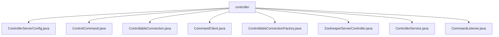

# 基础信息

|      |      |
|------|------|
| 名称 | controller |
| 编码语言 | .java |
| 代码路径 | zookeeper/zookeeper-server/src/main/java/org/apache/zookeeper/server/controller |
| 包名 | zookeeper.docs.zookeeper-server.src.main.java.org.apache.zookeeper.server.controller |
| 概述说明 | ControllerServerConfig类继承QuorumPeerConfig，用于配置控制器和ZooKeeper服务器参数。ControlCommand定义12种控制器操作枚举及URI解析方法。ControllableConnection继承NIOServerCnxn，受控管理连接行为。CommandClient是线程安全客户端，支持发送命令并处理响应。ControllableConnectionFactory扩展NIOServerCnxnFactory，模拟网络异常测试场景。ZooKeeperServerController管理服务器核心功能，支持多种控制命令。ControllerService独立管理服务生命周期。CommandListener监听处理HTTP命令请求。 |

# 说明

## 概述  
该模块实现ZooKeeper服务器的控制平面功能，核心职责是提供可编程化的集群管理接口。主要接口基于HTTP协议，例如通过`/command/ACTION`格式的URI发送控制指令。关键数据结构包括`ControlCommand`枚举和`ControllerServerConfig`配置类，依赖ZooKeeper仲裁协议和Jetty HTTP服务。例如`ControllableConnectionFactory`通过状态变量模拟网络异常。

## 主要业务场景  
支持集群控制全生命周期，例如主动关闭连接、强制领导者选举等12种指令。采用同步HTTP请求-响应模式，功能完整性体现在支持测试场景所需的网络分区模拟。主要用于集成测试环境，提供类似远程控制台的API。例如`CommandClient`封装HTTP客户端，与IDE测试框架集成时可发送`ADDDELAY`指令注入延迟。

### 包内部结构视图

该流程图展示了ZooKeeper服务器控制模块的完整文件结构，所有文件均位于controller目录下。包含8个关键组件文件：从核心配置类ControllerServerConfig到连接控制类ControllableConnection，再到服务控制类ControllerService，完整呈现了控制模块的功能划分。每个文件都直接隶属于controller节点，没有多级嵌套关系，结构清晰扁平化。

# 文件列表 File List

| 名称   | 类型  | 说明 |
|-------|------|-------------|
| [ControllableConnection.java](ControllableConnection.md) | file | ControllableConnection继承NIOServerCnxn，通过ControllableConnectionFactory控制响应发送和请求处理，可配置是否发送响应、延迟请求或模拟失败。 |
| [ControlCommand.java](ControlCommand.md) | file | ControlCommand类定义控制器操作枚举（如PING、SHUTDOWN等），提供创建和解析REST命令URI的方法，支持带参数操作。 |
| [ControllerServerConfig.java](ControllerServerConfig.md) | file | ControllerServerConfig类扩展QuorumPeerConfig，用于配置控制器服务器，包含控制器端口、客户端端口、数据目录等设置，支持从文件或参数初始化，并确保配置完整性。 |
| [CommandListener.java](CommandListener.md) | file | CommandListener类监听命令请求，初始化服务器并处理HTTP请求。通过CommandHandler解析执行命令，记录日志并返回响应状态码。异常时记录错误并退出系统。提供关闭方法停止服务器。 |
| [ControllerService.java](ControllerService.md) | file | ControllerService类管理ZooKeeper控制器服务，支持独立启动或线程内运行，包含初始化、运行、关闭及状态检查功能。 |
| [ZooKeeperServerController.java](ZooKeeperServerController.md) | file | ZooKeeperServerController类管理ZooKeeper服务器集群，初始化QuorumPeer和连接工厂，提供启动、关闭、就绪检查及处理多种控制命令（如关闭连接、选举新领导等）的功能。异常处理确保系统稳定。 |
| [ControllableConnectionFactory.java](ControllableConnectionFactory.md) | file | ControllableConnectionFactory扩展NIOServerCnxnFactory，提供延迟请求、失败请求和保留响应的控制功能，通过同步方法管理状态变量。 |
| [CommandClient.java](CommandClient.md) | file | CommandClient类用于发送HTTP命令到指定主机和端口，支持同步请求和超时设置，提供发送带参数命令和关闭连接的方法，默认超时10秒。 |

