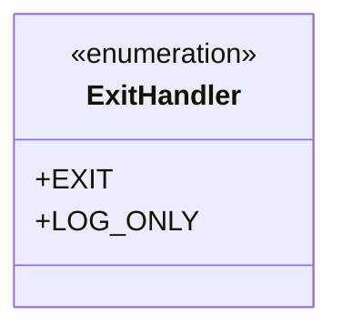
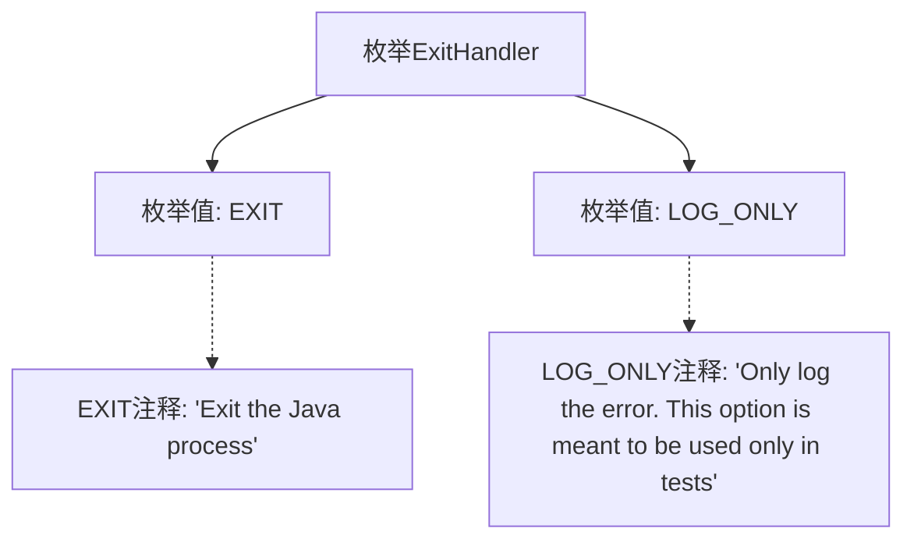

# 基础信息

|      |      |
|------|------|
| 名称 | ExitHandler |
| 编码语言 | .java |
| 代码路径 | zookeeper/zookeeper-server/src/main/java/org/apache/zookeeper/server/embedded/ExitHandler.java |
| 包名 | org.apache.zookeeper.server.embedded |
| 依赖项 | [] |
| 概述说明 | ExitHandler枚举定义两种退出行为：EXIT终止Java进程，LOG_ONLY仅记录错误（测试专用）。 |

# 说明

该内容定义了一个名为ExitHandler的公共枚举类型，包含两个枚举值。EXIT表示退出Java进程，LOG_ONLY表示仅记录错误，并特别说明此选项仅用于测试场景。枚举通过注释清晰说明了每个值的用途和适用场景。

# 类列表 Class Summary

| 名称   | 类型  | 说明 |
|-------|------|-------------|
| ExitHandler | enum | ExitHandler枚举定义两种行为：EXIT退出Java进程，LOG_ONLY仅记录错误（测试专用）。 |

## 类 ExitHandler

|      |      |
|------|------|
| 访问范围 | public |
| 类型 | enum |
| 名称 | ExitHandler |
| 说明 | ExitHandler枚举定义两种行为：EXIT退出Java进程，LOG_ONLY仅记录错误（测试专用）。 |

### UML类图

这段代码定义了一个名为ExitHandler的枚举类型，包含两个枚举常量：EXIT和LOG_ONLY。EXIT表示退出Java进程的操作，LOG_ONLY表示仅记录错误（专门用于测试场景）。枚举类型通过classDiagram中的<<enumeration>>标记表示，展示了该类型仅包含这两个静态公共常量，没有其他成员方法或属性。这种设计常用于定义程序中的有限状态或选项模式，特别适合处理程序退出时的不同策略选择。

### 内部方法调用关系图

这段流程图展示了ExitHandler枚举的结构，包含两个枚举值EXIT和LOG_ONLY。EXIT用于退出Java进程，LOG_ONLY仅记录错误且专为测试场景设计。图形清晰地呈现了枚举定义与各值的关联关系，并通过注释节点说明了每个枚举值的具体用途和使用场景。

### 字段列表 Field List

| 名称  | 类型  | 说明 |
|-------|-------|------|

### 方法列表 Method List

| 名称  | 类型  | 说明 |
|-------|-------|------|

