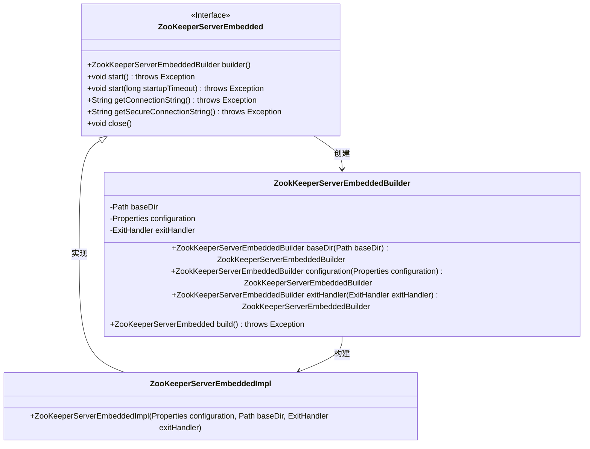
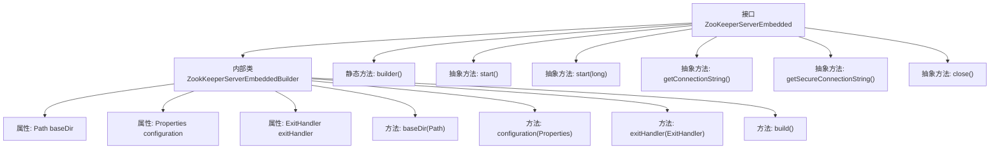

# 基础信息

|      |      |
|------|------|
| 名称 | ZooKeeperServerEmbedded |
| 编码语言 | .java |
| 代码路径 | zookeeper/zookeeper-server/src/main/java/org/apache/zookeeper/server/embedded/ZooKeeperServerEmbedded.java |
| 包名 | org.apache.zookeeper.server.embedded |
| 依赖项 | ['java.nio.file.Path', 'java.util.Objects', 'java.util.Properties', 'org.apache.yetus.audience.InterfaceAudience', 'org.apache.yetus.audience.InterfaceStability'] |
| 概述说明 | ZooKeeperServerEmbedded接口提供嵌入式服务器功能，包含构建器类设置基础目录、配置和退出处理器，支持启动、获取连接字符串和关闭操作。 |

# 说明

这是一个描述ZooKeeperServerEmbedded接口及其构建器的总结。该接口继承自AutoCloseable，提供嵌入式ZooKeeper服务器的功能。接口包含一个内部构建器类ZookKeeperServerEmbeddedBuilder，用于配置和创建服务器实例。构建器允许设置基础目录、配置属性和退出处理器，并通过build方法验证配置并创建服务器实例。接口提供了启动服务器的方法（包括带超时的版本）、获取客户端连接字符串的方法（包括安全版本）以及关闭服务器的方法。所有方法都可能抛出异常，构建器方法要求非空参数并在缺失时抛出异常。

# 类列表 Class Summary

| 名称   | 类型  | 说明 |
|-------|------|-------------|
| ZooKeeperServerEmbedded | interface | ZooKeeperServerEmbedded接口提供嵌入式ZooKeeper服务器功能，包含构建器设置基础目录、配置和退出处理，支持启动、获取连接字符串及优雅关闭。 |

## 类 ZooKeeperServerEmbedded

|      |      |
|------|------|
| 访问范围 | @InterfaceAudience.Public;@InterfaceStability.Evolving;public |
| 类型 | interface |
| 名称 | ZooKeeperServerEmbedded |
| 说明 | ZooKeeperServerEmbedded接口提供嵌入式ZooKeeper服务器功能，包含构建器设置基础目录、配置和退出处理，支持启动、获取连接字符串及优雅关闭。 |

### UML类图

该类图展示了ZooKeeper嵌入式服务器的核心结构，包含一个主接口ZooKeeperServerEmbedded及其实现类ZooKeeperServerEmbeddedImpl，以及用于构建服务器的ZookKeeperServerEmbeddedBuilder类。接口定义了服务器启动、关闭和获取连接字符串等核心方法，构建器类采用流式API设计模式，支持链式调用配置参数。实现类通过构建器创建，完整实现了接口定义的所有功能。

### 内部方法调用关系图

这段代码描述了一个嵌入式ZooKeeper服务器接口及其构建器模式实现。接口定义了服务器启动、连接字符串获取和关闭等核心操作，而内部构建器类提供了链式配置方式，包含基础目录设置、配置属性管理和异常处理机制。流程图清晰展示了接口与构建器类的层级关系，以及各配置方法和业务方法的调用路径，体现了构建复杂服务器实例时的模块化设计思想。

### 字段列表 Field List

| 名称  | 类型  | 说明 |
|-------|-------|------|

### 方法列表 Method List

| 名称  | 类型  | 说明 |
|-------|-------|------|
| builder | ZookKeeperServerEmbeddedBuilder | 创建一个ZookKeeperServerEmbeddedBuilder实例的静态方法。 |
| start | void | 启动方法，参数为超时时间，可能抛出异常。 |
| getConnectionString | String | 获取数据库连接字符串方法，可能抛出异常。 |
| getSecureConnectionString | String | 获取安全连接字符串的方法，可能抛出异常。 |
| start | void | 方法声明：start()可能抛出异常。 |
| close | void | 重写父类的close方法，用于关闭资源。 |

