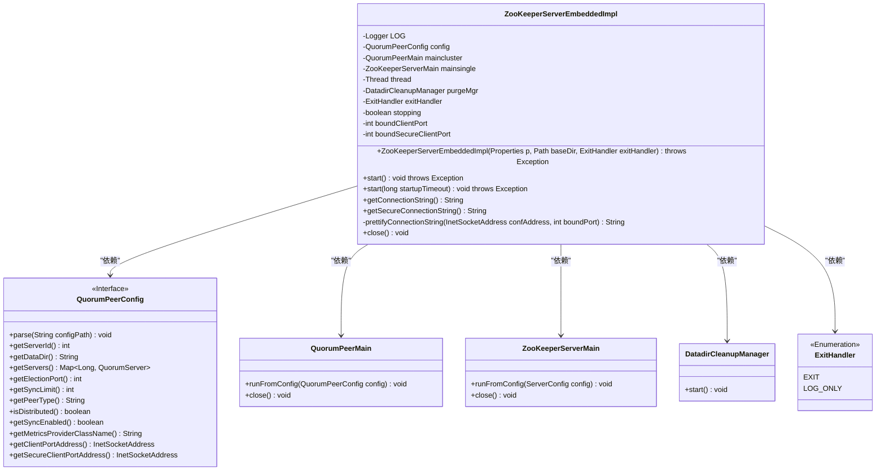

# 基础信息

|      |      |
|------|------|
| 名称 | ZooKeeperServerEmbeddedImpl |
| 编码语言 | .java |
| 代码路径 | zookeeper/zookeeper-server/src/main/java/org/apache/zookeeper/server/embedded/ZooKeeperServerEmbeddedImpl.java |
| 包名 | org.apache.zookeeper.server.embedded |
| 依赖项 | ['java.io.OutputStream', 'java.net.InetSocketAddress', 'java.nio.file.Files', 'java.nio.file.Path', 'java.util.Map', 'java.util.Properties', 'java.util.concurrent.CompletableFuture', 'java.util.concurrent.TimeUnit', 'java.util.concurrent.TimeoutException', 'javax.security.sasl.SaslException', 'org.apache.zookeeper.server.DatadirCleanupManager', 'org.apache.zookeeper.server.ExitCode', 'org.apache.zookeeper.server.ServerConfig', 'org.apache.zookeeper.server.ZooKeeperServerMain', 'org.apache.zookeeper.server.quorum.QuorumPeer', 'org.apache.zookeeper.server.quorum.QuorumPeerConfig', 'org.apache.zookeeper.server.quorum.QuorumPeerMain', 'org.apache.zookeeper.util.ServiceUtils', 'org.slf4j.Logger', 'org.slf4j.LoggerFactory'] |
| 概述说明 | ZooKeeperServerEmbeddedImpl类实现嵌入式ZooKeeper服务器，支持集群和单机模式，包含启动、关闭和连接管理功能，自动处理数据清理和日志记录。 |

# 说明

ZooKeeperServerEmbeddedImpl是一个嵌入式ZooKeeper服务器实现类，支持集群和单机模式。初始化时读取配置文件并设置数据目录，启动时根据配置选择集群或单机模式，分别使用QuorumPeerMain或ZooKeeperServerMain。启动后管理数据清理任务，提供连接字符串获取功能。关闭时停止服务器并清理资源。包含端口绑定、错误处理和日志记录等细节。

# 类列表 Class Summary

| 名称   | 类型  | 说明 |
|-------|------|-------------|
| ZooKeeperServerEmbeddedImpl | class | ZooKeeperServerEmbeddedImpl实现嵌入式ZooKeeper服务器，支持集群和单机模式，处理配置、启动、关闭及连接字符串生成。 |

## 类 ZooKeeperServerEmbeddedImpl

|      |      |
|------|------|
| 访问范围 | None |
| 类型 | class |
| 名称 | ZooKeeperServerEmbeddedImpl |
| 说明 | ZooKeeperServerEmbeddedImpl实现嵌入式ZooKeeper服务器，支持集群和单机模式，处理配置、启动、关闭及连接字符串生成。 |

### UML类图

这段代码实现了一个嵌入式ZooKeeper服务器，支持单机模式和集群模式。类图展示了ZooKeeperServerEmbeddedImpl作为核心类，通过组合方式使用QuorumPeerConfig配置类、QuorumPeerMain集群模式运行类、ZooKeeperServerMain单机模式运行类，以及DatadirCleanupManager数据清理管理器。ExitHandler枚举控制异常退出行为，整个设计支持灵活的服务器启动、关闭和连接管理功能。

### 内部方法调用关系图

```mermaid
graph TD
    A["类ZooKeeperServerEmbeddedImpl"]
    B["属性: QuorumPeerConfig config"]
    C["属性: QuorumPeerMain maincluster"]
    D["属性: ZooKeeperServerMain mainsingle"]
    E["属性: Thread thread"]
    F["属性: DatadirCleanupManager purgeMgr"]
    G["属性: ExitHandler exitHandler"]
    H["属性: boolean stopping"]
    I["属性: int boundClientPort"]
    J["属性: int boundSecureClientPort"]
    K["构造方法: ZooKeeperServerEmbeddedImpl(Properties p, Path baseDir, ExitHandler exitHandler)"]
    L["方法: start()"]
    M["方法: start(long startupTimeout)"]
    N["方法: getConnectionString()"]
    O["方法: getSecureConnectionString()"]
    P["方法: prettifyConnectionString(InetSocketAddress confAddress, int boundPort)"]
    Q["方法: close()"]

    A --> B
    A --> C
    A --> D
    A --> E
    A --> F
    A --> G
    A --> H
    A --> I
    A --> J
    A --> K
    A --> L
    A --> M
    A --> N
    A --> O
    A --> P
    A --> Q
```

该流程图展示了ZooKeeperServerEmbeddedImpl类的完整结构，包含11个关键属性和6个核心方法。构造方法负责初始化配置和日志记录，start()方法根据集群模式选择启动单机或分布式服务，close()方法实现服务关闭逻辑。连接字符串处理方法通过prettifyConnectionString标准化输出格式，整个类通过线程管理和清理机制确保ZooKeeper服务的稳定运行。

### 字段列表 Field List

| 名称  | 类型  | 说明 |
|-------|-------|------|
| maincluster | QuorumPeerMain | 私有QuorumPeerMain主集群实例。 |
| thread | Thread | 私有线程变量。 |
| exitHandler | ExitHandler | 私有不可变的退出处理器实例。 |
| boundClientPort | int | 私有整型变量，用于绑定客户端端口。 |
| config | QuorumPeerConfig | 私有不可变的QuorumPeerConfig配置对象。 |
| boundSecureClientPort | int | 私有整型变量，用于绑定安全客户端端口。 |
| LOG = LoggerFactory.getLogger(ZooKeeperServerEmbeddedImpl.class) | Logger | ZooKeeperServerEmbeddedImpl类中定义了一个私有静态日志记录器LOG。 |
| stopping | boolean | 私有易变布尔变量，标记停止状态。 |
| purgeMgr | DatadirCleanupManager | 私有数据目录清理管理器purgeMgr。 |
| mainsingle | ZooKeeperServerMain | 私有ZooKeeper单机服务器主类实例。 |

### 方法列表 Method List

| 名称  | 类型  | 说明 |
|-------|-------|------|
| start | void | 代码实现ZK服务器启动逻辑，根据配置选择集群或单机模式，设置退出处理方式，启动清理任务，并通过线程运行服务，处理超时和异常情况。 |
| start | void | 重写start方法，调用带参数的start，默认传入最大整数值。 |
| getSecureConnectionString | String | 重写方法getSecureConnectionString，返回格式化后的安全连接字符串，基于配置的安全端口地址和绑定端口。 |
| prettifyConnectionString | String | 方法prettifyConnectionString处理InetSocketAddress和端口，将0.0.0.0或IPv6全零地址替换为localhost并拼接端口号，未配置地址时抛出异常。 |
| close | void | 重写close方法，停止ZK服务器，关闭单机和集群实例。 |
| getConnectionString | String | 重写getConnectionString方法，返回美化后的客户端端口地址和绑定端口字符串。 |

