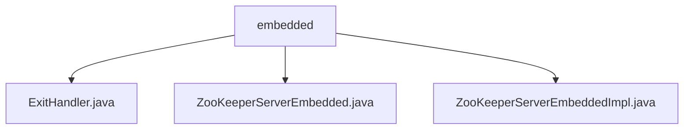

# 基础信息

|      |      |
|------|------|
| 名称 | embedded |
| 编码语言 | .java |
| 代码路径 | zookeeper/zookeeper-server/src/main/java/org/apache/zookeeper/server/embedded |
| 包名 | zookeeper.docs.zookeeper-server.src.main.java.org.apache.zookeeper.server.embedded |
| 概述说明 | ExitHandler枚举定义退出行为：EXIT终止进程，LOG_ONLY仅记录错误（测试用）。ZooKeeperServerEmbedded接口提供嵌入式服务器功能，含构建器配置目录、属性和退出处理器，支持启动、连接获取和关闭。ZooKeeperServerEmbeddedImpl实现类支持集群/单机模式，处理配置、启动、清理和关闭。 |

# 说明

## 概述  
1. 该模块实现嵌入式ZooKeeper服务器，提供轻量级进程内数据协调服务，类似微型的分布式键值存储系统。  
2. 主要接口为Java API，例如通过`ZooKeeperServerEmbedded`的`start()`和`getConnectionString()`方法控制服务生命周期。  
3. 关键数据结构包括`ExitHandler`枚举（例如定义进程退出策略）和构建器模式配置对象。  
4. 依赖ZooKeeper核心组件（如`QuorumPeerMain`）和Java NIO网络库。  

## 主要业务场景  
1. 支持单机/集群模式快速启动，例如测试场景使用`LOG_ONLY`错误处理策略避免进程退出。  
2. 采用同步阻塞式交互，例如`build()`方法验证配置后立即返回实例。  
3. 功能覆盖基础服务控制，例如支持超时启动和安全连接字符串生成。  
4. 典型用于单元测试或嵌入式场景，类似H2数据库的内存模式。  
5. 提供构建器API（如设置数据目录）和生命周期管理接口。  
6. 可与测试框架集成，例如JUnit规则中管理服务器启停。

### 包内部结构视图

该流程图展示了ZooKeeper服务器嵌入式模块的代码结构，根节点为embedded目录，包含三个Java文件：ExitHandler.java处理退出逻辑，ZooKeeperServerEmbedded.java定义主嵌入式服务器接口，ZooKeeperServerEmbeddedImpl.java是其具体实现类。所有文件均位于同一层级，没有嵌套子目录关系。

# 文件列表 File List

| 名称   | 类型  | 说明 |
|-------|------|-------------|
| [ZooKeeperServerEmbedded.java](ZooKeeperServerEmbedded.md) | file | ZooKeeperServerEmbedded接口提供嵌入式服务器功能，包含构建器类设置基础目录、配置和退出处理器，支持启动、获取连接字符串和关闭操作。 |
| [ExitHandler.java](ExitHandler.md) | file | ExitHandler枚举定义两种退出行为：EXIT终止Java进程，LOG_ONLY仅记录错误（测试专用）。 |
| [ZooKeeperServerEmbeddedImpl.java](ZooKeeperServerEmbeddedImpl.md) | file | ZooKeeperServerEmbeddedImpl类实现嵌入式ZooKeeper服务器，支持集群和单机模式，包含启动、关闭和连接管理功能，自动处理数据清理和日志记录。 |

