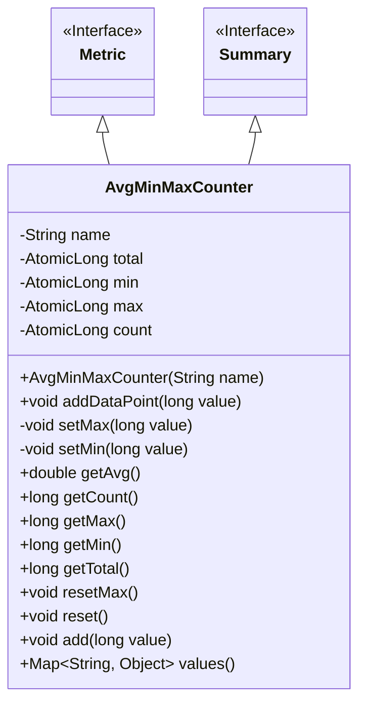
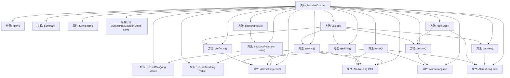

# 基础信息

|      |      |
|------|------|
| 名称 | AvgMinMaxCounter |
| 编码语言 | .java |
| 代码路径 | zookeeper/zookeeper-server/src/main/java/org/apache/zookeeper/server/metric/AvgMinMaxCounter.java |
| 包名 | org.apache.zookeeper.server.metric |
| 依赖项 | ['java.math.BigDecimal', 'java.math.RoundingMode', 'java.util.LinkedHashMap', 'java.util.Map', 'java.util.concurrent.atomic.AtomicLong', 'org.apache.zookeeper.metrics.Summary'] |
| 概述说明 | AvgMinMaxCounter类实现统计功能，记录数据点的总数、总和、最小值、最大值及平均值，支持重置和线程安全操作。 |

# 说明

AvgMinMaxCounter是一个用于统计数据的类，继承自Metric并实现Summary接口。它通过原子变量记录总和、最小值、最大值和计数，支持添加数据点并计算平均值、最小值、最大值等统计信息。类提供了重置功能，并能将统计结果以键值对形式返回，包含平均值、最小值、最大值、计数和总和。所有操作均线程安全，但平均值计算可能存在轻微竞态条件。

# 类列表 Class Summary

| 名称   | 类型  | 说明 |
|-------|------|-------------|
| AvgMinMaxCounter | class | AvgMinMaxCounter类用于统计数据的平均值、最小值、最大值和总数，支持原子操作和重置功能。 |

## 类 AvgMinMaxCounter

|      |      |
|------|------|
| 访问范围 | public |
| 类型 | class |
| 名称 | AvgMinMaxCounter |
| 说明 | AvgMinMaxCounter类用于统计数据的平均值、最小值、最大值和总数，支持原子操作和重置功能。 |

### UML类图

这段代码展示了一个名为`AvgMinMaxCounter`的类，它实现了`Metric`和`Summary`接口，用于统计数据的平均值、最小值、最大值等指标。类中包含多个原子长整型变量来保证线程安全，提供了添加数据点、获取统计结果和重置状态的方法。通过原子操作确保多线程环境下的数据一致性，同时使用四舍五入保留四位小数提高精度。最终结果以键值对形式返回，包含五种统计指标。

### 内部方法调用关系图

这段代码实现了一个线程安全的统计计算器类AvgMinMaxCounter，用于跟踪数据点的平均值、最小值、最大值、计数和总和。类通过AtomicLong保证多线程安全，提供数据点添加(addDataPoint)、统计值获取(getAvg/getMin等)、重置(reset)和结果导出(values)等功能。流程图清晰展示了类继承关系、属性构成和方法调用链，特别是addDataPoint方法会触发total/count的更新和min/max的原子性比较交换操作。

### 字段列表 Field List

| 名称  | 类型  | 说明 |
|-------|-------|------|
| count = new AtomicLong() | AtomicLong | 私有原子长整型计数器变量count，初始值为0，线程安全。 |
| total = new AtomicLong() | AtomicLong | 私有原子长整型变量total，用于线程安全计数。 |
| min = new AtomicLong(Long.MAX_VALUE) | AtomicLong | 声明一个私有不可变的AtomicLong变量min，初始值为Long的最大值。 |
| name | String | 私有字符串变量name。 |
| max = new AtomicLong(Long.MIN_VALUE) | AtomicLong | 声明一个私有不可变的AtomicLong变量max，初始值为Long的最小值。 |

### 方法列表 Method List

| 名称  | 类型  | 说明 |
|-------|-------|------|
| getCount | long | 获取当前计数值的方法，返回长整型数据。 |
| getTotal | long | 获取当前总数量的方法，返回长整型值。 |
| getMax | long | 获取最大值方法：若当前值为最小长整型则返回0，否则返回当前值。 |
| getAvg | double | 计算平均值的非线程安全方法，忽略竞态条件，返回四舍五入到4位小数的结果，无数据时返回0。 |
| setMin | void | 使用CAS操作更新最小值，确保线程安全。循环比较并设置，直到成功或当前值更小。 |
| resetMax | void | 重置最大值，将其设为当前最小值。 |
| getMin | long | 获取最小值方法：若当前值为Long最大值则返回0，否则返回当前值。 |
| addDataPoint | void | 方法addDataPoint接收长整型value，更新总和total和计数count，并设置最小值和最大值。 |
| setMax | void | 该方法通过循环和原子操作确保max值仅被设置为更大的数值。使用compareAndSet保证线程安全，避免竞态条件。 |
| reset | void | 重置计数器：count和total归零，min设为最大长整型值，max设为最小长整型值。 |
| add | void | 这是一个Java方法，功能是添加长整型数据点。方法名为add，接受一个long类型参数value，并调用addDataPoint方法处理该值。 |
| values | Map<String, Object> | 该方法返回一个包含统计数据的映射，键为带前缀的字段名，值为对应的平均值、最小值、最大值、计数和总和。 |

