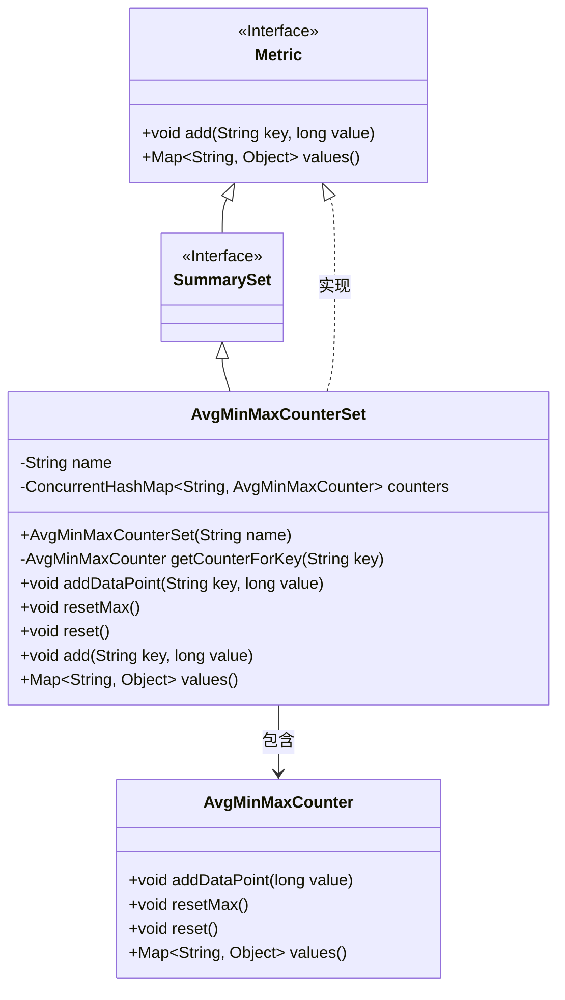
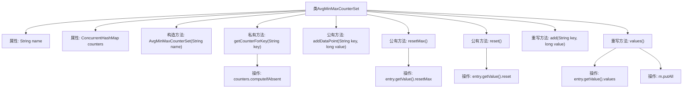

# 基础信息

|      |      |
|------|------|
| 名称 | AvgMinMaxCounterSet |
| 编码语言 | .java |
| 代码路径 | zookeeper/zookeeper-server/src/main/java/org/apache/zookeeper/server/metric/AvgMinMaxCounterSet.java |
| 包名 | org.apache.zookeeper.server.metric |
| 依赖项 | ['java.util.LinkedHashMap', 'java.util.Map', 'java.util.concurrent.ConcurrentHashMap', 'org.apache.zookeeper.metrics.SummarySet'] |
| 概述说明 | AvgMinMaxCounterSet类用于管理多个AvgMinMaxCounter实例，支持按key添加数据点、重置最大值或全部数据，并汇总所有计数器的值。 |

# 说明

AvgMinMaxCounterSet是一个继承自Metric类的统计集合实现，用于管理多个AvgMinMaxCounter实例。该类通过ConcurrentHashMap存储以字符串键为索引的计数器实例，提供线程安全的数据操作。核心功能包括：通过getCounterForKey方法按需创建计数器，addDataPoint方法添加数据点，resetMax和reset方法分别重置最大值或全部统计值。values方法返回包含所有计数器统计值的映射集合。该类实现了SummarySet接口的add方法作为addDataPoint的别名，支持键值对形式的数据录入。

# 类列表 Class Summary

| 名称   | 类型  | 说明 |
|-------|------|-------------|
| AvgMinMaxCounterSet | class | AvgMinMaxCounterSet类实现SummarySet接口，通过ConcurrentHashMap管理多个AvgMinMaxCounter实例，支持添加数据点、重置最大值和全部重置功能，并返回统计值集合。 |

## 类 AvgMinMaxCounterSet

|      |      |
|------|------|
| 访问范围 | public |
| 类型 | class |
| 名称 | AvgMinMaxCounterSet |
| 说明 | AvgMinMaxCounterSet类实现SummarySet接口，通过ConcurrentHashMap管理多个AvgMinMaxCounter实例，支持添加数据点、重置最大值和全部重置功能，并返回统计值集合。 |

### UML类图

AvgMinMaxCounterSet是一个实现Metric接口并继承SummarySet的统计工具类，内部使用ConcurrentHashMap管理多个AvgMinMaxCounter实例。该类提供添加数据点、重置最大值和完全重置功能，并通过values()方法聚合所有计数器的统计结果。线程安全的实现适用于高并发场景的数据收集与分析。

### 内部方法调用关系图

这段代码定义了一个名为AvgMinMaxCounterSet的类，继承自Metric并实现SummarySet接口，用于管理一组AvgMinMaxCounter实例。核心功能包括通过键值对存储计数器、添加数据点、重置最大值或整个计数器，以及获取所有计数器的值。类内部使用ConcurrentHashMap保证线程安全，通过computeIfAbsent方法实现懒加载计数器实例。values()方法会聚合所有计数器的统计结果，体现了组合模式的设计思想。

### 字段列表 Field List

| 名称  | 类型  | 说明 |
|-------|-------|------|
| name | String | 私有字符串变量name |
| counters = new ConcurrentHashMap<>() | ConcurrentHashMap<String, AvgMinMaxCounter> | 私有并发哈希表，键为字符串，值为AvgMinMaxCounter对象，用于线程安全的计数统计。 |

### 方法列表 Method List

| 名称  | 类型  | 说明 |
|-------|-------|------|
| resetMax | void | 重置所有计数器的最大值。遍历计数器映射，对每个计数器调用resetMax方法。 |
| getCounterForKey | AvgMinMaxCounter | 私有方法`getCounterForKey`根据键获取计数器，若不存在则创建新的`AvgMinMaxCounter`实例，键格式为"key_name"。 |
| addDataPoint | void | 方法`addDataPoint`接收键和值参数，调用`getCounterForKey`获取计数器并添加数据点。 |
| reset | void | 方法reset遍历counters中所有AvgMinMaxCounter实例并调用其reset方法重置状态。 |
| add | void | Java方法重写，通过addDataPoint方法实现键值对添加。 |
| values | Map<String, Object> | 重写values方法，遍历counters中的AvgMinMaxCounter对象，将其值存入LinkedHashMap并返回。 |

