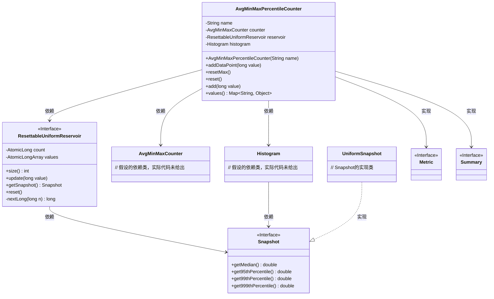
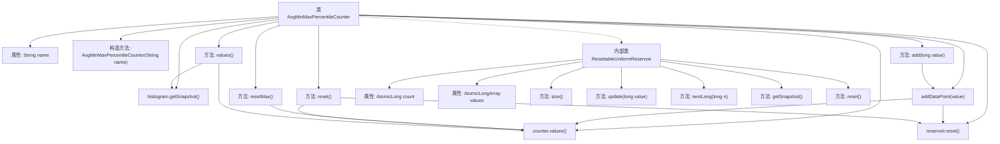

# 基础信息

|      |      |
|------|------|
| 名称 | AvgMinMaxPercentileCounter |
| 编码语言 | .java |
| 代码路径 | zookeeper/zookeeper-server/src/main/java/org/apache/zookeeper/server/metric/AvgMinMaxPercentileCounter.java |
| 包名 | org.apache.zookeeper.server.metric |
| 依赖项 | ['com.codahale.metrics.Histogram', 'com.codahale.metrics.Reservoir', 'com.codahale.metrics.Snapshot', 'com.codahale.metrics.UniformSnapshot', 'java.util.ArrayList', 'java.util.LinkedHashMap', 'java.util.List', 'java.util.Map', 'java.util.concurrent.ThreadLocalRandom', 'java.util.concurrent.atomic.AtomicLong', 'java.util.concurrent.atomic.AtomicLongArray', 'org.apache.zookeeper.metrics.Summary'] |
| 概述说明 | AvgMinMaxPercentileCounter类实现统计功能，包含平均值、最小值、最大值和百分位数计算。使用ResettableUniformReservoir存储数据，支持重置和更新操作。通过values方法输出统计结果。 |

# 说明

AvgMinMaxPercentileCounter是一个用于统计数据的类，继承自Metric并实现Summary接口。它包含名称、AvgMinMaxCounter计数器、ResettableUniformReservoir水库和Histogram直方图。ResettableUniformReservoir是一个可重置的均匀水库，使用原子操作管理数据，支持更新、获取快照和重置功能。该类提供添加数据点、重置最大值、重置所有数据以及获取包含平均值、最小值、最大值和不同百分位数（如p50、p95、p99、p999）的统计结果的功能。

# 类列表 Class Summary

| 名称   | 类型  | 说明 |
|-------|------|-------------|
| AvgMinMaxPercentileCounter | class | AvgMinMaxPercentileCounter类实现Summary接口，用于统计平均值、最小值、最大值及百分位数。包含计数器、直方图和可重置的均匀采样器，支持数据点添加、重置和获取统计结果。 |

## 类 AvgMinMaxPercentileCounter

|      |      |
|------|------|
| 访问范围 | public |
| 类型 | class |
| 名称 | AvgMinMaxPercentileCounter |
| 说明 | AvgMinMaxPercentileCounter类实现Summary接口，用于统计平均值、最小值、最大值及百分位数。包含计数器、直方图和可重置的均匀采样器，支持数据点添加、重置和获取统计结果。 |

### UML类图

这段代码实现了一个统计度量工具类`AvgMinMaxPercentileCounter`，继承自`Metric`并实现`Summary`接口，用于计算数据的平均值、最小值、最大值及百分位数（P50/P95/P99/P999）。核心包含一个可重置的均匀采样池`ResettableUniformReservoir`，通过`Histogram`生成快照数据。类图展示了其与基础统计组件（如`AvgMinMaxCounter`）、采样结构（如`ResettableUniformReservoir`）及快照接口的协作关系，体现了多维度数据采集和统计功能。

### 内部方法调用关系图

这段代码定义了一个用于统计指标的工具类AvgMinMaxPercentileCounter，它继承自Metric并实现了Summary接口。该类通过内部组合AvgMinMaxCounter和Histogram来实现对数据的统计计算，包括平均值、最小值、最大值以及各种百分位数（p50、p95、p99、p999）。内部类ResettableUniformReservoir实现了一个可重置的均匀采样池，用于存储数据点并计算百分位数。整个类提供了数据点添加、重置和获取统计结果的功能，适用于需要监控系统性能指标的场景。

### 字段列表 Field List

| 名称  | 类型  | 说明 |
|-------|-------|------|
| counter | AvgMinMaxCounter | 私有不可变的AvgMinMaxCounter计数器实例。 |
| reservoir | ResettableUniformReservoir | 私有不可变变量reservoir，类型为可重置均匀采样池。 |
| name | String | 私有字符串类型变量name。 |
| histogram | Histogram | 私有且不可变的直方图对象。 |

### 方法列表 Method List

| 名称  | 类型  | 说明 |
|-------|-------|------|
| values | Map<String, Object> | 该方法返回一个包含计数器值和直方图分位数的映射，包括中位数、95%、99%和99.9%分位数，键名添加前缀"pXX_name"。 |
| add | void | 这是一个Java方法，功能是添加长整型数据点。方法名为add，接受一个long类型参数value，并调用addDataPoint方法处理该值。 |
| resetMax | void | 重置计数器最大值，保持与上游行为一致。 |
| addDataPoint | void | 方法addDataPoint接收长整型value，分别调用counter.add和histogram.update更新计数器和直方图。 |
| reset | void | 重置计数器和存储器的状态。 |

