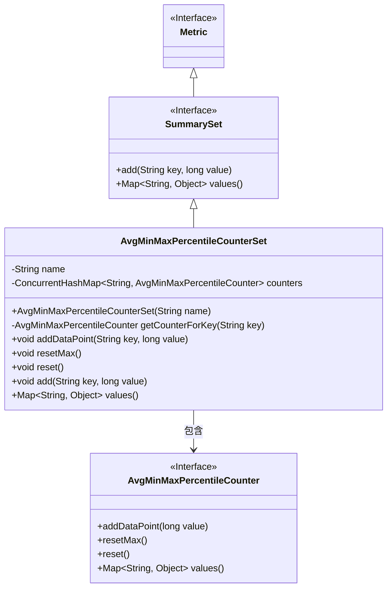
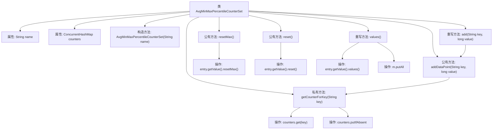

# 基础信息

|      |      |
|------|------|
| 名称 | AvgMinMaxPercentileCounterSet |
| 编码语言 | .java |
| 代码路径 | zookeeper/zookeeper-server/src/main/java/org/apache/zookeeper/server/metric/AvgMinMaxPercentileCounterSet.java |
| 包名 | org.apache.zookeeper.server.metric |
| 依赖项 | ['java.util.LinkedHashMap', 'java.util.Map', 'java.util.concurrent.ConcurrentHashMap', 'org.apache.zookeeper.metrics.SummarySet'] |
| 概述说明 | AvgMinMaxPercentileCounterSet类实现SummarySet接口，用于管理多个AvgMinMaxPercentileCounter实例。支持添加数据点、重置计数器和获取统计值。使用ConcurrentHashMap保证线程安全。 |

# 说明

AvgMinMaxPercentileCounterSet是一个继承自Metric并实现SummarySet接口的类，用于管理多个AvgMinMaxPercentileCounter实例。它通过ConcurrentHashMap存储计数器，确保线程安全。构造函数接收名称参数初始化。提供getCounterForKey方法按键获取或创建计数器。支持添加数据点、重置最大值和完全重置功能。values方法返回所有计数器的统计值集合。该类通过add方法兼容接口要求，实现数据点添加功能。

# 类列表 Class Summary

| 名称   | 类型  | 说明 |
|-------|------|-------------|
| AvgMinMaxPercentileCounterSet | class | AvgMinMaxPercentileCounterSet类实现SummarySet接口，用于管理多个AvgMinMaxPercentileCounter实例。通过ConcurrentHashMap存储计数器，支持添加数据点、重置最大值和全部重置功能，并能返回所有计数器的统计值。 |

## 类 AvgMinMaxPercentileCounterSet

|      |      |
|------|------|
| 访问范围 | public |
| 类型 | class |
| 名称 | AvgMinMaxPercentileCounterSet |
| 说明 | AvgMinMaxPercentileCounterSet类实现SummarySet接口，用于管理多个AvgMinMaxPercentileCounter实例。通过ConcurrentHashMap存储计数器，支持添加数据点、重置最大值和全部重置功能，并能返回所有计数器的统计值。 |

### UML类图

这段代码展示了一个名为AvgMinMaxPercentileCounterSet的类，它继承自Metric接口并实现了SummarySet接口。该类主要用于管理一组AvgMinMaxPercentileCounter实例，通过ConcurrentHashMap存储这些计数器，并提供添加数据点、重置最大值、完全重置以及获取所有计数器值的方法。每个计数器与特定键关联，当访问不存在的键时会自动创建新计数器。该类实现了线程安全的计数器管理，适合在多线程环境中使用。

### 内部方法调用关系图

这段代码流程图展示了AvgMinMaxPercentileCounterSet类的结构和主要方法调用关系。该类继承自Metric并实现SummarySet接口，核心功能是通过ConcurrentHashMap管理多个AvgMinMaxPercentileCounter实例。流程图从类声明开始，依次展示构造方法、私有辅助方法getCounterForKey（包含线程安全的计数器获取逻辑）、数据操作方法addDataPoint/add、重置方法reset/resetMax，以及重写的values方法。箭头清晰体现了方法间的调用链，特别是addDataPoint通过getCounterForKey获取计数器实例，而reset/resetMax/values则遍历所有计数器执行相应操作。

### 字段列表 Field List

| 名称  | 类型  | 说明 |
|-------|-------|------|
| name | String | 私有不可变字符串变量name。 |
| counters = new ConcurrentHashMap<>() | ConcurrentHashMap<String, AvgMinMaxPercentileCounter> | 私有并发哈希表，键为字符串，值为统计计数器对象，用于线程安全的高效统计操作。 |

### 方法列表 Method List

| 名称  | 类型  | 说明 |
|-------|-------|------|
| resetMax | void | 方法resetMax遍历counters中所有条目，调用每个AvgMinMaxPercentileCounter实例的resetMax方法重置最大值。 |
| addDataPoint | void | 方法`addDataPoint`接收键名`key`和数值`value`，调用`getCounterForKey`获取对应计数器并添加数据点。 |
| getCounterForKey | AvgMinMaxPercentileCounter | 私有方法`getCounterForKey`根据键获取计数器，若不存在则创建并存入映射，最终返回计数器实例。 |
| reset | void | 
重置所有计数器，遍历Map中的每个AvgMinMaxPercentileCounter并调用其reset方法。 |
| add | void | 重写add方法，调用addDataPoint添加键值对数据点。 |
| values | Map<String, Object> | 重写values方法，遍历counters中的AvgMinMaxPercentileCounter对象，合并其值到LinkedHashMap并返回。 |

