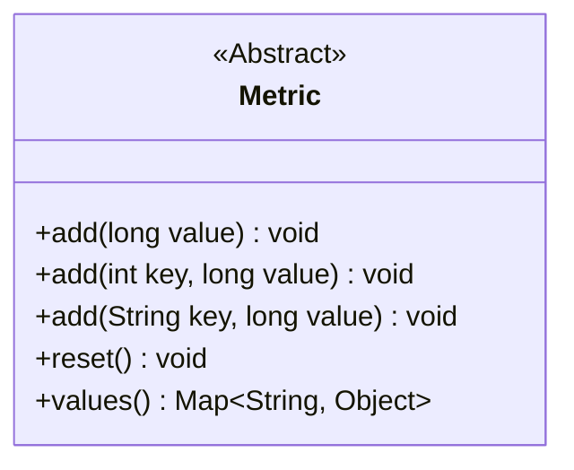
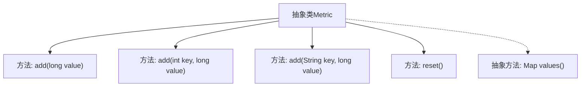

# 基础信息

|      |      |
|------|------|
| 名称 | Metric |
| 编码语言 | .java |
| 代码路径 | zookeeper/zookeeper-server/src/main/java/org/apache/zookeeper/server/metric/Metric.java |
| 包名 | org.apache.zookeeper.server.metric |
| 依赖项 | ['java.util.Map'] |
| 概述说明 | 抽象类Metric提供添加数值和重置功能，支持不同键类型，需实现values方法返回映射数据。 |

# 说明

这是一个名为Metric的抽象类，提供了多种方法来添加和重置度量值。它包含三个重载的add方法，分别接受long、int键与long值、String键与long值作为参数。还有一个reset方法用于重置状态，以及一个必须由子类实现的抽象方法values，该方法返回一个包含String键和Object值的Map。这个类为度量功能提供了基础框架，具体实现需要子类完成。

# 类列表 Class Summary

| 名称   | 类型  | 说明 |
|-------|------|-------------|
| Metric | class | 抽象类Metric提供添加数值方法（支持long、int键+long值、String键+long值），含重置功能，需子类实现values方法返回Map。 |

## 类 Metric

|      |      |
|------|------|
| 访问范围 | public abstract |
| 类型 | class |
| 名称 | Metric |
| 说明 | 抽象类Metric提供添加数值方法（支持long、int键+long值、String键+long值），含重置功能，需子类实现values方法返回Map。 |

### UML类图

这段类图描述了一个抽象类Metric，它提供了四种方法：三个重载的add方法用于添加不同类型的指标值（直接值、带整数键的值、带字符串键的值），一个reset方法用于重置指标，以及一个抽象的values方法返回包含所有指标的映射。该类作为度量指标的基类，通过抽象方法强制子类实现具体的指标收集逻辑，同时提供通用的数据添加和重置功能。

### 内部方法调用关系图

该流程图展示了抽象类Metric的结构，包含4个具体方法和1个抽象方法。类提供了三种重载的add()方法用于添加不同键类型的指标值，reset()方法用于重置状态，而抽象方法values()强制子类实现以返回指标数据的键值对集合。箭头表示类与方法间的从属关系，虚线箭头强调抽象方法的待实现特性。

### 字段列表 Field List

| 名称  | 类型  | 说明 |
|-------|-------|------|

### 方法列表 Method List

| 名称  | 类型  | 说明 |
|-------|-------|------|
| values | Map<String, Object> | 抽象方法，返回键值对映射。 |
| add | void | 方法定义：无参数添加长整型值。 |
| add | void | 方法定义：添加键值对，参数为字符串key和长整型value。 |
| reset | void | 方法reset()为空实现，无具体功能。 |
| add | void | 方法定义：添加键值对，参数为整型key和长整型value，无返回值。 |

