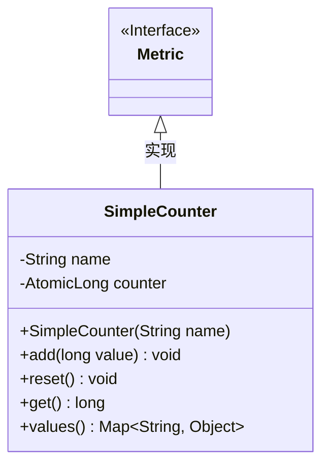
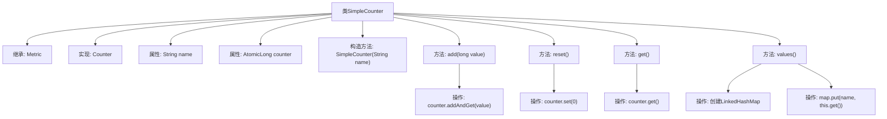

# 基础信息

|      |      |
|------|------|
| 名称 | SimpleCounter |
| 编码语言 | .java |
| 代码路径 | zookeeper/zookeeper-server/src/main/java/org/apache/zookeeper/server/metric/SimpleCounter.java |
| 包名 | org.apache.zookeeper.server.metric |
| 依赖项 | ['java.util.LinkedHashMap', 'java.util.Map', 'java.util.concurrent.atomic.AtomicLong', 'org.apache.zookeeper.metrics.Counter'] |
| 概述说明 | SimpleCounter类继承Metric实现Counter接口，包含原子计数器AtomicLong，提供add、reset、get和values方法，用于计数操作和数据输出。 |

# 说明

这是一个名为SimpleCounter的Java类，继承自Metric并实现Counter接口。该类包含一个名称字段和一个原子长整型计数器。构造函数接收名称参数初始化计数器。提供add方法增加计数值，reset方法重置计数器为0，get方法获取当前计数值。values方法返回包含名称和当前计数值的LinkedHashMap。整个类实现了基本的线程安全计数功能。

# 类列表 Class Summary

| 名称   | 类型  | 说明 |
|-------|------|-------------|
| SimpleCounter | class | SimpleCounter类继承Metric实现Counter接口，包含原子计数器，提供增加、重置、获取值和返回映射的方法。 |

## 类 SimpleCounter

|      |      |
|------|------|
| 访问范围 | public |
| 类型 | class |
| 名称 | SimpleCounter |
| 说明 | SimpleCounter类继承Metric实现Counter接口，包含原子计数器，提供增加、重置、获取值和返回映射的方法。 |

### UML类图

这段代码展示了一个简单的计数器实现，其中SimpleCounter类实现了Metric接口。类图清晰地呈现了类结构：SimpleCounter包含私有字段name和counter，以及公开的构造方法和方法。关键方法包括add(增加计数值)、reset(重置计数器)、get(获取当前值)和values(返回包含计数值的映射)。该类使用AtomicLong保证线程安全，并通过继承Metric接口表明其作为度量指标的用途。类图准确反映了这些设计特点和层级关系。

### 内部方法调用关系图

这段代码展示了一个名为SimpleCounter的类，它继承自Metric类并实现了Counter接口。该类主要用于计数操作，包含增加计数值、重置计数器、获取当前计数值以及将计数值转换为Map格式的功能。流程图清晰地展示了类的继承关系、属性构成以及各方法之间的调用关系，特别是AtomicLong类型的counter属性的线程安全操作。所有方法都围绕这个核心属性展开，确保计数的原子性和线程安全性。

### 字段列表 Field List

| 名称  | 类型  | 说明 |
|-------|-------|------|
| name | String | 私有字符串变量name |
| counter = new AtomicLong() | AtomicLong | 声明一个私有且不可变的AtomicLong类型变量counter，初始值为0，用于线程安全的原子操作。 |

### 方法列表 Method List

| 名称  | 类型  | 说明 |
|-------|-------|------|
| add | void | 重写add方法，使用原子操作将输入值累加到计数器。 |
| get | long | 获取计数器当前值的方法。 |
| reset | void | Java方法：reset()，功能是将计数器counter重置为0。 |
| values | Map<String, Object> | 重写values方法，返回包含当前对象值的LinkedHashMap。 |

