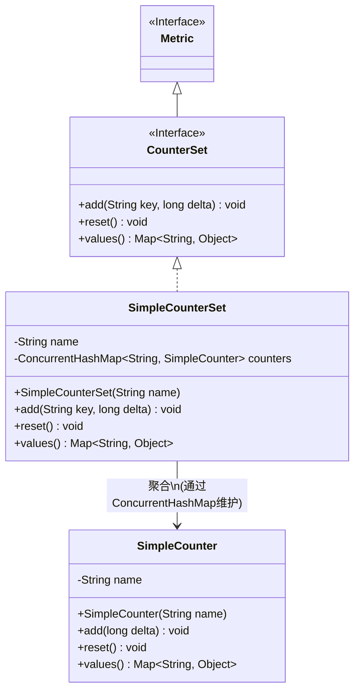
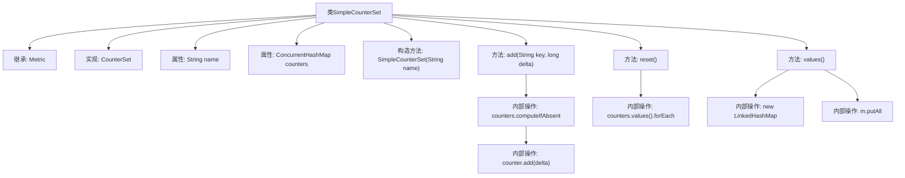

# 基础信息

|      |      |
|------|------|
| 名称 | SimpleCounterSet |
| 编码语言 | .java |
| 代码路径 | zookeeper/zookeeper-server/src/main/java/org/apache/zookeeper/server/metric/SimpleCounterSet.java |
| 包名 | org.apache.zookeeper.server.metric |
| 依赖项 | ['java.util.LinkedHashMap', 'java.util.Map', 'java.util.concurrent.ConcurrentHashMap', 'org.apache.zookeeper.metrics.CounterSet'] |
| 概述说明 | SimpleCounterSet是一个计数器集合类，继承Metric并实现CounterSet接口。使用ConcurrentHashMap存储计数器，支持添加计数、重置和获取值操作。 |

# 说明

SimpleCounterSet是一个实现了CounterSet接口的Metric类，用于管理一组计数器。它包含一个名称字段和一个线程安全的计数器映射表。构造函数接收名称参数初始化。add方法根据键添加或更新计数器值，键会与名称组合作为计数器标识。reset方法重置所有计数器。values方法返回所有计数器的当前值，以有序映射形式呈现。整个类设计为线程安全且支持动态计数器管理。

# 类列表 Class Summary

| 名称   | 类型  | 说明 |
|-------|------|-------------|
| SimpleCounterSet | class | SimpleCounterSet是一个计数器集合类，继承Metric并实现CounterSet接口。使用ConcurrentHashMap存储计数器，支持添加计数、重置和获取值操作。 |

## 类 SimpleCounterSet

|      |      |
|------|------|
| 访问范围 | public |
| 类型 | class |
| 名称 | SimpleCounterSet |
| 说明 | SimpleCounterSet是一个计数器集合类，继承Metric并实现CounterSet接口。使用ConcurrentHashMap存储计数器，支持添加计数、重置和获取值操作。 |

### UML类图

这段代码展示了一个基于接口实现的计数器集合系统。SimpleCounterSet类实现了CounterSet接口并继承自Metric，通过ConcurrentHashMap管理多个SimpleCounter实例。核心功能包括原子性增减计数(add)、重置所有计数器(reset)以及获取当前值集合(values)。其中SimpleCounter作为基础计数单元，每个实例通过键名与父集合名称组合标识，确保唯一性。类图清晰体现了接口继承、实现关系以及聚合关系，整体设计符合线程安全要求。

### 内部方法调用关系图

该流程图展示了SimpleCounterSet类的结构和主要方法调用关系。该类继承Metric并实现CounterSet接口，包含name属性和线程安全的counters映射。核心方法add()通过computeIfAbsent确保计数器存在后累加delta值；reset()遍历所有计数器执行重置；values()使用LinkedHashMap收集所有计数器值。图中清晰呈现了类继承关系、属性声明、方法调用链和内部集合操作流程，特别突出了ConcurrentHashMap的线程安全操作和值聚合过程。

### 字段列表 Field List

| 名称  | 类型  | 说明 |
|-------|-------|------|
| name | String | 私有字符串类型变量name，不可修改。 |
| counters = new ConcurrentHashMap<>() | ConcurrentHashMap<String, SimpleCounter> | 私有并发哈希表，键为字符串，值为SimpleCounter对象，线程安全。 |

### 方法列表 Method List

| 名称  | 类型  | 说明 |
|-------|-------|------|
| values | Map<String, Object> | 重写values方法，将counters中的值合并到LinkedHashMap并返回。 |
| add | void | Java方法：通过键值对累加数值，若键不存在则创建新计数器并累加。 |
| reset | void | 重写reset方法，遍历counters值并调用每个SimpleCounter的reset方法。 |

