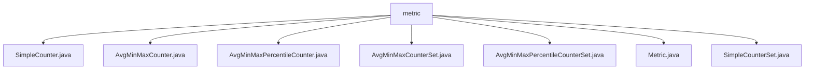

# 基础信息

|      |      |
|------|------|
| 名称 | metric |
| 编码语言 | .java |
| 代码路径 | zookeeper/zookeeper-server/src/main/java/org/apache/zookeeper/server/metric |
| 包名 | zookeeper.docs.zookeeper-server.src.main.java.org.apache.zookeeper.server.metric |
| 概述说明 | SimpleCounter是线程安全计数器类。AvgMinMaxCounter提供统计功能，记录总和、最小、最大值。AvgMinMaxPercentileCounter扩展统计功能，支持百分位数。AvgMinMaxCounterSet管理多个AvgMinMaxCounter实例。AvgMinMaxPercentileCounterSet管理多个AvgMinMaxPercentileCounter实例。Metric是度量功能基类。SimpleCounterSet管理一组计数器。 |

# 说明

## 概述  
1. 该模块是ZooKeeper服务器的度量统计组件，提供线程安全的计数器与统计值计算功能，类似监控系统的数据采集器。  
2. 主要接口包括Counter/Summary等度量标准，例如通过`add`方法写入数据点，`values`方法获取统计结果。  
3. 关键数据结构包含原子长整型计数器、ConcurrentHashMap管理的计数器集合，以及Reservoir采样水库（例如用于百分位计算）。  
4. 依赖Java并发工具包（如AtomicLong）和HdrHistogram库（例如实现p99统计）。  
5. 通过例如`LinkedHashMap`保持输出顺序，确保统计结果可预测。  

## 主要业务场景  
1. 业务流程包括记录请求延迟、节点操作次数等指标，例如在ZooKeeper处理客户端命令时更新计数器。  
2. 采用多线程并发更新模式，例如使用原子变量避免锁竞争，但平均值计算存在轻微竞态。  
3. 功能覆盖基础计数、极值统计、百分位计算，例如支持p50/p95/p999等常用分位数。  
4. 主要用于服务器性能监控，例如通过JMX暴露统计值或写入日志文件。  
5. 提供编程式API（如`addDataPoint`方法）和集合式API（例如`SimpleCounterSet`管理动态计数器组）。  
6. 可集成到监控系统，例如通过`values`方法输出的键值对适配Prometheus格式。

### 包内部结构视图

该流程图展示了Zookeeper服务器中metrics模块的类结构关系。所有类都直接位于metric目录下，包含7个实现不同功能的计数器类：简单计数器(SimpleCounter)、基础统计计数器(AvgMinMaxCounter)、百分位统计计数器(AvgMinMaxPercentileCounter)及其对应的集合版本，以及基础度量接口(Metric)和简单计数器集合(SimpleCounterSet)。这些类共同构成了Zookeeper的指标监控体系。

# 文件列表 File List

| 名称   | 类型  | 说明 |
|-------|------|-------------|
| [SimpleCounter.java](SimpleCounter.md) | file | SimpleCounter类继承Metric实现Counter接口，包含原子计数器AtomicLong，提供add、reset、get和values方法，用于计数操作和数据输出。 |
| [Metric.java](Metric.md) | file | 抽象类Metric提供添加数值和重置功能，支持不同键类型，需实现values方法返回映射数据。 |
| [AvgMinMaxPercentileCounterSet.java](AvgMinMaxPercentileCounterSet.md) | file | AvgMinMaxPercentileCounterSet类实现SummarySet接口，用于管理多个AvgMinMaxPercentileCounter实例。支持添加数据点、重置计数器和获取统计值。使用ConcurrentHashMap保证线程安全。 |
| [AvgMinMaxCounterSet.java](AvgMinMaxCounterSet.md) | file | AvgMinMaxCounterSet类用于管理多个AvgMinMaxCounter实例，支持按key添加数据点、重置最大值或全部数据，并汇总所有计数器的值。 |
| [AvgMinMaxPercentileCounter.java](AvgMinMaxPercentileCounter.md) | file | AvgMinMaxPercentileCounter类实现统计功能，包含平均值、最小值、最大值和百分位数计算。使用ResettableUniformReservoir存储数据，支持重置和更新操作。通过values方法输出统计结果。 |
| [SimpleCounterSet.java](SimpleCounterSet.md) | file | SimpleCounterSet是一个计数器集合类，继承Metric并实现CounterSet接口。使用ConcurrentHashMap存储计数器，支持添加计数、重置和获取值操作。 |
| [AvgMinMaxCounter.java](AvgMinMaxCounter.md) | file | AvgMinMaxCounter类实现统计功能，记录数据点的总数、总和、最小值、最大值及平均值，支持重置和线程安全操作。 |

