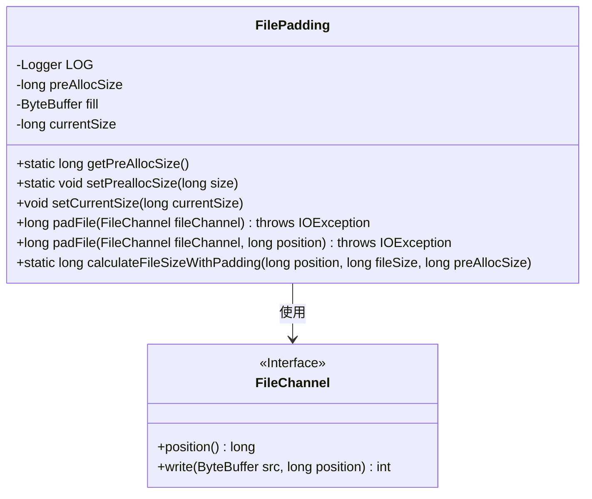
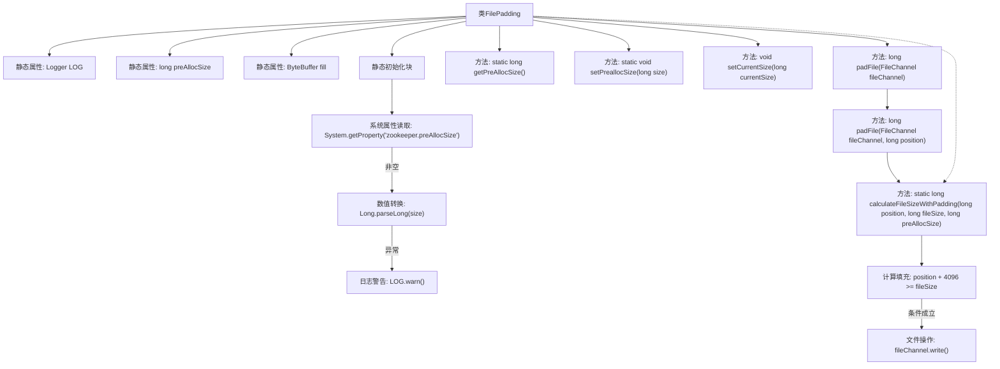

# 基础信息

|      |      |
|------|------|
| 名称 | FilePadding |
| 编码语言 | .java |
| 代码路径 | zookeeper/zookeeper-server/src/main/java/org/apache/zookeeper/server/persistence/FilePadding.java |
| 包名 | org.apache.zookeeper.server.persistence |
| 依赖项 | ['java.io.IOException', 'java.nio.ByteBuffer', 'java.nio.channels.FileChannel', 'org.slf4j.Logger', 'org.slf4j.LoggerFactory'] |
| 概述说明 | FilePadding类用于文件预分配填充，支持设置预分配大小，通过padFile方法扩展文件至预分配大小的倍数，calculateFileSizeWithPadding方法计算填充后的文件大小。 |

# 说明

该代码定义了一个FilePadding类，用于文件预分配和填充操作。主要功能包括：通过静态变量preAllocSize设置预分配大小（默认65536KB），支持系统属性zookeeper.preAllocSize动态配置；提供padFile方法将文件填充至preAllocSize的整数倍大小；calculateFileSizeWithPadding方法计算需要填充的文件大小，当写入位置接近文件末尾且preAllocSize为正时触发扩容。类包含日志记录、大小设置/获取方法及当前文件大小管理功能，适用于需要预分配磁盘空间的场景。

# 类列表 Class Summary

| 名称   | 类型  | 说明 |
|-------|------|-------------|
| FilePadding | class | FilePadding类用于文件预分配填充，支持设置预分配大小，计算填充后文件大小，并通过文件通道进行填充操作。关键方法包括padFile和calculateFileSizeWithPadding。 |

## 类 FilePadding

|      |      |
|------|------|
| 访问范围 | public |
| 类型 | class |
| 名称 | FilePadding |
| 说明 | FilePadding类用于文件预分配填充，支持设置预分配大小，计算填充后文件大小，并通过文件通道进行填充操作。关键方法包括padFile和calculateFileSizeWithPadding。 |

### UML类图

类图描述：
FilePadding类主要用于文件预分配和填充操作，包含静态成员preAllocSize（预分配大小）和fill（填充缓冲区），以及实例成员currentSize（当前文件大小）。提供静态方法calculateFileSizeWithPadding计算带填充的文件大小，实例方法padFile执行实际填充操作。该类依赖java.nio.channels.FileChannel接口来获取文件位置和执行写入操作。通过系统属性zookeeper.preAllocSize可配置预分配大小，包含完善的错误处理和日志记录能力。

### 内部方法调用关系图

流程图描述了FilePadding类的核心结构和逻辑流程。静态初始化块会读取系统属性并设置预分配大小，padFile方法通过calculateFileSizeWithPadding计算需要填充的文件大小，当满足条件时执行文件写入操作。该流程图清晰展示了从属性初始化、参数校验到文件填充的完整处理链条，特别突出了条件判断和异常处理路径。

### 字段列表 Field List

| 名称  | 类型  | 说明 |
|-------|-------|------|
| LOG | Logger | 私有静态常量日志记录器LOG。 |
| preAllocSize = 65536 * 1024 | long | 定义私有静态长整型变量preAllocSize，初始值为65536乘以1024。 |
| currentSize | long | 私有长整型变量currentSize，用于存储当前大小。 |
| fill = ByteBuffer.allocateDirect(1) | ByteBuffer | 私有静态最终字节缓冲区fill，直接分配1字节空间。 |

### 方法列表 Method List

| 名称  | 类型  | 说明 |
|-------|-------|------|
| setCurrentSize | void | 设置当前大小的公共方法，将参数currentSize赋值给类的同名成员变量。 |
| padFile | long | 方法`long padFile`调用`padFile`并传入文件当前位置作为参数，可能用于文件填充操作。 |
| setPreallocSize | void | 设置预分配内存大小的方法，参数为长整型size。 |
| getPreAllocSize | long | 获取预分配大小的静态方法，返回preAllocSize值。 |
| padFile | long | 方法`long padFile`用于扩展文件大小至指定位置，若当前大小不足则填充数据，返回更新后的文件大小。参数：文件通道、位置；异常：IO异常。 |
| calculateFileSizeWithPadding | long | 静态方法计算带预分配的文件大小。若预分配大小为正且当前位置接近文件末尾，则调整文件大小：若当前位置超过原大小，按预分配大小扩展并对齐；否则直接增加预分配大小。返回调整后的大小。 |

