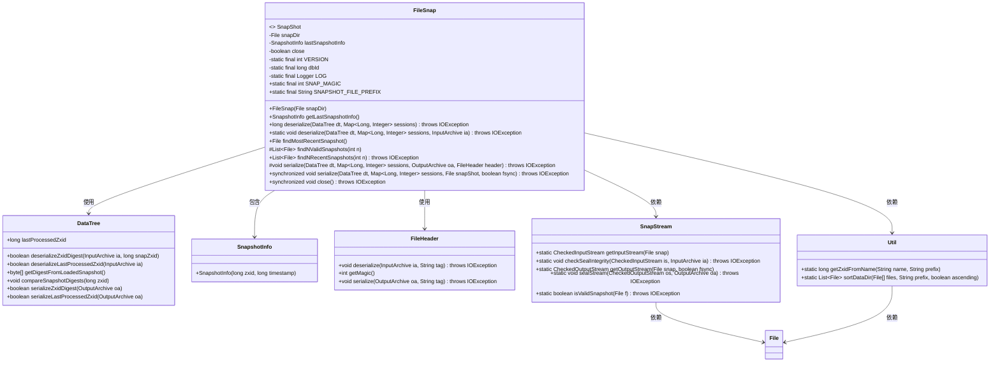
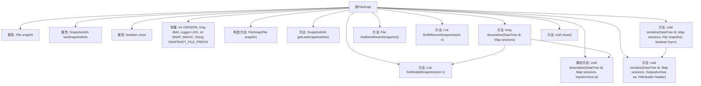
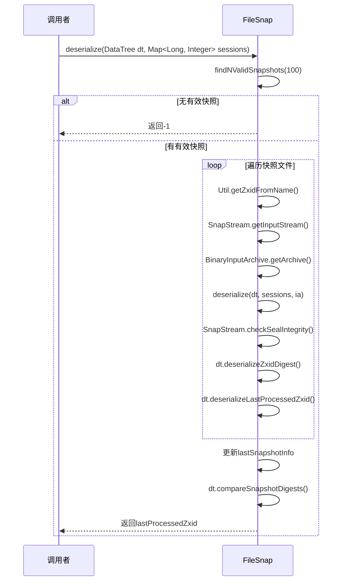

# 基础信息

|      |      |
|------|------|
| 名称 | FileSnap |
| 编码语言 | .java |
| 代码路径 | zookeeper/zookeeper-server/src/main/java/org/apache/zookeeper/server/persistence/FileSnap.java |
| 包名 | org.apache.zookeeper.server.persistence |
| 依赖项 | ['java.io.File', 'java.io.IOException', 'java.nio.ByteBuffer', 'java.util.ArrayList', 'java.util.List', 'java.util.Map', 'java.util.zip.CheckedInputStream', 'java.util.zip.CheckedOutputStream', 'javax.annotation.Nonnull', 'org.apache.jute.BinaryInputArchive', 'org.apache.jute.BinaryOutputArchive', 'org.apache.jute.InputArchive', 'org.apache.jute.OutputArchive', 'org.apache.zookeeper.server.DataTree', 'org.apache.zookeeper.server.util.SerializeUtils', 'org.slf4j.Logger', 'org.slf4j.LoggerFactory'] |
| 概述说明 | FileSnap类实现快照功能，支持序列化/反序列化数据树和会话，查找有效快照文件，并管理快照信息。包含版本控制、完整性校验和关闭操作。 |

# 说明

FileSnap类实现了SnapShot接口，用于管理文件快照的序列化和反序列化。主要功能包括：通过findNValidSnapshots方法查找有效快照文件，deserialize方法从快照恢复数据树和会话信息，serialize方法将数据树和会话序列化到文件。类中包含版本号、魔数校验、完整性检查等机制，支持处理ZXID摘要和最后处理ZXID。通过close方法控制资源释放，线程安全设计确保操作同步。快照文件名以"snapshot"为前缀，支持最多100个快照的验证处理。

# 类列表 Class Summary

| 名称   | 类型  | 说明 |
|-------|------|-------------|
| FileSnap | class | FileSnap类实现快照功能，管理文件存储的快照数据，支持序列化、反序列化及查找最新快照，包含校验和完整性检查。 |

## 类 FileSnap

|      |      |
|------|------|
| 访问范围 | public |
| 类型 | class |
| 名称 | FileSnap |
| 说明 | FileSnap类实现快照功能，管理文件存储的快照数据，支持序列化、反序列化及查找最新快照，包含校验和完整性检查。 |

### UML类图

这段类图描述了FileSnap类的结构及其与相关类的关系。FileSnap实现了SnapShot接口，主要负责文件快照的序列化和反序列化操作。它依赖于DataTree来处理数据树结构，使用SnapshotInfo存储快照信息，通过FileHeader处理文件头信息，并借助SnapStream和Util类进行流操作和工具方法。类图中清晰地展示了各个类之间的依赖关系和主要方法，体现了文件快照管理的核心功能。

### 内部方法调用关系图

该流程图展示了FileSnap类的核心结构和主要方法调用关系。类主要负责快照文件的序列化和反序列化操作，包含查找有效快照、验证快照完整性、读写数据树等核心功能。时序图重点描述了反序列化过程：首先查找有效快照，然后逐个验证并读取快照文件内容，最后更新快照信息并返回处理结果。整个设计体现了对快照数据完整性的严格检查机制，包括多次校验和密封验证，确保数据一致性。

### 字段列表 Field List

| 名称  | 类型  | 说明 |
|-------|-------|------|
| dbId = -1 | long | 私有静态长整型常量dbId值为-1。 |
| LOG = LoggerFactory.getLogger(FileSnap.class) | Logger | 定义静态常量LOG，用于FileSnap类的日志记录。 |
| VERSION = 2 | int | 私有静态常量整型变量VERSION，值为2。 |
| SNAPSHOT_FILE_PREFIX = "snapshot" | String | 定义静态常量字符串SNAPSHOT_FILE_PREFIX，值为"snapshot"，用于表示快照文件前缀。 |
| lastSnapshotInfo = null | SnapshotInfo | 声明一个变量lastSnapshotInfo，类型为SnapshotInfo，初始值为null。 |
| snapDir | File | 文件快照目录。 |
| SNAP_MAGIC = ByteBuffer.wrap("ZKSN".getBytes()).getInt() | int | 该代码定义了一个静态常量SNAP_MAGIC，其值为字符串"ZKSN"转换成的整型数值，用于标识数据格式或校验。 |
| close = false | boolean | 私有易变布尔变量close，初始值为false。 |

### 方法列表 Method List

| 名称  | 类型  | 说明 |
|-------|-------|------|
| deserialize | void | 该方法从输入存档反序列化数据树和会话映射。首先验证文件头的魔数是否匹配，不匹配则抛出异常。匹配则调用工具类继续反序列化快照数据。 |
| findNRecentSnapshots | List<File> | 方法查找最近的n个快照文件，按名称排序并筛选有效文件后返回列表。 |
| deserialize | long | 方法从100个快照中尝试反序列化数据，若成功则更新最后处理的Zxid并校验数据完整性，失败则抛出异常。 |
| findNValidSnapshots | List<File> | 方法findNValidSnapshots从目录中查找前n个有效快照文件，忽略无效文件并记录异常。返回符合条件的文件列表。 |
| findMostRecentSnapshot | File | 查找最新快照文件，若无则返回空。 |
| getLastSnapshotInfo | SnapshotInfo | 获取最近快照信息的方法，返回最后保存的快照数据。 |
| serialize | void | 方法serialize将DataTree、会话映射和文件头序列化到输出存档。若文件头为空则抛出异常，否则先序列化文件头，再序列化快照数据。 |
| serialize | void | 同步方法serialize将DataTree和会话数据序列化到快照文件，支持fsync确保数据持久化。包含CRC和摘要校验，处理最后zxid并记录快照信息。若已关闭则抛出异常。 |
| close | void | 同步方法close()，设置close为true，可能抛出IOException。 |

