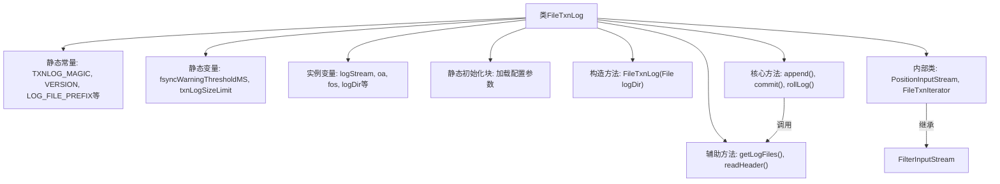
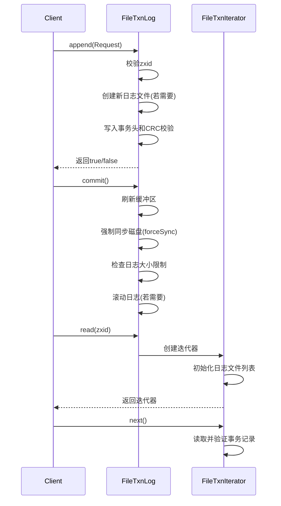

# 基础信息

|      |      |
|------|------|
| 名称 | FileTxnLog |
| 编码语言 | .java |
| 代码路径 | zookeeper/zookeeper-server/src/main/java/org/apache/zookeeper/server/persistence/FileTxnLog.java |
| 包名 | org.apache.zookeeper.server.persistence |
| 依赖项 | ['java.io.BufferedInputStream', 'java.io.BufferedOutputStream', 'java.io.Closeable', 'java.io.EOFException', 'java.io.File', 'java.io.FileInputStream', 'java.io.FileOutputStream', 'java.io.FilterInputStream', 'java.io.IOException', 'java.io.InputStream', 'java.io.RandomAccessFile', 'java.nio.ByteBuffer', 'java.nio.channels.FileChannel', 'java.util.ArrayDeque', 'java.util.ArrayList', 'java.util.List', 'java.util.Queue', 'java.util.concurrent.TimeUnit', 'java.util.zip.Adler32', 'java.util.zip.Checksum', 'org.apache.jute.BinaryInputArchive', 'org.apache.jute.BinaryOutputArchive', 'org.apache.jute.InputArchive', 'org.apache.jute.OutputArchive', 'org.apache.jute.Record', 'org.apache.zookeeper.server.Request', 'org.apache.zookeeper.server.ServerMetrics', 'org.apache.zookeeper.server.ServerStats', 'org.apache.zookeeper.server.TxnLogEntry', 'org.apache.zookeeper.server.util.SerializeUtils', 'org.apache.zookeeper.txn.TxnDigest', 'org.apache.zookeeper.txn.TxnHeader', 'org.slf4j.Logger', 'org.slf4j.LoggerFactory'] |
| 概述说明 | FileTxnLog是ZooKeeper的事务日志类，负责管理日志文件读写、滚动、同步及校验，支持事务追加、日志截断和迭代读取，包含日志大小限制和同步性能监控功能。 |

# 说明

FileTxnLog是ZooKeeper的事务日志实现类，负责管理事务日志文件的读写操作。它支持日志文件滚动、强制同步、CRC校验等功能。关键属性包括日志文件大小限制、同步警告阈值、日志目录等。主要方法包括追加事务记录、提交日志、滚动日志文件、读取日志等。内部类FileTxnIterator提供了遍历事务日志的能力，支持从指定zxid开始读取。日志文件以"log"为前缀，按zxid排序。该类还包含文件填充、性能监控等辅助功能，确保事务日志的完整性和可靠性。

# 类列表 Class Summary

| 名称   | 类型  | 说明 |
|-------|------|-------------|
| FileTxnLog | class | FileTxnLog是ZooKeeper的事务日志类，负责管理事务日志的读写、滚动、同步和校验。支持日志大小限制、强制同步、CRC校验，提供迭代器读取日志，并监控同步延迟。关键功能包括日志追加、提交、截断和按zxid查询。 |


## 类 FileTxnLog

|      |      |
|------|------|
| 访问范围 | public |
| 类型 | class |
| 名称 | FileTxnLog |
| 说明 | FileTxnLog是ZooKeeper的事务日志类，负责管理事务日志的读写、滚动、同步和校验。支持日志大小限制、强制同步、CRC校验，提供迭代器读取日志，并监控同步延迟。关键功能包括日志追加、提交、截断和按zxid查询。 |


### UML类图

```mermaid
classDiagram
    class FileTxnLog {
        -static Logger LOG
        -static int TXNLOG_MAGIC
        -static int VERSION
        -static String LOG_FILE_PREFIX
        -static String FSYNC_WARNING_THRESHOLD_MS_PROPERTY
        -static String ZOOKEEPER_FSYNC_WARNING_THRESHOLD_MS_PROPERTY
        -static long fsyncWarningThresholdMS
        -static String txnLogSizeLimitSetting
        -static long txnLogSizeLimit
        -long lastZxidSeen
        -volatile BufferedOutputStream logStream
        -volatile OutputArchive oa
        -volatile FileOutputStream fos
        -File logDir
        -boolean forceSync
        -long dbId
        -Queue~FileOutputStream~ streamsToFlush
        -File logFileWrite
        -FilePadding filePadding
        -ServerStats serverStats
        -volatile long syncElapsedMS
        -long prevLogsRunningTotal
        -long filePosition
        -long unFlushedSize
        -long fileSize
        +FileTxnLog(File logDir)
        +static void setPreallocSize(long size)
        +synchronized void setServerStats(ServerStats serverStats)
        +static void setTxnLogSizeLimit(long size)
        +synchronized long getCurrentLogSize()
        +synchronized void setTotalLogSize(long size)
        +synchronized long getTotalLogSize()
        +static long getTxnLogSizeLimit()
        +protected Checksum makeChecksumAlgorithm()
        +synchronized void rollLog() throws IOException
        +synchronized void close() throws IOException
        +synchronized boolean append(Request request) throws IOException
        +static File[] getLogFiles(File[] logDirList, long snapshotZxid)
        +long getLastLoggedZxid()
        +synchronized void commit() throws IOException
        +long getTxnLogSyncElapsedTime()
        +TxnIterator read(long zxid) throws IOException
        +TxnIterator read(long zxid, boolean fastForward) throws IOException
        +boolean truncate(long zxid) throws IOException
        -static FileHeader readHeader(File file) throws IOException
        +long getDbId() throws IOException
        +boolean isForceSync()
    }

    class FileTxnIterator {
        -File logDir
        -long zxid
        -TxnHeader hdr
        -Record record
        -TxnDigest digest
        -File logFile
        -InputArchive ia
        -static String CRC_ERROR
        -PositionInputStream inputStream
        -ArrayList~File~ storedFiles
        +FileTxnIterator(File logDir, long zxid, boolean fastForward) throws IOException
        +FileTxnIterator(File logDir, long zxid) throws IOException
        -void init() throws IOException
        +long getStorageSize()
        -boolean goToNextLog() throws IOException
        -protected void inStreamCreated(InputArchive ia, InputStream is) throws IOException
        -protected InputArchive createInputArchive(File logFile) throws IOException
        -protected Checksum makeChecksumAlgorithm()
        +boolean next() throws IOException
        +TxnHeader getHeader()
        +Record getTxn()
        +TxnDigest getDigest()
        +void close() throws IOException
    }

    class PositionInputStream {
        -long position
        +PositionInputStream(InputStream in)
        +int read() throws IOException
        +int read(byte[] b) throws IOException
        +int read(byte[] b, int off, int len) throws IOException
        +long skip(long n) throws IOException
        +long getPosition()
        +boolean markSupported()
        +void mark(int readLimit)
        +void reset()
    }

    interface TxnLog {
        <<Interface>>
        +TxnIterator read(long zxid) throws IOException
        +boolean append(Request request) throws IOException
        +long getLastLoggedZxid()
        +void close() throws IOException
        +boolean truncate(long zxid) throws IOException
        +long getDbId() throws IOException
    }

    interface Closeable {
        <<Interface>>
        +void close() throws IOException
    }

    FileTxnLog --|> TxnLog
    FileTxnLog --|> Closeable
    FileTxnIterator ..|> TxnLog.TxnIterator
    PositionInputStream --* FileTxnIterator
    FileTxnIterator --> FileTxnLog : 使用
    FileTxnLog --> FilePadding : 包含
    FileTxnLog --> ServerStats : 依赖
    FileTxnLog --> Request : 处理
    FileTxnLog --> FileHeader : 使用
    FileTxnIterator --> FileHeader : 使用
    FileTxnIterator --> TxnHeader : 使用
    FileTxnIterator --> Record : 使用
    FileTxnIterator --> TxnDigest : 使用
```

这段代码实现了一个事务日志系统，主要用于ZooKeeper服务器记录事务操作。FileTxnLog类作为核心实现，负责日志文件的创建、追加、滚动和读取操作，同时支持日志截断和校验功能。它通过FileTxnIterator提供日志遍历能力，利用PositionInputStream精确定位读取位置。类图中清晰展示了与TxnLog和Closeable接口的继承关系，以及与辅助类如FilePadding、ServerStats的协作关系。系统通过静态配置参数控制日志大小和同步阈值，确保数据一致性的同时兼顾性能表现。


### 内部方法调用关系图





该流程图展示了FileTxnLog类的核心结构和主要交互流程。类负责管理ZooKeeper事务日志，包含静态配置参数、文件操作方法和两个关键内部类。时序图重点描述了事务追加(append)、提交(commit)和读取(read)三个核心操作的执行序列，体现了日志文件的创建、CRC校验、强制刷盘和迭代查询等关键过程。整个设计采用同步机制保证线程安全，通过文件预分配和批量处理优化IO性能，并包含完善的异常处理和日志监控能力。

### 字段列表 Field List

| 名称  | 类型  | 说明 |
|-------|-------|------|
| unFlushedSize = 0 | long | 变量unFlushedSize记录未刷新数据大小，初始值为0。 |
| ZOOKEEPER_FSYNC_WARNING_THRESHOLD_MS_PROPERTY = "zookeeper." + FSYNC_WARNING_THRESHOLD_MS_PROPERTY | String | 定义静态常量ZOOKEEPER_FSYNC_WARNING_THRESHOLD_MS_PROPERTY，值为"zookeeper."与FSYNC_WARNING_THRESHOLD_MS_PROPERTY拼接。 |
| txnLogSizeLimit = -1 | long | 私有静态长整型变量txnLogSizeLimit，初始值为-1。 |
| LOG_FILE_PREFIX = "log" | String | 定义静态常量LOG_FILE_PREFIX，值为"log"，表示日志文件前缀。 |
| logFileWrite = null | File | 声明一个文件日志写入对象logFileWrite并初始化为null。 |
| serverStats | ServerStats | 私有服务器状态变量serverStats。 |
| forceSync = !System.getProperty("zookeeper.forceSync", "yes").equals("no") | boolean | 私有布尔变量forceSync，默认值为true，当系统属性zookeeper.forceSync设为no时为false。 |
| dbId | long | 数据库记录唯一标识符 |
| filePosition = 0 | long | 初始化长整型变量filePosition并赋值为0。 |
| prevLogsRunningTotal | long | 私有长整型变量prevLogsRunningTotal，用于记录日志累计值。 |
| syncElapsedMS = -1L | long | 私有可变长整型变量syncElapsedMS，初始值为-1毫秒，用于记录同步耗时。 |
| logDir | File | 定义文件变量logDir。 |
| oa | OutputArchive | volatile OutputArchive oa; 声明了一个易变的输出归档对象oa。 |
| logStream = null | BufferedOutputStream | 声明一个可变的缓冲输出流logStream，初始化为null。 |
| TXNLOG_MAGIC = ByteBuffer.wrap("ZKLG".getBytes()).getInt() | int | 代码定义了一个静态常量TXNLOG_MAGIC，其值为字符串"ZKLG"转换的整型数值。 |
| fsyncWarningThresholdMS | long | 私有静态长整型常量，用于定义文件同步操作的警告阈值（毫秒）。 |
| filePadding = new FilePadding() | FilePadding | 创建FilePadding类的私有实例filePadding。 |
| fos = null | FileOutputStream | 声明一个可能为空的文件输出流变量fos。 |
| fileSize = 0 | long | 定义长整型变量fileSize，初始值为0。 |
| VERSION = 2 | int | 静态常量整型变量VERSION，值为2。 |
| streamsToFlush = new ArrayDeque<>() | Queue<FileOutputStream> | 私有队列存储待刷新的文件输出流，使用ArrayDeque实现。 |
| FSYNC_WARNING_THRESHOLD_MS_PROPERTY = "fsync.warningthresholdms" | String | 静态字符串常量FSYNC_WARNING_THRESHOLD_MS_PROPERTY，用于定义fsync操作警告阈值毫秒数的属性键。 |
| lastZxidSeen | long | 变量long lastZxidSeen用于记录最后看到的ZooKeeper事务ID。 |
| txnLogSizeLimitSetting = "zookeeper.txnLogSizeLimitInKb" | String | ZooKeeper事务日志大小限制配置参数，变量名为txnLogSizeLimitSetting，单位为KB。 |
| LOG | Logger | 私有静态常量日志记录器LOG。 |

### 方法列表 Method List

| 名称  | 类型  | 说明 |
|-------|-------|------|
| setPreallocSize | void | 这是一个Java静态方法，用于设置文件预分配大小，通过调用FilePadding类的setPreallocSize方法实现。参数为long类型的size。 |
| isForceSync | boolean | 该方法返回布尔值forceSync，表示是否强制同步。 |
| append | boolean | 同步方法append处理请求：检查zxid，创建日志文件并写入数据，更新文件位置和大小，确保数据完整性和序列化。 |
| commit | void | 同步提交方法，刷新日志流并更新文件位置。若写入超过预分配大小，调整文件大小。强制同步时记录耗时，超阈值则警告并统计。检查日志大小，超限则滚动日志。 |
| read | TxnIterator | 公开方法read接收长整型zxid参数，可能抛出IO异常，返回TxnIterator类型结果，内部调用read(zxid, true)。 |
| getLogFiles | File[] | 该方法筛选日志文件，返回ZXID不大于快照ZXID的文件。先排序文件，找到最大ZXID，再收集所有ZXID不小于该值的文件。 |
| setTotalLogSize | void | Java同步方法，设置日志总大小为指定值。 |
| readHeader | FileHeader | 读取文件头方法：通过输入流读取文件，反序列化为FileHeader对象，确保流关闭，异常时记录日志。 |
| getTxnLogSizeLimit | long | 获取事务日志大小限制的方法，返回变量txnLogSizeLimit的值。 |
| setTxnLogSizeLimit | void | 设置事务日志大小限制的方法，参数为长整型size。 |
| truncate | boolean | 该方法用于截断日志文件至指定zxid位置。若找不到日志文件则抛出异常，否则定位到指定位置并截断文件，删除后续日志文件。操作成功返回true。 |
| getCurrentLogSize | long | 同步方法获取当前日志大小，若日志文件存在则返回文件大小，否则返回0。 |
| getTxnLogSyncElapsedTime | long | 该方法返回事务日志同步耗时，单位为毫秒。 |
| close | void | 同步关闭方法，先关闭logStream，再遍历关闭streamsToFlush中的所有流。 |
| makeChecksumAlgorithm | Checksum | 创建Adler32校验和算法实例的方法。 |
| getTotalLogSize | long | 这是一个同步方法，返回日志总大小，由历史日志累计值和当前日志大小相加得出。 |
| read | TxnIterator | 读取事务迭代器，根据zxid和fastForward参数创建FileTxnIterator实例，可能抛出IO异常。 |
| setServerStats | void | 重写Java方法，同步设置serverStats属性。 |
| getLastLoggedZxid | long | 获取最新日志事务ID。扫描日志目录，读取最大日志文件号，遍历事务记录更新最高ID，异常时记录警告并返回结果。 |
| rollLog | void | 同步方法rollLog()用于日志滚动：刷新并关闭当前日志流，重置文件大小和位置等状态，累计日志总大小。可能抛出IO异常。 |
| getDbId | long | 获取数据库ID：读取日志文件头，验证格式后返回ID，若格式错误抛出异常。 |


