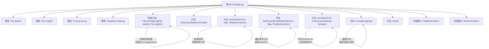

# 基础信息

|      |      |
|------|------|
| 名称 | FileTxnSnapLog |
| 编码语言 | .java |
| 代码路径 | zookeeper/zookeeper-server/src/main/java/org/apache/zookeeper/server/persistence/FileTxnSnapLog.java |
| 包名 | org.apache.zookeeper.server.persistence |
| 依赖项 | ['java.io.File', 'java.io.FilenameFilter', 'java.io.IOException', 'java.nio.file.Files', 'java.util.List', 'java.util.Map', 'java.util.concurrent.ConcurrentHashMap', 'org.apache.jute.Record', 'org.apache.zookeeper.KeeperException', 'org.apache.zookeeper.KeeperException.Code', 'org.apache.zookeeper.ZooDefs.OpCode', 'org.apache.zookeeper.common.Time', 'org.apache.zookeeper.server.DataTree', 'org.apache.zookeeper.server.DataTree.ProcessTxnResult', 'org.apache.zookeeper.server.Request', 'org.apache.zookeeper.server.ServerMetrics', 'org.apache.zookeeper.server.ServerStats', 'org.apache.zookeeper.server.ZooTrace', 'org.apache.zookeeper.server.persistence.TxnLog.TxnIterator', 'org.apache.zookeeper.txn.CreateSessionTxn', 'org.apache.zookeeper.txn.TxnDigest', 'org.apache.zookeeper.txn.TxnHeader', 'org.slf4j.Logger', 'org.slf4j.LoggerFactory'] |
| 概述说明 | FileTxnSnapLog类管理ZooKeeper事务日志和快照，提供数据恢复、快照保存、日志截断等功能，支持自动创建目录和空快照处理，包含错误处理和监听器接口。 |

# 说明

FileTxnSnapLog类负责管理ZooKeeper的事务日志和快照文件。它包含两个核心目录：dataDir存储事务日志，snapDir存储快照。构造函数会检查目录可写性，并根据配置自动创建目录。核心功能包括：通过restore方法从快照和日志恢复数据树，使用fastForwardFromEdits快速重放事务日志，提供事务迭代器readTxnLog，支持保存快照文件save，以及日志截断truncateLog。类还定义了PlayBackListener回调接口，用于在恢复过程中处理事务。异常处理涵盖目录校验错误、空快照警告等场景，同时维护了与服务器统计指标的关联。

# 类列表 Class Summary

| 名称   | 类型  | 说明 |
|-------|------|-------------|
| FileTxnSnapLog | class | FileTxnSnapLog类管理ZooKeeper的事务日志和快照，提供数据恢复、日志截断、快照保存等功能，支持自动创建目录和空快照信任配置。 |


## 类 FileTxnSnapLog

|      |      |
|------|------|
| 访问范围 | public |
| 类型 | class |
| 名称 | FileTxnSnapLog |
| 说明 | FileTxnSnapLog类管理ZooKeeper的事务日志和快照，提供数据恢复、日志截断、快照保存等功能，支持自动创建目录和空快照信任配置。 |


### UML类图

```mermaid
classDiagram
    class FileTxnSnapLog {
        -final File dataDir
        -final File snapDir
        -TxnLog txnLog
        -SnapShot snapLog
        -boolean autoCreateDB
        -boolean trustEmptySnapshot
        +static final int VERSION
        +static final String version
        -static final Logger LOG
        +static final String ZOOKEEPER_DATADIR_AUTOCREATE
        +static final String ZOOKEEPER_DATADIR_AUTOCREATE_DEFAULT
        +static final String ZOOKEEPER_DB_AUTOCREATE
        -static final String ZOOKEEPER_DB_AUTOCREATE_DEFAULT
        +static final String ZOOKEEPER_SNAPSHOT_TRUST_EMPTY
        -static final String EMPTY_SNAPSHOT_WARNING
        +FileTxnSnapLog(File dataDir, File snapDir) throws IOException
        +void setServerStats(ServerStats serverStats)
        -void checkLogDir() throws LogDirContentCheckException
        -void checkSnapDir() throws SnapDirContentCheckException
        +File getDataLogDir()
        +File getSnapDir()
        +SnapshotInfo getLastSnapshotInfo()
        +boolean shouldForceWriteInitialSnapshotAfterLeaderElection()
        +long restore(DataTree dt, Map~Long, Integer~ sessions, PlayBackListener listener) throws IOException
        +long fastForwardFromEdits(DataTree dt, Map~Long, Integer~ sessions, PlayBackListener listener) throws IOException
        +TxnIterator readTxnLog(long zxid) throws IOException
        +TxnIterator readTxnLog(long zxid, boolean fastForward) throws IOException
        +void processTransaction(TxnHeader hdr, DataTree dt, Map~Long, Integer~ sessions, Record txn) throws KeeperException.NoNodeException
        +long getLastLoggedZxid()
        +File save(DataTree dataTree, ConcurrentHashMap~Long, Integer~ sessionsWithTimeouts, boolean syncSnap) throws IOException
        +boolean truncateLog(long zxid)
        +File findMostRecentSnapshot() throws IOException
        +List~File~ findNRecentSnapshots(int n) throws IOException
        +List~File~ findNValidSnapshots(int n)
        +File[] getSnapshotLogs(long zxid)
        +boolean append(Request si) throws IOException
        +void commit() throws IOException
        +long getTxnLogElapsedSyncTime()
        +void rollLog() throws IOException
        +void close() throws IOException
        +void setTotalLogSize(long size)
        +long getTotalLogSize()
    }

    class DatadirException {
        <<Serializable>>
        +DatadirException(String msg)
        +DatadirException(String msg, Exception e)
    }

    class LogDirContentCheckException {
        <<Serializable>>
        +LogDirContentCheckException(String msg)
    }

    class SnapDirContentCheckException {
        <<Serializable>>
        +SnapDirContentCheckException(String msg)
    }

    interface PlayBackListener {
        <<Interface>>
        +void onTxnLoaded(TxnHeader hdr, Record rec, TxnDigest digest)
    }

    interface RestoreFinalizer {
        <<Interface>>
        +long run() throws IOException
    }

    FileTxnSnapLog --> DatadirException : throws
    FileTxnSnapLog --> LogDirContentCheckException : throws
    FileTxnSnapLog --> SnapDirContentCheckException : throws
    FileTxnSnapLog ..|> PlayBackListener : implements
    FileTxnSnapLog ..|> RestoreFinalizer : implements
    LogDirContentCheckException --|> DatadirException
    SnapDirContentCheckException --|> DatadirException
```

这段代码定义了一个ZooKeeper的事务日志和快照管理类FileTxnSnapLog，它负责处理事务日志和快照文件的读写、恢复、截断等操作。类中包含两个内部异常类和两个内部接口，分别用于处理目录检查异常和恢复过程中的回调。主要功能包括初始化日志/快照目录、恢复数据树状态、处理事务操作、管理日志文件等，是ZooKeeper数据持久化的核心组件。


### 内部方法调用关系图



该流程图展示了FileTxnSnapLog类的核心结构和主要方法调用关系。该类作为ZooKeeper的事务日志和快照管理组件，包含目录检查、数据恢复、快照生成等关键功能。构造方法负责初始化目录和日志组件，restore()实现数据树恢复逻辑，fastForwardFromEdits()处理事务日志回放，save()生成快照文件，truncateLog()提供日志截断能力。通过两个内部接口PlayBackListener和RestoreFinalizer支持回调机制，整体设计体现了事务日志与快照文件的协同管理能力。

### 字段列表 Field List

| 名称  | 类型  | 说明 |
|-------|-------|------|
| snapDir | File | final修饰的File类型变量snapDir。 |
| ZOOKEEPER_DB_AUTOCREATE_DEFAULT = "true" | String | 私有静态常量ZOOKEEPER_DB_AUTOCREATE_DEFAULT默认值为"true"。 |
| ZOOKEEPER_DATADIR_AUTOCREATE_DEFAULT = "true" | String | 定义静态常量ZOOKEEPER_DATADIR_AUTOCREATE_DEFAULT，默认值为"true"，用于控制ZooKeeper数据目录是否自动创建。 |
| trustEmptySnapshot | boolean | 私有布尔变量，标识是否信任空快照。 |
| LOG = LoggerFactory.getLogger(FileTxnSnapLog.class) | Logger | 声明一个私有静态不可变日志对象LOG，用于FileTxnSnapLog类的日志记录。 |
| ZOOKEEPER_DB_AUTOCREATE = "zookeeper.db.autocreate" | String | 静态常量ZOOKEEPER_DB_AUTOCREATE，用于配置ZooKeeper数据库自动创建功能。 |
| autoCreateDB | boolean | 私有布尔变量autoCreateDB，用于控制是否自动创建数据库。 |
| snapLog | SnapShot | 声明一个名为snapLog的SnapShot类型变量。 |
| txnLog | TxnLog | 交易日志对象，记录交易信息。 |
| ZOOKEEPER_DATADIR_AUTOCREATE = "zookeeper.datadir.autocreate" | String | ZOOKEEPER_DATADIR_AUTOCREATE是ZooKeeper自动创建数据目录的配置参数。 |
| ZOOKEEPER_SNAPSHOT_TRUST_EMPTY = "zookeeper.snapshot.trust.empty" | String | ZOOKEEPER_SNAPSHOT_TRUST_EMPTY是一个静态常量字符串，用于标识ZooKeeper快照是否信任空值。 |
| version = "version-" | String | 代码定义了一个公共静态常量字符串变量version，初始值为"version-"。 |
| dataDir | File | 声明一个名为dataDir的File类型变量。 |
| EMPTY_SNAPSHOT_WARNING = "No snapshot found, but there are log entries. " | String | 私有静态常量字符串，提示未找到快照但存在日志条目。 |
| VERSION = 2 | int | 静态常量整型变量VERSION，值为2。 |

### 方法列表 Method List

| 名称  | 类型  | 说明 |
|-------|-------|------|
| commit | void | Java方法`commit()`调用`txnLog.commit()`，可能抛出`IOException`异常。 |
| getSnapDir | File | 获取snapDir文件目录的方法。 |
| findMostRecentSnapshot | File | 查找最新快照文件的方法，调用FileSnap类处理指定目录并返回结果。 |
| shouldForceWriteInitialSnapshotAfterLeaderElection | boolean | 方法检查是否应在选举后强制写入初始快照：当信任空快照且无最后快照信息时返回真。 |
| getLastSnapshotInfo | SnapshotInfo | 获取最新快照信息的方法，返回快照日志中的最后一条记录。 |
| findNRecentSnapshots | List<File> | 方法`findNRecentSnapshots`通过`FileSnap`类从`snapDir`目录查找最近的`n`个快照文件，可能抛出`IOException`异常。 |
| getLastLoggedZxid | long | 获取最后记录的Zxid值，通过FileTxnLog从指定目录读取并返回。 |
| getSnapshotLogs | File[] | 获取指定事务ID(zxid)对应的快照日志文件列表，通过FileTxnLog工具从数据目录中筛选匹配文件。 |
| findNValidSnapshots | List<File> | 方法findNValidSnapshots接收整数n，使用FileSnap类在指定目录查找并返回前n个有效快照文件列表。 |
| readTxnLog | TxnIterator | 读取事务日志，返回迭代器，支持从指定zxid开始读取，默认包含子节点。 |
| getTxnLogElapsedSyncTime | long | 获取事务日志同步耗时的方法，返回txnLog的同步时间。 |
| rollLog | void | 方法rollLog调用txnLog.rollLog()，可能抛出IOException。 |
| readTxnLog | TxnIterator | 读取事务日志，返回指定zxid开始的迭代器，支持快速跳转。 |
| checkSnapDir | void | 检查快照目录是否包含日志文件，若有则抛出异常提示检查配置。 |
| append | boolean | Java方法：将请求追加到事务日志，成功返回true，失败抛出IOException。 |
| checkLogDir | void | 检查日志目录是否包含快照文件，若有则抛出异常提示检查配置。 |
| close | void | 
关闭事务日志和快照日志，释放资源并置空引用。 |
| setTotalLogSize | void | 设置事务日志总大小的方法，参数为长整型size。 |
| getTotalLogSize | long | 获取事务日志总大小的方法，返回txnLog的总日志大小。 |
| fastForwardFromEdits | long | 方法fastForwardFromEdits处理事务日志，更新数据树和会话，记录最高事务ID。加载事务数及耗时，返回最高ID。异常时抛出IO异常。 |
| restore | long | 方法restore用于恢复数据树，处理快照和事务日志。若初始化文件存在则信任空数据库，否则根据设置决定。若无快照且事务日志非空，根据信任空快照设置处理。最终返回最高事务ID或错误状态。 |
| processTransaction | void | 处理事务的方法，根据类型创建或关闭会话，记录日志并同步数据树状态，忽略快照期间的节点错误。 |
| setServerStats | void | 设置服务器统计信息，将serverStats赋值给txnLog的serverStats属性。 |
| save | File | 方法save将数据树和会话信息序列化为快照文件，若磁盘空间不足会删除空文件，否则抛出异常。成功时返回快照文件。 |
| truncateLog | boolean | 该方法用于截断事务日志至指定zxid，先关闭现有日志，截断后重新打开，成功返回true，失败返回false并记录错误。 |
| getDataLogDir | File | 方法getDataLogDir返回dataDir文件对象。 |


