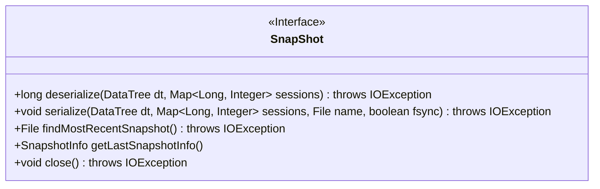
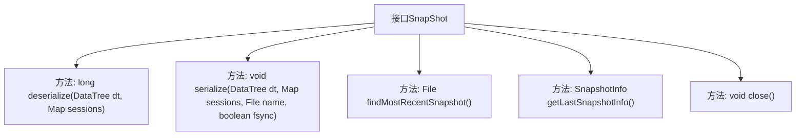

# 基础信息

|      |      |
|------|------|
| 名称 | SnapShot |
| 编码语言 | .java |
| 代码路径 | zookeeper/zookeeper-server/src/main/java/org/apache/zookeeper/server/persistence/SnapShot.java |
| 包名 | org.apache.zookeeper.server.persistence |
| 依赖项 | ['java.io.File', 'java.io.IOException', 'java.util.Map', 'org.apache.zookeeper.server.DataTree'] |
| 概述说明 | 快照接口提供数据树序列化、反序列化、查找最新快照、获取快照信息及资源释放功能。 |

# 说明

该接口定义了快照操作的核心功能，包含五个关键方法：deserialize用于从快照反序列化数据树和会话并返回最后处理的zxid；serialize将数据树和会话序列化存储到指定文件，支持同步写入选项；findMostRecentSnapshot查找最新快照文件；getLastSnapshotInfo获取最近快照的元信息；close用于立即释放资源。所有方法都可能抛出IO异常，涉及快照的读写、查找和资源管理全生命周期操作。

# 类列表 Class Summary

| 名称   | 类型  | 说明 |
|-------|------|-------------|
| SnapShot | interface | 快照接口提供数据树序列化、反序列化、查找最新快照、获取快照信息及资源释放功能。 |

## 类 SnapShot

|      |      |
|------|------|
| 访问范围 | public |
| 类型 | interface |
| 名称 | SnapShot |
| 说明 | 快照接口提供数据树序列化、反序列化、查找最新快照、获取快照信息及资源释放功能。 |

### UML类图

这段代码定义了一个名为`SnapShot`的接口，该接口提供了数据序列化和反序列化的相关操作。接口包含五个方法：`deserialize`用于将快照数据反序列化到数据树和会话映射中；`serialize`用于将数据树和会话超时信息序列化到持久化存储；`findMostRecentSnapshot`用于查找最近的快照文件；`getLastSnapshotInfo`获取最后一次保存/恢复的快照信息；`close`用于立即释放资源。所有方法都可能抛出`IOException`异常，体现了对文件操作可能失败的考虑。

### 内部方法调用关系图

该流程图展示了SnapShot接口的结构及其五个核心方法。接口定义了数据树的序列化(serialize)和反序列化(deserialize)操作，用于持久化存储和恢复数据。同时提供查找最新快照文件(findMostRecentSnapshot)、获取最后快照信息(getLastSnapshotInfo)以及资源释放(close)的功能。所有方法都可能抛出IOException异常，体现了对持久化存储操作的错误处理能力。

### 字段列表 Field List

| 名称  | 类型  | 说明 |
|-------|-------|------|

### 方法列表 Method List

| 名称  | 类型  | 说明 |
|-------|-------|------|
| close | void | 关闭资源，可能抛出IO异常。 |
| findMostRecentSnapshot | File | 查找最新快照文件，可能抛出IO异常。 |
| getLastSnapshotInfo | SnapshotInfo | 获取最近一次快照的信息。 |
| serialize | void | 序列化DataTree对象和会话映射到文件，可选同步写入，可能抛出IO异常。 |
| deserialize | long | 方法反序列化DataTree和会话映射，可能抛出IO异常。 |

