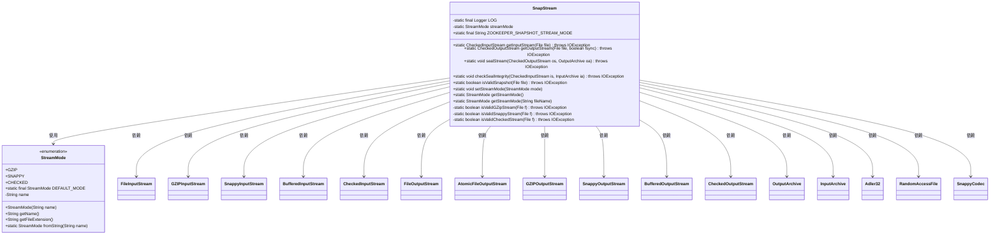
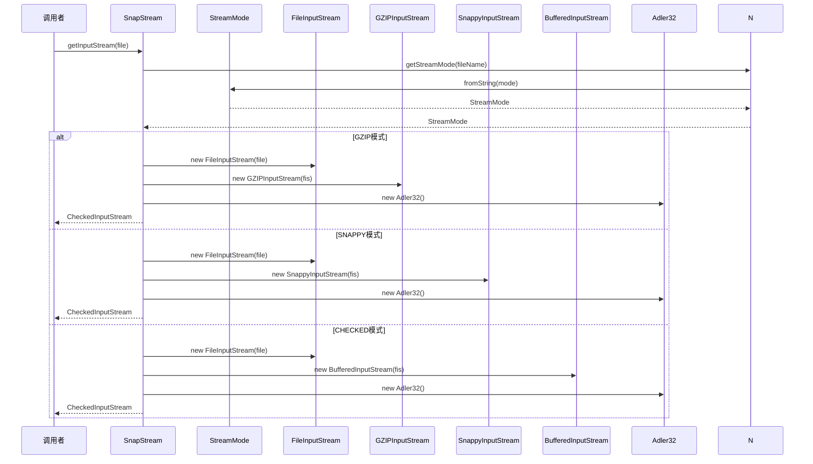

# 基础信息

|      |      |
|------|------|
| 名称 | SnapStream |
| 编码语言 | .java |
| 代码路径 | zookeeper/zookeeper-server/src/main/java/org/apache/zookeeper/server/persistence/SnapStream.java |
| 包名 | org.apache.zookeeper.server.persistence |
| 依赖项 | ['java.io.BufferedInputStream', 'java.io.BufferedOutputStream', 'java.io.File', 'java.io.FileInputStream', 'java.io.FileNotFoundException', 'java.io.FileOutputStream', 'java.io.IOException', 'java.io.InputStream', 'java.io.OutputStream', 'java.io.RandomAccessFile', 'java.nio.ByteBuffer', 'java.util.Arrays', 'java.util.zip.Adler32', 'java.util.zip.CheckedInputStream', 'java.util.zip.CheckedOutputStream', 'java.util.zip.GZIPInputStream', 'java.util.zip.GZIPOutputStream', 'org.apache.jute.InputArchive', 'org.apache.jute.OutputArchive', 'org.apache.zookeeper.common.AtomicFileOutputStream', 'org.slf4j.Logger', 'org.slf4j.LoggerFactory', 'org.xerial.snappy.SnappyCodec', 'org.xerial.snappy.SnappyInputStream', 'org.xerial.snappy.SnappyOutputStream'] |
| 概述说明 | SnapStream类提供ZooKeeper快照的压缩流处理，支持GZIP、SNAPPY和CHECKED模式，包含流模式检测、校验和验证及快照完整性检查功能。 |

# 说明

SnapStream类是一个用于处理压缩流和校验流的工具类，支持GZIP、SNAPPY和CHECKED三种流模式。它提供了获取输入输出流的方法，并支持流的密封和完整性校验。类中包含枚举StreamMode定义流模式，默认模式为CHECKED。通过文件名扩展自动检测流模式，并提供校验方法验证文件是否为有效快照。校验逻辑包括检查文件头魔数和格式，确保数据完整性。类还支持设置和获取当前流模式，并处理文件读写异常。

# 类列表 Class Summary

| 名称   | 类型  | 说明 |
|-------|------|-------------|
| SnapStream | class | SnapStream类提供ZooKeeper快照流的压缩与校验功能，支持GZIP、SNAPPY和CHECKED模式，包含输入输出流封装、完整性校验及快照有效性验证方法。 |

## 类 SnapStream

|      |      |
|------|------|
| 访问范围 | public |
| 类型 | class |
| 名称 | SnapStream |
| 说明 | SnapStream类提供ZooKeeper快照流的压缩与校验功能，支持GZIP、SNAPPY和CHECKED模式，包含输入输出流封装、完整性校验及快照有效性验证方法。 |

### UML类图

这段代码定义了一个`SnapStream`类，主要用于处理ZooKeeper快照文件的压缩流操作。该类包含枚举类型`StreamMode`表示不同的压缩模式（GZIP/SNAPPY/CHECKED），提供静态方法获取输入/输出流、验证流完整性和快照有效性。核心功能包括：根据文件扩展名自动选择压缩模式、支持原子性写入、通过校验和(Adler32)验证数据完整性，并针对不同压缩格式实现特定的魔术字检查逻辑。类通过组合多种Java I/O类实现功能，体现了策略模式的设计思想。

### 内部方法调用关系图

```mermaid
graph TD
    A["类SnapStream"]
    B["静态属性: Logger LOG"]
    C["静态常量: ZOOKEEPER_SHAPSHOT_STREAM_MODE"]
    D["静态属性: StreamMode streamMode"]
    E["静态初始化块: 日志输出配置"]
    F["枚举StreamMode"]
    G["方法: getInputStream"]
    H["方法: getOutputStream"]
    I["方法: sealStream"]
    J["方法: checkSealIntegrity"]
    K["方法: isValidSnapshot"]
    L["方法: setStreamMode"]
    M["方法: getStreamMode"]
    N["方法: getStreamMode(String)"]
    O["私有方法: isValidGZipStream"]
    P["私有方法: isValidSnappyStream"]
    Q["私有方法: isValidCheckedStream"]

    A --> B
    A --> C
    A --> D
    A --> E
    A --> F
    A --> G
    A --> H
    A --> I
    A --> J
    A --> K
    A --> L
    A --> M
    A --> N
    A --> O
    A --> P
    A --> Q

    F --> F1["枚举值: GZIP/SNAPPY/CHECKED"]
    F --> F2["方法: getName/getFileExtension/fromString"]
```

流程图描述：该流程图展示了SnapStream类的核心结构和功能，包含静态属性初始化、枚举类型定义和主要方法调用链。类通过StreamMode枚举管理压缩模式，提供getInputStream/getOutputStream进行流处理，并包含密封流验证和快照完整性检查功能。时序图具体演示了getInputStream方法根据文件扩展名自动选择解压策略的过程，涉及文件流初始化、压缩流包装和校验和计算。

### 字段列表 Field List

| 名称  | 类型  | 说明 |
|-------|-------|------|
| streamMode = StreamMode.fromString(        System.getProperty(ZOOKEEPER_SHAPSHOT_STREAM_MODE,                           StreamMode.DEFAULT_MODE.getName())) | StreamMode | 私有静态变量streamMode通过系统属性ZOOKEEPER_SHAPSHOT_STREAM_MODE获取流模式，默认使用DEFAULT_MODE。 |
| ZOOKEEPER_SHAPSHOT_STREAM_MODE = "zookeeper.snapshot.compression.method" | String | ZOOKEEPER_SHAPSHOT_STREAM_MODE是定义ZooKeeper快照压缩方法的静态常量字符串。 |
| LOG = LoggerFactory.getLogger(SnapStream.class) | Logger | 定义SnapStream类的私有静态日志对象LOG，使用LoggerFactory创建。 |

### 方法列表 Method List

| 名称  | 类型  | 说明 |
|-------|-------|------|
| getOutputStream | CheckedOutputStream | 静态方法`getOutputStream`根据参数创建不同输出流：`fsync`为真时使用原子文件流，否则普通文件流。根据`streamMode`选择GZIP、SNAPPY或默认缓冲流，最终返回带Adler32校验的CheckedOutputStream。异常时关闭资源。 |
| getInputStream | CheckedInputStream | 静态方法getInputStream根据文件名后缀返回对应类型的输入流（GZIP、SNAPPY或默认缓冲流），并封装为带校验的CheckedInputStream。异常时关闭文件流并抛出。 |
| isValidSnapshot | boolean | 检查文件是否为有效快照：非空且文件名含有效ZXID时，根据压缩模式（GZIP/SNAPPY/CHECKED）验证流完整性。 |
| isValidCheckedStream | boolean | 检查文件是否为有效快照：文件需至少10字节，末尾5字节需包含特定格式（int值1和字符'/'），否则记录错误并返回false。 |
| isValidGZipStream | boolean | 检查文件是否为有效GZIP流：读取前2字节，验证是否为GZIP魔数0x1f8b，异常时记录错误并返回false。 |
| checkSealIntegrity | void | 检查输入流完整性，比较校验和与读取值，不匹配则抛出异常。 |
| getStreamMode | StreamMode | 获取当前流模式的静态方法，返回streamMode变量值。 |
| setStreamMode | void | 设置流模式方法，静态函数，参数为StreamMode类型，用于更新全局变量streamMode。 |
| sealStream | void | 该方法用于密封输出流，先获取校验和值并写入输出归档，再写入路径标记"/"。 |
| isValidSnappyStream | boolean | 检查文件是否为有效的Snappy流：读取文件头并与标准魔数比较，失败或异常时返回false并记录错误。 |
| getStreamMode | StreamMode | 静态方法getStreamMode通过文件名后缀确定StreamMode，若无后缀则返回CHECKED。 |

