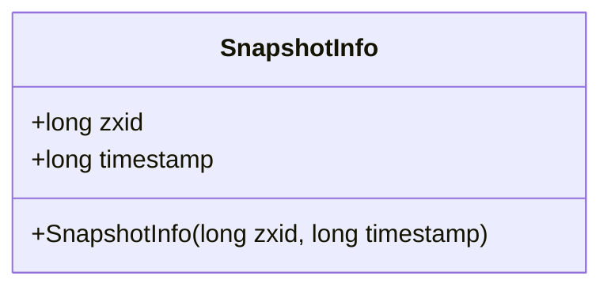
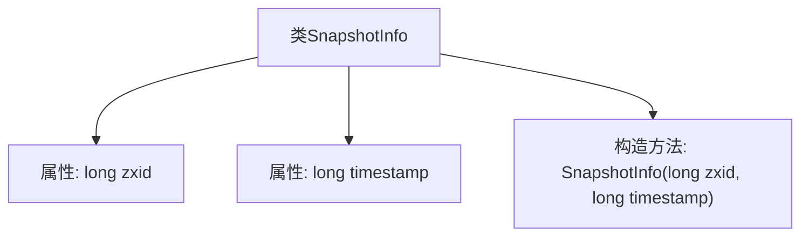

# 基础信息

|      |      |
|------|------|
| 名称 | SnapshotInfo |
| 编码语言 | .java |
| 代码路径 | zookeeper/zookeeper-server/src/main/java/org/apache/zookeeper/server/persistence/SnapshotInfo.java |
| 包名 | org.apache.zookeeper.server.persistence |
| 依赖项 | [] |
| 概述说明 | 快照信息类，包含zxid和时间戳字段，通过构造函数初始化。 |

# 说明

该内容定义了一个名为SnapshotInfo的Java类，用于存储快照信息。类中包含两个公共成员变量：zxid（长整型）和timestamp（长整型）。通过构造函数初始化这两个变量，构造函数接收zxid和timestamp作为参数，并将它们分别赋值给对应的成员变量。该类没有其他方法或功能，仅用于数据存储。

# 类列表 Class Summary

| 名称   | 类型  | 说明 |
|-------|------|-------------|
| SnapshotInfo | class | 快照信息类，包含zxid和时间戳字段，通过构造函数初始化。 |

## 类 SnapshotInfo

|      |      |
|------|------|
| 访问范围 | public |
| 类型 | class |
| 名称 | SnapshotInfo |
| 说明 | 快照信息类，包含zxid和时间戳字段，通过构造函数初始化。 |

### UML类图

这段代码定义了一个名为`SnapshotInfo`的简单数据类，用于存储两个公共字段：`zxid`（事务ID）和`timestamp`（时间戳），并通过构造函数初始化这些字段。类图展示了其结构，包含两个长整型公有属性和一个带参数的构造方法。该类可能用于分布式系统中记录快照的元信息，通过`zxid`标识事务顺序，`timestamp`记录生成时间，适用于需要追踪状态变更的场景。

### 内部方法调用关系图

这段代码定义了一个名为SnapshotInfo的类，包含两个long类型的属性zxid和timestamp，以及一个构造方法用于初始化这两个属性。流程图清晰地展示了类与属性、构造方法之间的层级关系，SnapshotInfo类作为父节点，zxid和timestamp属性作为子节点，构造方法同样作为子节点与类关联。这个类可能用于存储某个快照的zxid和时间戳信息，构造方法确保在创建SnapshotInfo对象时能够正确初始化这两个关键属性。

### 字段列表 Field List

| 名称  | 类型  | 说明 |
|-------|-------|------|
| zxid | long | 
zxid是一个公共长整型变量。 |
| timestamp | long | 声明一个公共长整型变量timestamp，用于存储时间戳。 |

### 方法列表 Method List

| 名称  | 类型  | 说明 |
|-------|-------|------|

