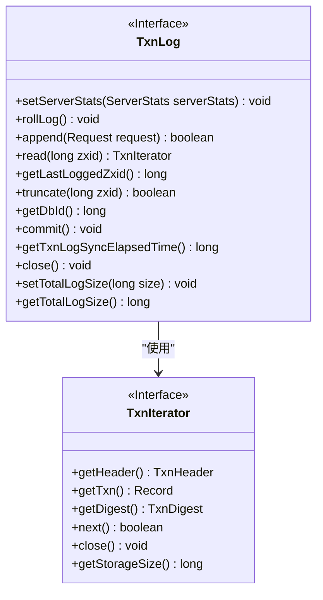
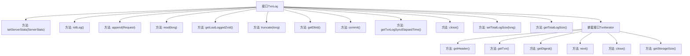

# 基础信息

|      |      |
|------|------|
| 名称 | TxnLog |
| 编码语言 | .java |
| 代码路径 | zookeeper/zookeeper-server/src/main/java/org/apache/zookeeper/server/persistence/TxnLog.java |
| 包名 | org.apache.zookeeper.server.persistence |
| 依赖项 | ['java.io.Closeable', 'java.io.IOException', 'org.apache.jute.Record', 'org.apache.zookeeper.server.Request', 'org.apache.zookeeper.server.ServerStats', 'org.apache.zookeeper.txn.TxnDigest', 'org.apache.zookeeper.txn.TxnHeader'] |
| 概述说明 | TxnLog接口定义了事务日志操作，包括设置统计、滚动日志、追加请求、读取日志、截断日志、提交事务等。TxnIterator接口提供迭代读取事务日志功能，包含获取事务头、记录、摘要及跳转下一记录等方法。两者均继承Closeable，需处理IO异常。 |

# 说明

TxnLog接口定义了事务日志的核心操作，包括设置服务器统计、滚动日志、追加请求、读取日志、获取最后事务ID、截断日志、获取数据库ID、提交事务、获取同步时间、关闭日志及管理日志大小。内部接口TxnIterator提供了遍历事务日志的功能，支持获取事务头、记录、摘要、跳转下一记录及估算存储空间。所有操作均可能抛出IO异常。

# 类列表 Class Summary

| 名称   | 类型  | 说明 |
|-------|------|-------------|
| TxnLog | interface | TxnLog接口定义了事务日志操作，包括设置统计、滚动日志、追加请求、读取日志、截断日志、提交事务等。TxnIterator接口提供迭代读取事务日志功能，包括获取事务头、记录、摘要及存储大小等。两者均支持资源关闭。 |

## 类 TxnLog

|      |      |
|------|------|
| 访问范围 | public |
| 类型 | interface |
| 名称 | TxnLog |
| 说明 | TxnLog接口定义了事务日志操作，包括设置统计、滚动日志、追加请求、读取日志、截断日志、提交事务等。TxnIterator接口提供迭代读取事务日志功能，包括获取事务头、记录、摘要及存储大小等。两者均支持资源关闭。 |

### UML类图

这段类图描述了一个事务日志系统接口及其迭代器接口的设计。TxnLog接口定义了事务日志的核心操作，包括日志滚动、追加请求、读取日志、截断日志等功能，同时通过TxnIterator接口提供了事务记录的迭代访问能力。TxnIterator接口则定义了获取事务头、事务记录、摘要以及迭代控制等方法。两个接口都继承了Closeable接口，表明它们都是可关闭的资源。该设计支持事务日志的高效管理和访问，适用于需要持久化事务记录的分布式系统场景。

### 内部方法调用关系图

这段代码定义了一个名为TxnLog的接口，该接口扩展了Closeable接口，主要用于处理事务日志的相关操作。接口包含多个方法，如设置服务器统计信息、滚动日志、追加请求、读取事务日志、获取最后记录的事务ID、截断日志、提交事务等。此外，还定义了一个嵌套接口TxnIterator，用于迭代读取事务日志，包含获取事务头、事务记录、摘要、移动到下一个事务记录等方法。整个接口设计用于高效、可靠地管理事务日志的读写操作。

### 字段列表 Field List

| 名称  | 类型  | 说明 |
|-------|-------|------|

### 方法列表 Method List

| 名称  | 类型  | 说明 |
|-------|-------|------|
| append | boolean | 布尔方法append，接收Request参数，可能抛出IOException异常。 |
| rollLog | void | 方法声明：rollLog()可能抛出IOException异常。 |
| getDbId | long | 获取数据库ID，可能抛出IO异常。 |
| commit | void | 提交更改，可能抛出IO异常。 |
| truncate | boolean | 截断指定zxid的日志文件，可能抛出IO异常。 |
| getLastLoggedZxid | long | 获取最后记录的Zxid，可能抛出IO异常。 |
| setServerStats | void | 设置服务器状态的方法，参数为ServerStats对象。 |
| read | TxnIterator | 读取指定zxid的事务迭代器，可能抛出IO异常。 |
| getTxnLogSyncElapsedTime | long | 获取事务日志同步耗时 |
| close | void | 关闭资源，可能抛出IO异常。 |
| setTotalLogSize | void | 设置日志总大小限制，参数为长整型size。 |
| getTotalLogSize | long | 获取日志总大小的方法，返回类型为长整型。 |

