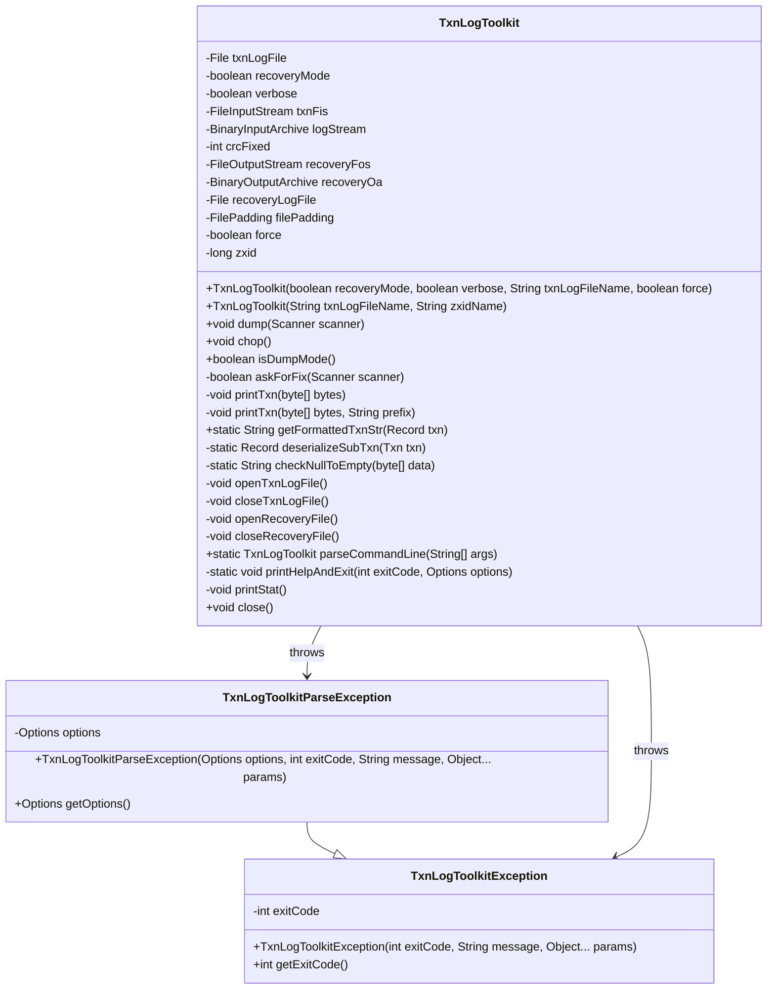
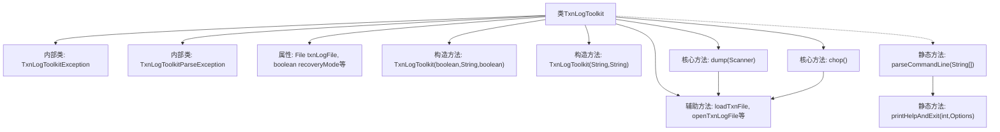
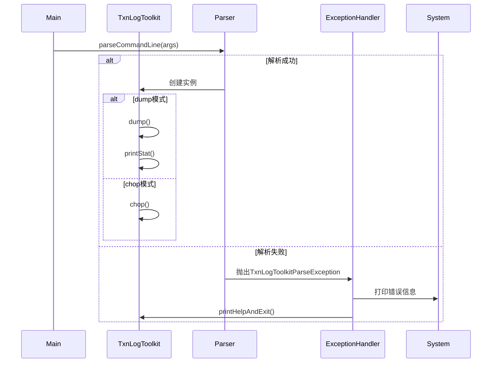

# 基础信息

|      |      |
|------|------|
| 名称 | TxnLogToolkit |
| 编码语言 | .java |
| 代码路径 | zookeeper/zookeeper-server/src/main/java/org/apache/zookeeper/server/persistence/TxnLogToolkit.java |
| 包名 | org.apache.zookeeper.server.persistence |
| 依赖项 | ['org.apache.zookeeper.server.persistence.FileTxnLog.TXNLOG_MAGIC', 'java.io.BufferedInputStream', 'java.io.BufferedOutputStream', 'java.io.Closeable', 'java.io.EOFException', 'java.io.File', 'java.io.FileInputStream', 'java.io.FileNotFoundException', 'java.io.FileOutputStream', 'java.io.IOException', 'java.io.InputStream', 'java.io.OutputStream', 'java.nio.ByteBuffer', 'java.nio.charset.StandardCharsets', 'java.text.DateFormat', 'java.util.Date', 'java.util.List', 'java.util.Scanner', 'java.util.zip.Adler32', 'java.util.zip.Checksum', 'org.apache.commons.cli.CommandLine', 'org.apache.commons.cli.CommandLineParser', 'org.apache.commons.cli.DefaultParser', 'org.apache.commons.cli.HelpFormatter', 'org.apache.commons.cli.Option', 'org.apache.commons.cli.Options', 'org.apache.commons.cli.ParseException', 'org.apache.jute.BinaryInputArchive', 'org.apache.jute.BinaryOutputArchive', 'org.apache.jute.Record', 'org.apache.zookeeper.ZooDefs', 'org.apache.zookeeper.server.ByteBufferInputStream', 'org.apache.zookeeper.server.ExitCode', 'org.apache.zookeeper.server.Request', 'org.apache.zookeeper.server.TxnLogEntry', 'org.apache.zookeeper.server.util.LogChopper', 'org.apache.zookeeper.server.util.SerializeUtils', 'org.apache.zookeeper.txn.CheckVersionTxn', 'org.apache.zookeeper.txn.CreateContainerTxn', 'org.apache.zookeeper.txn.CreateTTLTxn', 'org.apache.zookeeper.txn.CreateTxn', 'org.apache.zookeeper.txn.DeleteTxn', 'org.apache.zookeeper.txn.ErrorTxn', 'org.apache.zookeeper.txn.MultiTxn', 'org.apache.zookeeper.txn.SetDataTxn', 'org.apache.zookeeper.txn.Txn', 'org.apache.zookeeper.txn.TxnHeader', 'org.apache.zookeeper.util.ServiceUtils'] |
| 概述说明 | TxnLogToolkit是ZooKeeper事务日志处理工具，支持恢复模式修复CRC错误、转储模式查看日志内容及截断模式按zxid切割日志文件。提供命令行参数控制交互方式及输出详细程度。 |

# 说明

TxnLogToolkit是一个用于处理ZooKeeper事务日志文件的工具类，支持两种操作模式：dump模式和chop模式。dump模式用于读取并显示日志文件内容，支持恢复模式以修复CRC错误，提供交互式修复选项或强制修复选项。chop模式用于截断日志文件到指定zxid。工具类包含异常处理、文件操作、CRC校验、事务记录解析等功能，支持命令行参数解析，提供帮助信息。恢复模式会生成修复后的日志文件，记录修复的CRC错误数量。工具类实现了Closeable接口确保资源正确释放。

# 类列表 Class Summary

| 名称   | 类型  | 说明 |
|-------|------|-------------|
| TxnLogToolkit | class | TxnLogToolkit是处理ZooKeeper事务日志的工具，支持两种模式：dump模式可读取并打印日志内容；recovery模式可修复CRC错误。提供命令行选项控制交互方式、详细输出及强制修复。工具自动关闭资源，异常处理完善。 |

## 类 TxnLogToolkit

|      |      |
|------|------|
| 访问范围 | public |
| 类型 | class |
| 名称 | TxnLogToolkit |
| 说明 | TxnLogToolkit是处理ZooKeeper事务日志的工具，支持两种模式：dump模式可读取并打印日志内容；recovery模式可修复CRC错误。提供命令行选项控制交互方式、详细输出及强制修复。工具自动关闭资源，异常处理完善。 |

### UML类图

这段类图展示了TxnLogToolkit工具的核心结构，它是一个用于处理ZooKeeper事务日志的工具类。主类TxnLogToolkit实现了Closeable接口，包含两种操作模式：dump模式（读取和校验日志）和chop模式（截断日志）。图中还包含两个自定义异常类（TxnLogToolkitException及其子类TxnLogToolkitParseException），用于处理不同场景下的错误情况。类之间的关系主要表现为继承和异常抛出依赖，整体设计体现了事务日志处理的完整生命周期管理能力。

### 内部方法调用关系图

该流程图展示了TxnLogToolkit类的核心结构和主要执行流程。类包含两个内部异常类和多个事务日志处理方法，通过parseCommandLine解析参数后进入dump或chop模式。dump模式会读取并验证日志文件，支持CRC错误修复；chop模式则按指定zxid截断日志。时序图详细描述了从命令行解析到具体操作执行的完整过程，包括异常处理路径。整个设计体现了事务日志处理工具的核心功能，包括恢复、校验和截断操作。

### 字段列表 Field List

| 名称  | 类型  | 说明 |
|-------|-------|------|
| verbose = false | boolean | 私有布尔变量verbose，默认值为false。 |
| recoveryLogFile | File | 私有文件恢复日志文件变量。 |
| logStream | BinaryInputArchive | 私有二进制输入归档日志流。 |
| zxid = -1L | long | 私有长整型变量zxid，初始值为-1。 |
| crcFixed = 0 | int | 私有整型变量crcFixed初始化为0。 |
| filePadding = new FilePadding() | FilePadding | 创建FilePadding类的私有实例filePadding。 |
| force = false | boolean | 强制标志，默认为false。 |
| recoveryOa | BinaryOutputArchive | 私有二进制输出归档恢复对象。 |
| txnFis | FileInputStream | 声明一个私有文件输入流变量txnFis。 |
| recoveryFos | FileOutputStream | 私有文件输出流变量recoveryFos。 |
| txnLogFile | File | 私有文件类型变量txnLogFile。 |
| recoveryMode = false | boolean | 私有布尔变量recoveryMode初始值为false。 |

### 方法列表 Method List

| 名称  | 类型  | 说明 |
|-------|-------|------|
| openTxnLogFile | void | 该方法打开事务日志文件，创建文件输入流并初始化为二进制输入归档。 |
| isDumpMode | boolean | 方法检查zxid是否小于0，返回布尔值表示是否为转储模式。 |
| openRecoveryFile | void | 打开恢复文件，创建文件输出流和二进制输出归档。 |
| checkNullToEmpty | String | 检查字节数组是否为空或零长度，是则返回空字符串，否则转为UTF-8字符串。 |
| dump | void | 方法dump读取ZooKeeper事务日志，验证文件头和CRC校验。支持恢复模式，可修复CRC错误。统计事务数量，遇EOF或空事务终止。异常时抛出错误。 |
| chop | void | 方法chop将事务日志文件切割至目标文件，若失败则抛出异常并提示错误信息。 |
| closeRecoveryFile | void | 关闭恢复文件流，若存在则执行关闭操作，可能抛出IO异常。 |
| deserializeSubTxn | Record | 根据事务类型反序列化记录，创建对应实例并填充数据，不支持类型抛出异常。 |
| getFormattedTxnStr | String | 静态方法getFormattedTxnStr格式化交易记录字符串，处理多种交易类型（创建、设置数据、删除等），拼接路径、数据、版本等字段，支持多交易组合。空交易返回空字符串。 |
| askForFix | boolean | 方法askForFix通过循环询问用户是否修复问题，接受Y/N/A输入，分别返回true、false或抛出异常终止恢复。 |
| loadTxnFile | File | 该方法加载事务日志文件，检查文件是否存在及可读性，若不符合则抛出异常，否则返回文件对象。 |
| main | void | Java主方法：解析命令行参数后，根据模式选择转储日志或截断日志，捕获异常并输出错误信息或帮助。 |
| printTxn | void | 方法printTxn用于格式化并打印事务日志条目，包含时间、会话ID、事务ID、ZXID、操作类型和事务内容，支持可选前缀。 |
| printTxn | void | 私有方法printTxn接收字节数组参数，可能抛出IO异常，调用同名方法并传入空字符串作为第二参数。 |
| closeTxnLogFile | void | 关闭事务日志文件流，若存在则执行关闭操作，可能抛出IO异常。 |
| parseCommandLine | TxnLogToolkit | 解析命令行参数，支持帮助、恢复、静默、转储、强制及截断模式，处理异常并返回工具实例。 |
| printHelpAndExit | void | 
私有静态方法`printHelpAndExit`用于打印帮助信息并退出程序，参数包括退出码和选项配置，调用`HelpFormatter`显示格式化的帮助信息后强制退出。 |
| printStat | void | 私有方法printStat在恢复模式下输出修复的CRC错误数量及恢复日志文件名。 |
| close | void | 重写close方法，在恢复模式下关闭恢复文件后关闭事务日志文件。 |

