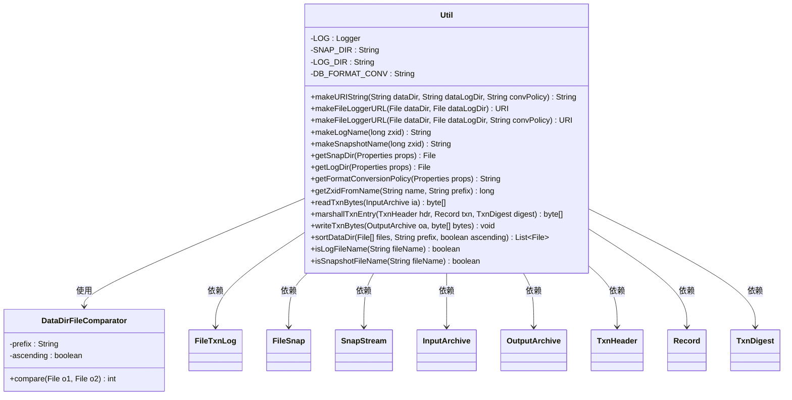
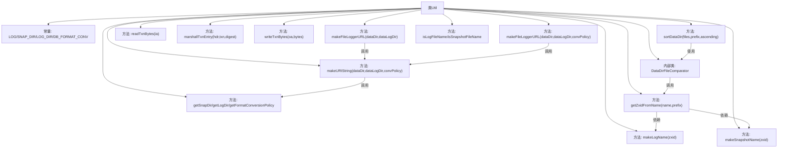

# 基础信息

|      |      |
|------|------|
| 名称 | Util |
| 编码语言 | .java |
| 代码路径 | zookeeper/zookeeper-server/src/main/java/org/apache/zookeeper/server/persistence/Util.java |
| 包名 | org.apache.zookeeper.server.persistence |
| 依赖项 | ['java.io.ByteArrayOutputStream', 'java.io.EOFException', 'java.io.File', 'java.io.IOException', 'java.io.Serializable', 'java.net.URI', 'java.util.ArrayList', 'java.util.Arrays', 'java.util.Collections', 'java.util.Comparator', 'java.util.List', 'java.util.Properties', 'org.apache.jute.BinaryOutputArchive', 'org.apache.jute.InputArchive', 'org.apache.jute.OutputArchive', 'org.apache.jute.Record', 'org.apache.zookeeper.txn.TxnDigest', 'org.apache.zookeeper.txn.TxnHeader', 'org.slf4j.Logger', 'org.slf4j.LoggerFactory'] |
| 概述说明 | 工具类Util提供日志和快照文件操作，包括生成URI、文件名、排序及数据读写功能。 |

# 说明

该Util类提供了一系列与文件日志和快照管理相关的工具方法。主要功能包括：生成日志和快照的URI字符串；创建日志和快照文件名；从文件名中提取zxid；读取和写入事务记录；对文件按版本号排序；判断文件类型是否为日志或快照。类中定义了常量SNAP_DIR、LOG_DIR和DB_FORMAT_CONV用于配置属性键名，并通过静态方法封装了文件路径处理、事务记录序列化等常用操作。DataDirFileComparator内部类实现了按文件版本号排序的功能。所有方法均为静态，可直接调用。

# 类列表 Class Summary

| 名称   | 类型  | 说明 |
|-------|------|-------------|
| Util | class | 工具类Util提供日志和快照文件操作，包括生成URI、文件名、目录管理、事务记录读写及文件排序功能。 |

## 类 Util

|      |      |
|------|------|
| 访问范围 | public |
| 类型 | class |
| 名称 | Util |
| 说明 | 工具类Util提供日志和快照文件操作，包括生成URI、文件名、目录管理、事务记录读写及文件排序功能。 |

### UML类图

该代码实现了一个工具类Util，主要用于处理文件路径构造、日志/快照文件命名、事务记录序列化等操作。核心功能包括：构建URI字符串、生成日志/快照文件名、从文件名解析zxid、排序数据目录文件、读写事务记录等。内部类DataDirFileComparator实现了文件比较器，通过zxid进行排序。类图中展示了Util与多个外部类的依赖关系，包括文件处理类、序列化接口和事务相关类。

### 内部方法调用关系图

该流程图展示了Util工具类的完整结构，包含12个核心方法和1个内部比较器类。主要功能分为四类：URI构造器(makeURIString/makeFileLoggerURL)、文件名处理器(makeLogName/makeSnapshotName/isXxxFileName)、属性提取器(getXxxDir)和事务处理(readTxnBytes/marshallTxnEntry)。内部类DataDirFileComparator通过getZxidFromName实现文件版本号比较，支撑sortDataDir的排序功能。所有方法通过静态方式提供工具能力，涉及文件路径处理、事务序列化等分布式系统基础功能。

### 字段列表 Field List

| 名称  | 类型  | 说明 |
|-------|-------|------|
| DB_FORMAT_CONV = "dbFormatConversion" | String | 私有静态常量字符串，用于数据库格式转换标识。 |
| LOG_DIR = "logDir" | String | 定义私有静态常量字符串LOG_DIR，值为"logDir"。 |
| SNAP_DIR = "snapDir" | String | 私有静态常量SNAP_DIR，值为"snapDir"。 |
| LOG = LoggerFactory.getLogger(Util.class) | Logger | 声明Util类的私有静态日志常量LOG，使用LoggerFactory获取Logger实例。 |

### 方法列表 Method List

| 名称  | 类型  | 说明 |
|-------|-------|------|
| getSnapDir | File | 静态方法getSnapDir接收Properties对象，返回SNAP_DIR属性指定的File对象。 |
| marshallTxnEntry | byte[] | 方法将事务头、记录和摘要序列化为字节数组，处理空值情况后返回结果。 |
| writeTxnBytes | void | 静态方法writeTxnBytes将字节数组写入输出归档，标记事务条目后写入结束符0x42。可能抛出IO异常。 |
| sortDataDir | List<File> | 这是一个Java静态方法，用于对文件数组按前缀和升降序排序。若输入为空，返回空列表。使用自定义比较器DataDirFileComparator进行排序，返回排序后的列表。 |
| isLogFileName | boolean | 检查文件名是否以特定前缀开头。 |
| isSnapshotFileName | boolean | 检查文件名是否以特定前缀开头，判断是否为快照文件。 |
| getZxidFromName | long | 该方法从文件名提取zxid：若文件名以指定前缀开头且含十六进制数，则将其转为长整型返回，否则返回-1。 |
| makeFileLoggerURL | URI | 静态方法makeFileLoggerURL接收两个File参数dataDir和dataLogDir，调用makeURIString生成URI字符串并返回URI对象。 |
| getLogDir | File | 静态方法getLogDir从Properties对象获取LOG_DIR属性值，返回对应的File对象。 |
| makeLogName | String | 生成日志文件名，格式为前缀加zxid的16进制字符串。 |
| makeSnapshotName | String | 生成快照文件名，格式为前缀.十六进制zxid.扩展名。 |
| makeURIString | String | 静态方法生成URI字符串，参数为数据目录、日志目录和转换策略。拼接文件路径并替换反斜杠，若转换策略非空则追加。返回处理后的URI字符串。 |
| readTxnBytes | byte[] | 静态方法readTxnBytes从输入归档读取事务字节，空数组视为EOF，非'B'结尾返回null，异常时也返回null。 |
| makeFileLoggerURL | URI | 静态方法makeFileLoggerURL生成文件日志URI，接收数据目录、日志目录和策略参数，调用makeURIString构建URI字符串并返回URI对象。 |
| getFormatConversionPolicy | String | 这是一个静态方法，从Properties对象获取指定属性值并返回字符串。方法名为getFormatConversionPolicy，参数为props，返回DB_FORMAT_CONV对应的属性值。 |

