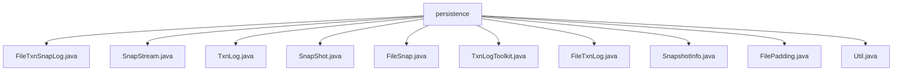

# 基础信息

|      |      |
|------|------|
| 名称 | persistence |
| 编码语言 | .java |
| 代码路径 | zookeeper/zookeeper-server/src/main/java/org/apache/zookeeper/server/persistence |
| 包名 | zookeeper.docs.zookeeper-server.src.main.java.org.apache.zookeeper.server.persistence |
| 概述说明 | FileTxnSnapLog管理ZK事务日志和快照，含恢复、重放、截断功能。SnapStream处理压缩校验流。TxnLog定义日志操作接口。SnapShot定义快照反序列化等核心功能。FileSnap实现快照管理。TxnLogToolkit提供日志修复截断工具。FileTxnLog实现日志读写。SnapshotInfo存储快照元数据。FilePadding处理文件预分配。Util提供文件管理工具方法。 |

# 说明

## 概述  
1. 模块核心职责是管理ZooKeeper的事务日志和快照文件，类似数据库的WAL（预写日志）和检查点机制。  
2. 主要接口包括TxnLog的事务追加/读取和SnapShot的快照序列化/反序列化，例如通过PlayBackListener回调处理事务重放。  
3. 关键数据结构为基于ZXID（事务ID）排序的日志文件和快照文件，例如使用魔数校验确保文件完整性。  
4. 外部依赖包括GZIP/SNAPPY压缩库和文件系统API，例如通过FilePadding预分配磁盘空间优化IO性能。  

## 主要业务场景  
1. 支持数据恢复流程，例如通过restore组合快照和日志重建数据树。  
2. 采用同步写入模式，例如serialize方法支持强制刷盘确保数据持久化。  
3. 功能覆盖完整生命周期，包括日志截断（truncateLog）和快照版本管理（findMostRecentSnapshot）。  
4. 主要用于集群故障恢复，例如TxnLogToolkit提供日志修复和截断工具。  
5. 提供文件级API，例如FileTxnIterator实现事务日志的遍历访问。  
6. 集成案例包括IDE插件，例如通过解析日志文件实现事务可视化。

### 包内部结构视图

该流程图展示了Zookeeper服务器持久化模块的文件结构，以persistence目录为根节点，包含10个关键Java类文件，涵盖事务日志、快照处理等核心功能组件。所有文件均直接隶属于persistence目录下，形成扁平化结构，反映了Zookeeper数据持久化层的实现细节。

# 文件列表 File List

| 名称   | 类型  | 说明 |
|-------|------|-------------|
| [FileTxnSnapLog.java](FileTxnSnapLog.md) | file | FileTxnSnapLog类管理ZooKeeper事务日志和快照，提供数据恢复、快照保存、日志截断等功能，支持自动创建目录和空快照处理，包含错误处理和监听器接口。 |
| [TxnLogToolkit.java](TxnLogToolkit.md) | file | TxnLogToolkit是ZooKeeper事务日志处理工具，支持恢复模式修复CRC错误、转储模式查看日志内容及截断模式按zxid切割日志文件。提供命令行参数控制交互方式及输出详细程度。 |
| [SnapShot.java](SnapShot.md) | file | 快照接口提供数据树序列化、反序列化、查找最新快照、获取快照信息及资源释放功能。 |
| [TxnLog.java](TxnLog.md) | file | TxnLog接口定义了事务日志操作，包括设置统计、滚动日志、追加请求、读取日志、截断日志、提交事务等。TxnIterator接口提供迭代读取事务日志功能，包含获取事务头、记录、摘要及跳转下一记录等方法。两者均继承Closeable，需处理IO异常。 |
| [SnapStream.java](SnapStream.md) | file | SnapStream类提供ZooKeeper快照的压缩流处理，支持GZIP、SNAPPY和CHECKED模式，包含流模式检测、校验和验证及快照完整性检查功能。 |
| [Util.java](Util.md) | file | 工具类Util提供日志和快照文件操作，包括生成URI、文件名、排序及数据读写功能。 |
| [SnapshotInfo.java](SnapshotInfo.md) | file | 快照信息类，包含zxid和时间戳字段，通过构造函数初始化。 |
| [FileTxnLog.java](FileTxnLog.md) | file | FileTxnLog是ZooKeeper的事务日志类，负责管理日志文件读写、滚动、同步及校验，支持事务追加、日志截断和迭代读取，包含日志大小限制和同步性能监控功能。 |
| [FilePadding.java](FilePadding.md) | file | FilePadding类用于文件预分配填充，支持设置预分配大小，通过padFile方法扩展文件至预分配大小的倍数，calculateFileSizeWithPadding方法计算填充后的文件大小。 |
| [FileSnap.java](FileSnap.md) | file | FileSnap类实现快照功能，支持序列化/反序列化数据树和会话，查找有效快照文件，并管理快照信息。包含版本控制、完整性校验和关闭操作。 |

