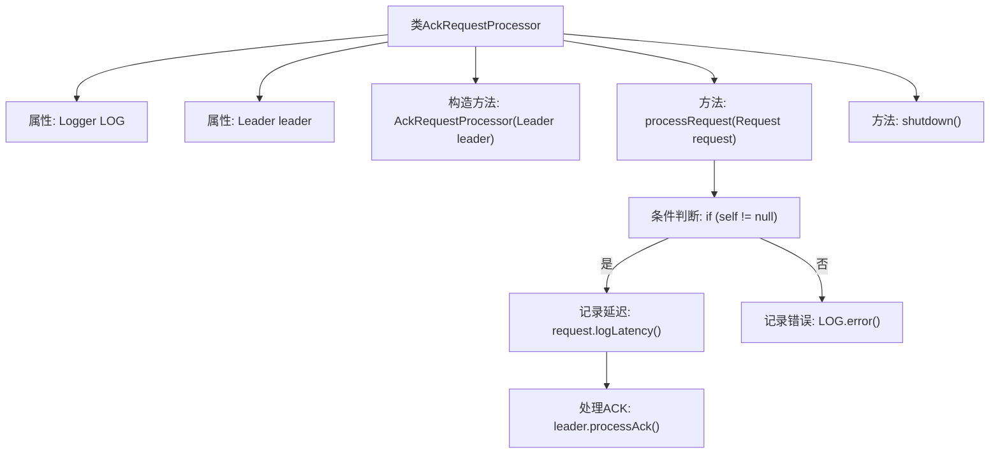

# 基础信息

|      |      |
|------|------|
| 名称 | AckRequestProcessor |
| 编码语言 | .java |
| 代码路径 | zookeeper/zookeeper-server/src/main/java/org/apache/zookeeper/server/quorum/AckRequestProcessor.java |
| 包名 | org.apache.zookeeper.server.quorum |
| 依赖项 | ['org.apache.zookeeper.server.Request', 'org.apache.zookeeper.server.RequestProcessor', 'org.apache.zookeeper.server.ServerMetrics', 'org.slf4j.Logger', 'org.slf4j.LoggerFactory'] |
| 概述说明 | AckRequestProcessor类实现RequestProcessor接口，将请求作为ACK转发给Leader处理，包含processRequest和shutdown方法。 |

# 说明

AckRequestProcessor是一个实现RequestProcessor接口的类，主要用于处理ACK请求。它包含一个Leader类型的成员变量leader，通过构造函数初始化。processRequest方法负责将请求作为ACK转发给leader，首先检查QuorumPeer是否存在，若存在则记录延迟并调用leader的processAck方法处理ACK，否则记录错误日志。shutdown方法当前无需实现任何功能。该类主要用于ZooKeeper中领导者处理确认请求的逻辑。

# 类列表 Class Summary

| 名称   | 类型  | 说明 |
|-------|------|-------------|
| AckRequestProcessor | class | AckRequestProcessor类实现RequestProcessor接口，处理ACK请求。构造函数接收Leader对象，processRequest方法将请求作为ACK转发给Leader，记录延迟并处理；若QuorumPeer为空则报错。shutdown方法暂无操作。 |


## 类 AckRequestProcessor

|      |      |
|------|------|
| 访问范围 | None |
| 类型 | class |
| 名称 | AckRequestProcessor |
| 说明 | AckRequestProcessor类实现RequestProcessor接口，处理ACK请求。构造函数接收Leader对象，processRequest方法将请求作为ACK转发给Leader，记录延迟并处理；若QuorumPeer为空则报错。shutdown方法暂无操作。 |


### UML类图

```mermaid
classDiagram
    class AckRequestProcessor {
        -Leader leader
        -static Logger LOG
        +AckRequestProcessor(Leader leader)
        +processRequest(Request request) void
        +shutdown() void
    }

    class Leader {
        <<Interface>>
        +processAck(long sid, long zxid, SocketAddress followerAddr) void
    }

    class QuorumPeer {
        +getMyId() long
    }

    AckRequestProcessor --> Leader : "依赖\n通过构造函数注入"
    AckRequestProcessor --> QuorumPeer : "依赖\n通过leader.self访问"
    AckRequestProcessor ..|> RequestProcessor : "实现"
    RequestProcessor <<Interface>> {
        +processRequest(Request request) void
        +shutdown() void
    }
```

这段类图描述了ZooKeeper中AckRequestProcessor的架构设计。AckRequestProcessor实现了RequestProcessor接口，主要功能是将请求作为ACK转发给Leader节点处理。它通过构造函数依赖Leader实例，并通过Leader访问QuorumPeer节点信息。关键方法processRequest()会校验QuorumPeer有效性后调用Leader的processAck()，同时记录请求延迟指标。整个设计体现了处理器链模式，符合ZooKeeper的请求处理管道架构。


### 内部方法调用关系图



该流程图展示了AckRequestProcessor类的结构和工作流程。类包含日志记录、Leader引用属性和两个主要方法。processRequest方法为核心逻辑，先检查QuorumPeer有效性，有效时记录提案ACK创建延迟并转发请求给Leader处理，无效时记录错误日志。shutdown方法当前为空实现。整体呈现了ACK请求处理的决策流程和异常处理路径。

### 字段列表 Field List

| 名称  | 类型  | 说明 |
|-------|-------|------|
| LOG = LoggerFactory.getLogger(AckRequestProcessor.class) | Logger | AckRequestProcessor类中定义了一个私有静态日志记录器LOG。 |
| leader | Leader | 领导角色或领导者。 |

### 方法列表 Method List

| 名称  | 类型  | 说明 |
|-------|-------|------|
| processRequest | void | 方法处理请求，检查QuorumPeer是否存在。存在则记录延迟并处理确认，否则记录错误"Null QuorumPeer"。 |
| shutdown | void | 方法shutdown()当前为空实现，无需任何操作。 |


