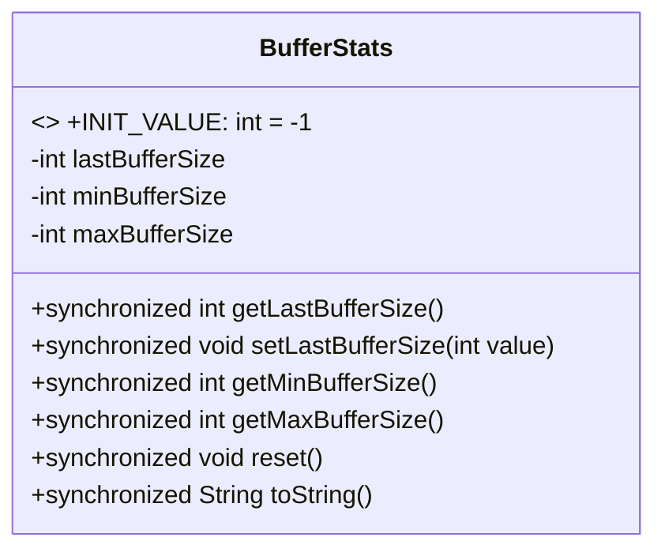
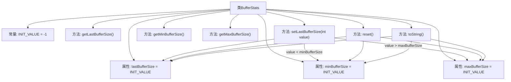

# 基础信息

|      |      |
|------|------|
| 名称 | BufferStats |
| 编码语言 | .java |
| 代码路径 | zookeeper/zookeeper-server/src/main/java/org/apache/zookeeper/server/quorum/BufferStats.java |
| 包名 | org.apache.zookeeper.server.quorum |
| 依赖项 | [] |
| 概述说明 | BufferStats类用于跟踪缓冲区使用情况，记录最新、最小和最大缓冲区大小，提供获取和重置功能。 |

# 说明

BufferStats类用于跟踪缓冲区使用情况的统计信息。它包含三个关键指标：最后一次缓冲区大小、最小缓冲区大小和最大缓冲区大小，初始值均为-1。通过同步方法setLastBufferSize更新统计数据时会自动更新最小和最大值。提供getLastBufferSize、getMinBufferSize和getMaxBufferSize方法获取相应值。reset方法可重置所有统计信息。toString方法以"最后/最小/最大"格式返回统计值。所有方法均为线程安全。

# 类列表 Class Summary

| 名称   | 类型  | 说明 |
|-------|------|-------------|
| BufferStats | class | BufferStats类记录缓冲区使用情况，包括最新、最小和最大尺寸，提供获取、更新和重置功能，所有方法线程安全。 |

## 类 BufferStats

|      |      |
|------|------|
| 访问范围 | public |
| 类型 | class |
| 名称 | BufferStats |
| 说明 | BufferStats类记录缓冲区使用情况，包括最新、最小和最大尺寸，提供获取、更新和重置功能，所有方法线程安全。 |

### UML类图

BufferStats类用于跟踪缓冲区使用情况的统计信息，包括最近一次、最小和最大的缓冲区大小。它通过同步方法保证线程安全，提供获取统计值、更新数据和重置状态的功能。初始化值为-1表示未设置状态，toString()方法以"last/min/max"格式返回统计信息。

### 内部方法调用关系图

这段代码定义了一个BufferStats类，用于跟踪和统计缓冲区大小的使用情况。类中包含三个主要属性：lastBufferSize记录最后一次缓冲区大小，minBufferSize记录最小缓冲区大小，maxBufferSize记录最大缓冲区大小。所有方法都是同步的，确保线程安全。setLastBufferSize方法在设置最新缓冲区大小时会同时更新最小和最大值，reset方法将所有统计值重置为初始值-1，toString方法以特定格式返回当前统计值。

### 字段列表 Field List

| 名称  | 类型  | 说明 |
|-------|-------|------|
| minBufferSize = INIT_VALUE | int | 私有整型变量minBufferSize初始值为INIT_VALUE。 |
| INIT_VALUE = -1 | int | 静态常量INIT_VALUE值为-1。 |
| lastBufferSize = INIT_VALUE | int | 私有整型变量lastBufferSize初始值为INIT_VALUE。 |
| maxBufferSize = INIT_VALUE | int | 私有整型变量maxBufferSize初始值为INIT_VALUE。 |

### 方法列表 Method List

| 名称  | 类型  | 说明 |
|-------|-------|------|
| reset | void | 同步方法reset重置三个缓冲区大小变量为初始值。 |
| getLastBufferSize | int | 这是一个同步方法，返回lastBufferSize的值。 |
| getMaxBufferSize | int | 同步方法返回最大缓冲区大小。 |
| setLastBufferSize | void | 同步方法setLastBufferSize更新lastBufferSize，并动态调整minBufferSize和maxBufferSize。若当前值为初始值或小于minBufferSize，则更新minBufferSize；若大于maxBufferSize，则更新maxBufferSize。 |
| getMinBufferSize | int | 同步方法返回最小缓冲区大小。 |
| toString | String | 重写toString方法，同步返回格式化字符串，显示lastBufferSize、minBufferSize和maxBufferSize的值。 |

