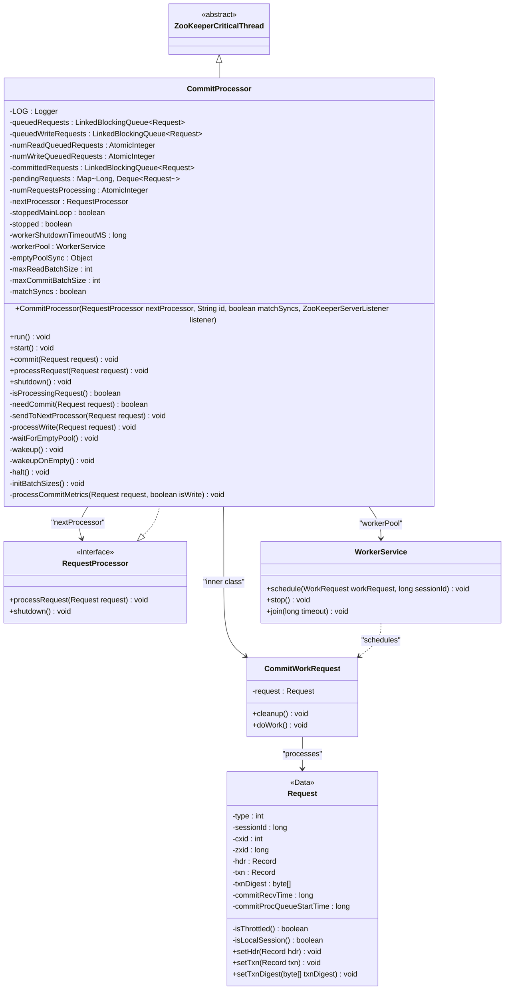
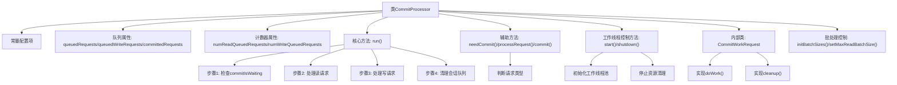
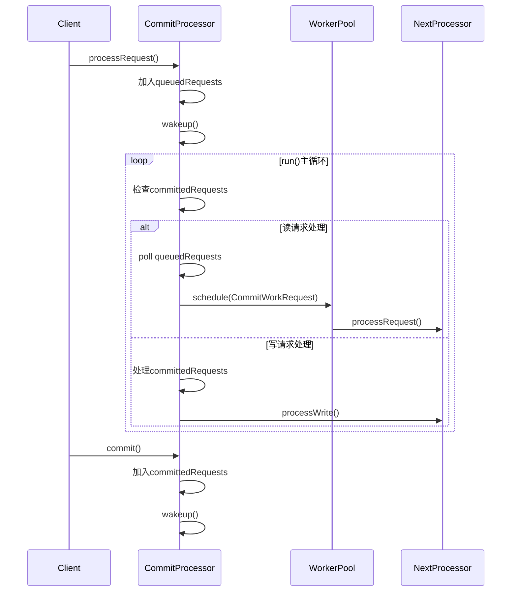

# 基础信息

|      |      |
|------|------|
| 名称 | CommitProcessor |
| 编码语言 | .java |
| 代码路径 | zookeeper/zookeeper-server/src/main/java/org/apache/zookeeper/server/quorum/CommitProcessor.java |
| 包名 | org.apache.zookeeper.server.quorum |
| 依赖项 | ['edu.umd.cs.findbugs.annotations.SuppressFBWarnings', 'java.util.ArrayDeque', 'java.util.Deque', 'java.util.HashMap', 'java.util.HashSet', 'java.util.Map', 'java.util.Set', 'java.util.concurrent.LinkedBlockingQueue', 'java.util.concurrent.atomic.AtomicInteger', 'org.apache.zookeeper.ZooDefs.OpCode', 'org.apache.zookeeper.common.Time', 'org.apache.zookeeper.server.ExitCode', 'org.apache.zookeeper.server.Request', 'org.apache.zookeeper.server.RequestProcessor', 'org.apache.zookeeper.server.ServerMetrics', 'org.apache.zookeeper.server.WorkerService', 'org.apache.zookeeper.server.ZooKeeperCriticalThread', 'org.apache.zookeeper.server.ZooKeeperServerListener', 'org.apache.zookeeper.util.ServiceUtils', 'org.slf4j.Logger', 'org.slf4j.LoggerFactory'] |
| 概述说明 | CommitProcessor是ZooKeeper核心线程，负责处理读写请求队列，支持多线程工作池配置，通过批处理优化性能，确保请求按序提交和处理，同时提供监控指标和优雅停机机制。 |

# 说明

CommitProcessor是ZooKeeper的核心线程组件，负责协调请求处理与提交顺序。它维护多个队列：queuedRequests接收新请求，queuedWriteRequests存放待提交写请求，committedRequests存储已提交请求，pendingRequests按会话分组暂存阻塞请求。通过maxReadBatchSize和maxCommitBatchSize参数控制读写批处理量，避免饥饿问题。核心run()方法循环处理请求：优先处理读请求直至阈值，再处理积压的提交请求，通过原子计数器跟踪处理状态。该处理器还集成性能监控指标，支持动态线程池配置，并确保关闭时有序清理资源。关键特性包括本地/远程请求区分处理、会话级请求排序保障，以及通过WorkerService实现并行处理。

# 类列表 Class Summary

| 名称   | 类型  | 说明 |
|-------|------|-------------|
| CommitProcessor | class | CommitProcessor是ZooKeeper的核心线程，负责处理读写请求，确保顺序执行。它维护多个队列管理待处理请求，支持批量处理配置，通过工作线程池异步处理请求，并跟踪请求状态和性能指标。 |

## 类 CommitProcessor

|      |      |
|------|------|
| 访问范围 | public |
| 类型 | class |
| 名称 | CommitProcessor |
| 说明 | CommitProcessor是ZooKeeper的核心线程，负责处理读写请求，确保顺序执行。它维护多个队列管理待处理请求，支持批量处理配置，通过工作线程池异步处理请求，并跟踪请求状态和性能指标。 |

### UML类图

类图描述：
CommitProcessor是ZooKeeper的核心组件，继承自ZooKeeperCriticalThread并实现了RequestProcessor接口，负责处理读写请求的提交和调度。它维护多个队列(queuedRequests/committedRequests等)来管理不同状态的请求，使用WorkerService线程池异步处理请求，并通过nextProcessor将处理后的请求传递给下游处理器。类图展示了其与WorkerService、内部类CommitWorkRequest以及Request数据类的关系，体现了多线程协作处理请求的复杂机制。

### 内部方法调用关系图

流程图描述：该流程图展示了ZooKeeper中CommitProcessor的核心处理逻辑，包含请求分类处理、读写请求分流、工作线程调度等关键环节。类结构分为配置管理、队列控制、批处理调节三大模块，run()方法实现主循环通过检查提交队列和待处理队列的平衡，确保读写请求按优先级处理。时序图则清晰呈现了外部请求进入、工作线程分配、下游处理器调用的完整链路，特别突出了对写请求的提交通知机制和读请求的即时处理策略。

### 字段列表 Field List

| 名称  | 类型  | 说明 |
|-------|-------|------|
| workerShutdownTimeoutMS | long | 私有长整型变量，用于设置工作者线程关闭超时时间（毫秒）。 |
| emptyPoolSync = new Object() | Object | 私有对象emptyPoolSync用于同步控制。 |
| maxCommitBatchSize | int | 私有静态可变整型变量maxCommitBatchSize，用于控制提交批次的最大大小。 |
| ZOOKEEPER_COMMIT_PROC_MAX_READ_BATCH_SIZE = "zookeeper.commitProcessor.maxReadBatchSize" | String | ZOOKEEPER_COMMIT_PROC_MAX_READ_BATCH_SIZE定义ZooKeeper提交处理器的最大读取批量大小参数。 |
| queuedRequests = new LinkedBlockingQueue<>() | LinkedBlockingQueue<Request> | 声明一个受保护的阻塞队列queuedRequests，用于存储Request对象，基于LinkedBlockingQueue实现。 |
| pendingRequests = new HashMap<>(10000) | Map<Long, Deque<Request>> | 保护性声明的哈希映射，键为长整型，值为双端队列，初始容量10000，存储待处理请求。 |
| numWriteQueuedRequests = new AtomicInteger(0) | AtomicInteger | 声明一个原子整型变量numWriteQueuedRequests，初始值为0，用于线程安全计数。 |
| stoppedMainLoop = true | boolean | 声明一个受保护的易变布尔变量stoppedMainLoop，初始值为true。 |
| maxReadBatchSize | int | 私有静态可变整数maxReadBatchSize |
| nextProcessor | RequestProcessor | 声明一个名为nextProcessor的RequestProcessor类型变量。 |
| ZOOKEEPER_COMMIT_PROC_SHUTDOWN_TIMEOUT = "zookeeper.commitProcessor.shutdownTimeout" | String | ZOOKEEPER_COMMIT_PROC_SHUTDOWN_TIMEOUT是ZooKeeper提交处理器关闭超时的配置参数。 |
| numRequestsProcessing = new AtomicInteger(0) | AtomicInteger | 保护型原子整型变量，初始值为0，用于并发请求计数。 |
| queuedWriteRequests = new LinkedBlockingQueue<>() | LinkedBlockingQueue<Request> | 保护性声明的阻塞队列，存储请求对象，线程安全。 |
| matchSyncs | boolean | 布尔变量matchSyncs，用于同步匹配状态。 |
| numReadQueuedRequests = new AtomicInteger(0) | AtomicInteger | 原子整型变量numReadQueuedRequests，初始值为0，用于线程安全计数。 |
| ZOOKEEPER_COMMIT_PROC_MAX_COMMIT_BATCH_SIZE = "zookeeper.commitProcessor.maxCommitBatchSize" | String | ZOOKEEPER提交处理器最大批量提交大小配置项。 |
| workerPool | WorkerService | 保护型WorkerService线程池实例。 |
| committedRequests = new LinkedBlockingQueue<>() | LinkedBlockingQueue<Request> | 保护型阻塞队列，存储已提交请求。 |
| ZOOKEEPER_COMMIT_PROC_NUM_WORKER_THREADS = "zookeeper.commitProcessor.numWorkerThreads" | String | ZOOKEEPER提交处理器的工作线程数配置项。 |
| stopped = true | boolean | 声明一个受保护的易变布尔变量stopped，初始值为true。 |
| LOG = LoggerFactory.getLogger(CommitProcessor.class) | Logger | 定义CommitProcessor类的私有静态日志对象LOG。 |

### 方法列表 Method List

| 名称  | 类型  | 说明 |
|-------|-------|------|
| setMaxReadBatchSize | void | 设置读取批次大小的方法，更新maxReadBatchSize并记录日志。 |
| getMaxReadBatchSize | int | 获取最大读取批次大小的方法，返回预设的maxReadBatchSize值。 |
| sendToNextProcessor | void | 私有方法发送请求至下一处理器：原子递增处理数，创建提交工作请求，按会话ID调度至工作池。 |
| getMaxCommitBatchSize | int | 这是一个静态方法，返回最大提交批处理大小的整数值。 |
| setMaxCommitBatchSize | void | 设置提交批处理大小的方法，若输入值大于0则更新配置并记录日志。 |
| endOfIteration | void | 方法`endOfIteration`定义了一个无参数、无返回值的受保护空方法。 |
| processWrite | void | 处理写入请求：记录提交指标，调用后续处理器，统计最终处理耗时。 |
| waitForEmptyPool | void | 等待请求池为空的方法：检查处理中请求数，非零时记录指标；同步等待池空或停止信号，记录等待时间。 |
| start | void | 重写start方法，初始化线程池和参数，启动CommitProcessor。核心数决定工作线程数，默认超时5000ms，日志记录配置信息。 |
| isProcessingRequest | boolean | 检查是否有请求正在处理，返回布尔值。 |
| needCommit | boolean | 方法needCommit判断请求是否需要提交：若被限流则返回false；根据请求类型，创建、删除、设置数据等操作返回true，sync操作取决于matchSyncs，会话操作需非本地会话，其他情况返回false。 |
| run | void | 处理请求队列，优先处理待提交请求，避免读请求饥饿。同步检查队列状态，处理读请求和写提交，更新指标并确保请求顺序。异常时处理并记录日志。 |
| processCommitMetrics | void | 处理提交指标：写操作记录本地/远程写入耗时，读操作记录处理队列耗时。 |
| initBatchSizes | void | 初始化批处理大小：读取批大小设为系统参数或默认-1，提交批大小设为系统参数或默认1。若提交批大小非正数则抛出异常。记录配置日志。 |
| wakeup | void | 同步方法wakeup调用notifyAll唤醒线程，忽略NN_NAKED_NOTIFY警告。 |
| wakeupOnEmpty | void | 唤醒空池线程：同步调用emptyPoolSync对象的notifyAll方法，释放所有等待线程。 |
| commit | void | 方法commit处理请求：检查状态和请求有效性，记录日志，设置接收时间，更新队列计数，添加请求并唤醒处理。 |
| processRequest | void | 处理请求方法：若服务停止则返回，记录请求日志，设置开始时间并加入队列。根据请求类型（读写）分别计数，最后唤醒处理线程。 |
| halt | void | 停止主循环，清空请求队列并终止工作池。 |
| shutdown | void | 该方法执行关闭操作：记录日志，停止当前处理，等待工作线程池结束（若存在），并触发下一处理器的关闭（若存在）。 |

