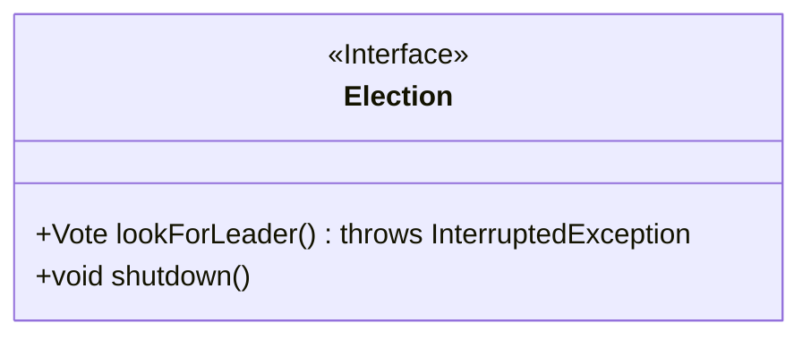
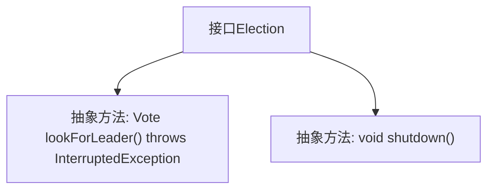

# 基础信息

|      |      |
|------|------|
| 名称 | Election |
| 编码语言 | .java |
| 代码路径 | zookeeper/zookeeper-server/src/main/java/org/apache/zookeeper/server/quorum/Election.java |
| 包名 | org.apache.zookeeper.server.quorum |
| 依赖项 | [] |
| 概述说明 | 选举接口定义两个方法：查找领导者（可能阻塞）和关闭选举。 |

# 说明

这是一个名为Election的公共接口，定义了两个关键方法。lookForLeader方法用于寻找领导者并返回Vote对象，可能抛出InterruptedException异常。shutdown方法用于关闭或终止选举过程，无返回值。该接口简洁明了，适用于需要选举功能的系统设计。

# 类列表 Class Summary

| 名称   | 类型  | 说明 |
|-------|------|-------------|
| Election | interface | 这是一个选举接口，包含查找领导者和关闭功能。查找可能中断，关闭无返回值。 |

## 类 Election

|      |      |
|------|------|
| 访问范围 | public |
| 类型 | interface |
| 名称 | Election |
| 说明 | 这是一个选举接口，包含查找领导者和关闭功能。查找可能中断，关闭无返回值。 |

### UML类图

这段代码定义了一个名为`Election`的接口，包含两个方法：`lookForLeader()`和`shutdown()`。`lookForLeader()`方法返回`Vote`类型对象并可能抛出`InterruptedException`异常，用于异步查找领导者；`shutdown()`方法用于终止选举过程。该接口可作为选举系统的抽象规范，具体实现类需提供这两个方法的具体逻辑。接口设计体现了选举过程的两个核心操作：查询和终止，适用于分布式系统领导者选举等场景。

### 内部方法调用关系图

这段流程图描述了Election接口的结构，包含两个核心抽象方法：lookForLeader()用于查找领导者并可能抛出中断异常，shutdown()用于关闭选举功能。接口作为抽象类型，定义了选举系统必须实现的行为契约，其中lookForLeader()的返回值类型Vote和异常声明体现了方法的核心职责。整个结构简洁明确，符合接口设计的最小暴露原则。

### 字段列表 Field List

| 名称  | 类型  | 说明 |
|-------|-------|------|

### 方法列表 Method List

| 名称  | 类型  | 说明 |
|-------|-------|------|
| shutdown | void | 关闭系统或终止程序运行。 |
| lookForLeader | Vote | 方法Vote lookForLeader()可能抛出InterruptedException异常，用于寻找领导者。 |

