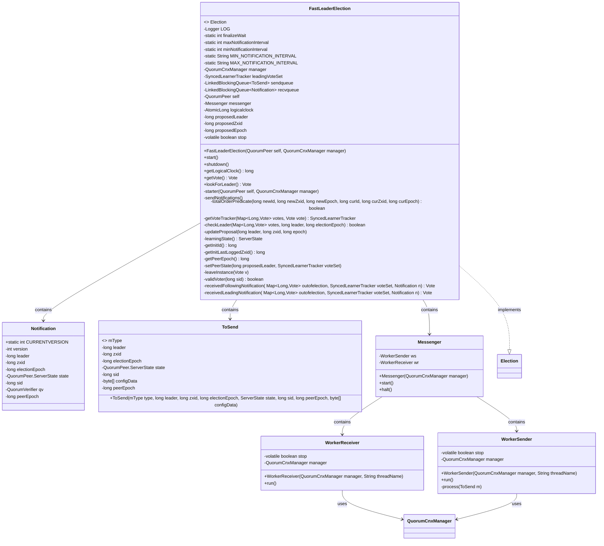
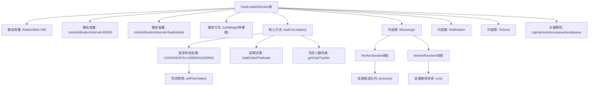
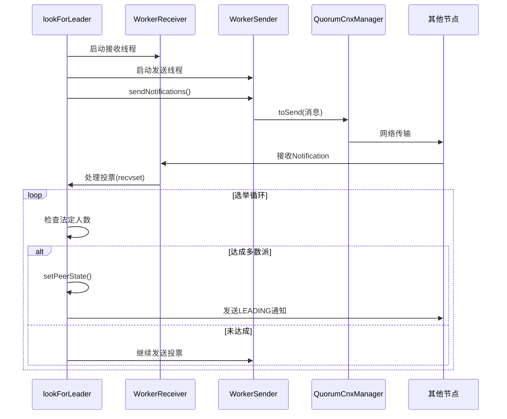

# 基础信息

|      |      |
|------|------|
| 名称 | FastLeaderElection |
| 编码语言 | .java |
| 代码路径 | zookeeper/zookeeper-server/src/main/java/org/apache/zookeeper/server/quorum/FastLeaderElection.java |
| 包名 | org.apache.zookeeper.server.quorum |
| 依赖项 | ['java.nio.charset.StandardCharsets.UTF_8', 'java.io.IOException', 'java.nio.BufferUnderflowException', 'java.nio.ByteBuffer', 'java.util.HashMap', 'java.util.Map', 'java.util.concurrent.LinkedBlockingQueue', 'java.util.concurrent.TimeUnit', 'java.util.concurrent.atomic.AtomicLong', 'org.apache.zookeeper.common.Time', 'org.apache.zookeeper.jmx.MBeanRegistry', 'org.apache.zookeeper.server.ZooKeeperThread', 'org.apache.zookeeper.server.quorum.QuorumCnxManager.Message', 'org.apache.zookeeper.server.quorum.QuorumPeer.LearnerType', 'org.apache.zookeeper.server.quorum.QuorumPeer.ServerState', 'org.apache.zookeeper.server.quorum.QuorumPeerConfig.ConfigException', 'org.apache.zookeeper.server.quorum.flexible.QuorumOracleMaj', 'org.apache.zookeeper.server.quorum.flexible.QuorumVerifier', 'org.apache.zookeeper.server.util.ZxidUtils', 'org.slf4j.Logger', 'org.slf4j.LoggerFactory'] |
| 概述说明 | FastLeaderElection是ZooKeeper的快速领导者选举实现，基于TCP通信，包含通知和确认机制，通过逻辑时钟和投票集合确定领导者，支持最小200ms和最大60秒的通知间隔，处理LOOKING、FOLLOWING和LEADING状态转换，确保集群一致性。 |

# 说明

FastLeaderElection是ZooKeeper中实现快速领导者选举的核心类，采用基于TCP的通知协议。关键机制包括：1. 使用logicalclock维护选举轮次，通过比较epoch/zxid/sid确定胜选者；2. 包含Messenger组件（WorkerSender/WorkerReceiver线程）处理消息收发；3. 支持最小200ms和最大60秒的通知间隔配置；4. 通过SyncedLearnerTracker验证法定人数；5. 处理LOOKING/FOLLOWING/LEADING/OBSERVING四种节点状态；6. 支持动态配置变更和Oracle仲裁机制（针对2节点场景的特殊处理）。选举过程通过比较候选者的(epoch, zxid, sid)三元组确定优先级，最终由多数派确认领导者。

# 类列表 Class Summary

| 名称   | 类型  | 说明 |
|-------|------|-------------|
| FastLeaderElection | class | FastLeaderElection是ZooKeeper的快速选举算法实现，通过TCP通信管理选主流程，包含投票通知、状态同步和超时处理机制，支持集群节点间高效协调选出领导者。 |

## 类 FastLeaderElection

|      |      |
|------|------|
| 访问范围 | public |
| 类型 | class |
| 名称 | FastLeaderElection |
| 说明 | FastLeaderElection是ZooKeeper的快速选举算法实现，通过TCP通信管理选主流程，包含投票通知、状态同步和超时处理机制，支持集群节点间高效协调选出领导者。 |

### UML类图

该代码实现了一个快速领导者选举算法，主要用于ZooKeeper集群中的领导者选举过程。核心类FastLeaderElection实现了Election接口，包含内部类Notification（用于通知消息）、ToSend（用于发送消息）和Messenger（消息处理器）。Messenger又包含WorkerReceiver（消息接收线程）和WorkerSender（消息发送线程）。整个系统通过消息队列（sendqueue/recvqueue）进行通信，使用QuorumCnxManager管理网络连接，通过比较zxid、epoch等参数来确定领导者，支持集群配置变更和故障恢复场景。

### 内部方法调用关系图

该流程图展示了ZooKeeper快速领导者选举的核心机制。FastLeaderElection类通过Messenger内部类的双工通信体系（WorkerSender/WorkerReceiver线程）实现选举消息交换，lookForLeader方法驱动状态机在LOOKING/FOLLOWING/LEADING状态间转换。时序图重点呈现了选举过程中跨节点的消息交互流程，包括投票广播、状态传播和法定人数验证等关键阶段，最终通过totalOrderPredicate算法确定最高优先级候选者。整个设计采用事件驱动架构，结合超时重试和指数退避机制确保分区容错性。

### 字段列表 Field List

| 名称  | 类型  | 说明 |
|-------|-------|------|
| proposedEpoch | long | 变量声明：long类型的proposedEpoch。 |
| leadingVoteSet | SyncedLearnerTracker | 私有同步学习跟踪器leadingVoteSet。 |
| proposedLeader | long | 声明一个名为proposedLeader的长整型变量。 |
| sendqueue | LinkedBlockingQueue<ToSend> | LinkedBlockingQueue类型为ToSend的发送队列sendqueue。 |
| stop | boolean | 声明一个易变的布尔变量stop。 |
| messenger | Messenger | 定义了一个名为messenger的Messenger类型变量。 |
| manager | QuorumCnxManager | QuorumCnxManager是管理ZooKeeper集群节点间网络通信的组件。 |
| dummyData = new byte[0] | byte[] | 定义空字节数组dummyData。 |
| minNotificationInterval = finalizeWait | int | 私有静态整型变量minNotificationInterval被初始化为finalizeWait的值。 |
| recvqueue | LinkedBlockingQueue<Notification> | 接收通知的阻塞队列，类型为LinkedBlockingQueue<Notification>。 |
| self | QuorumPeer | QuorumPeer是ZooKeeper中负责集群选举和协调的核心组件。 |
| maxNotificationInterval = 60000 | int | 私有静态整型变量maxNotificationInterval，值为60000毫秒。 |
| LOG = LoggerFactory.getLogger(FastLeaderElection.class) | Logger | FastLeaderElection类中定义了一个私有静态日志记录器LOG。 |
| logicalclock = new AtomicLong() | AtomicLong | 创建原子长整型变量logicalclock，初始值为0。 |
| MAX_NOTIFICATION_INTERVAL = "zookeeper.fastleader.maxNotificationInterval" | String | 这是一个静态常量字符串，定义ZooKeeper领导者选举的最大通知间隔配置键。 |
| MIN_NOTIFICATION_INTERVAL = "zookeeper.fastleader.minNotificationInterval" | String | 这是一个Java静态常量，定义ZooKeeper领导者选举的最小通知间隔配置项。 |
| proposedZxid | long | 长整型变量proposedZxid，用于存储提议的事务ID。 |
| finalizeWait = 200 | int | 静态整型常量finalizeWait，值为200，用于等待时间控制。 |

### 方法列表 Method List

| 名称  | 类型  | 说明 |
|-------|-------|------|
| getVote | Vote | 同步方法getVote返回包含提议领导者、ZXID和纪元的新Vote对象。 |
| start | void | 启动messenger服务的方法。 |
| starter | void | 初始化方法，设置队列和消息处理器，重置提议参数。 |
| lookForLeader | Vote | 该方法实现了ZooKeeper的领导者选举逻辑，通过交换通知和投票来确定集群领导者。核心流程包括初始化选举状态、发送通知、处理响应、判断多数派达成，最终选出领导者或超时重试。支持2节点配置的特殊处理，并包含JMX监控注册与清理。 |
| checkLeader | boolean | 检查当前节点是否为领导者：若自身非领导者且未收到领导者的LEADING状态投票，或自身逻辑时钟与选举周期不符，则返回false；否则返回true。 |
| buildMsg | ByteBuffer | 构建通知消息的ByteBuffer，包含状态、leader、zxid、选举轮次、epoch、版本、配置数据长度及配置数据。 |
| learningState | ServerState | 方法根据学习者类型返回服务器状态：参与者返回FOLLOWING，观察者返回OBSERVING，并记录日志。 |
| totalOrderPredicate | boolean | 方法判断新提议是否优于当前：新纪元更大，或纪元相同但新zxid更大，或zxid相同但服务器ID更大。权重为0则直接拒绝。 |
| getCnxManager | QuorumCnxManager | 这是一个公共方法，返回QuorumCnxManager类型的manager对象。 |
| getLogicalClock | long | 获取当前逻辑时钟值的方法，返回长整型数值。 |
| receivedLeadingNotification | Vote | 两节点配置中，恢复节点因票数不足无法定位领导者，需Oracle介入裁决。若Oracle允许跟随，则更新状态并返回投票；否则返回空。 |
| getInitId | long | 方法getInitId检查当前节点ID是否在投票成员列表中，是则返回该ID，否则返回Long的最小值。 |
| getVoteTracker | SyncedLearnerTracker | 方法getVoteTracker创建SyncedLearnerTracker对象，添加当前和更高版本的QuorumVerifier，遍历votes匹配vote时记录ack。返回voteSet。 |
| getPeerEpoch | long | 获取节点纪元值：若节点为参与者则返回当前纪元，异常时抛出运行时异常；非参与者返回最小长整数值。 |
| setPeerState | void | 方法设置节点状态：若提议领导ID与自身ID相同则设为LEADING，否则设为学习状态。若为LEADING则记录投票集合。 |
| receivedFollowingNotification | Vote | 处理选举通知，验证多数节点支持同一领导者。若满足条件，更新状态并返回最终投票；否则返回空。 |
| validVoter | boolean | 检查sid是否为当前及下一配置中的有效投票者。 |
| buildMsg | ByteBuffer | 构建40字节通知包，包含状态、领导ID、zxid、选举周期和纪元，最后补1。用于测试直接调用。 |
| shutdown | void | 该方法用于关闭系统，设置停止标志，清空选举相关变量，并依次停止连接管理器和消息服务，最后记录关闭状态。 |
| leaveInstance | void | 方法leaveInstance清理接收队列，记录离开FLE实例的调试信息，包括领导者ID、事务ID、自身ID和状态。 |
| getInitLastLoggedZxid | long | 方法getInitLastLoggedZxid根据LearnerType返回不同的zxid：如果是PARTICIPANT则返回最后记录的zxid，否则返回Long最小值。 |
| updateProposal | void | 更新提案方法：设置新leader、zxid和epoch，并记录新旧leader和zxid的日志。 |
| sendNotifications | void | 方法sendNotifications遍历当前及下一配置的投票者，为每个接收者sid创建包含领导者、zxid、选举轮次等信息的通知消息，并加入发送队列。日志记录通知详情。 |

